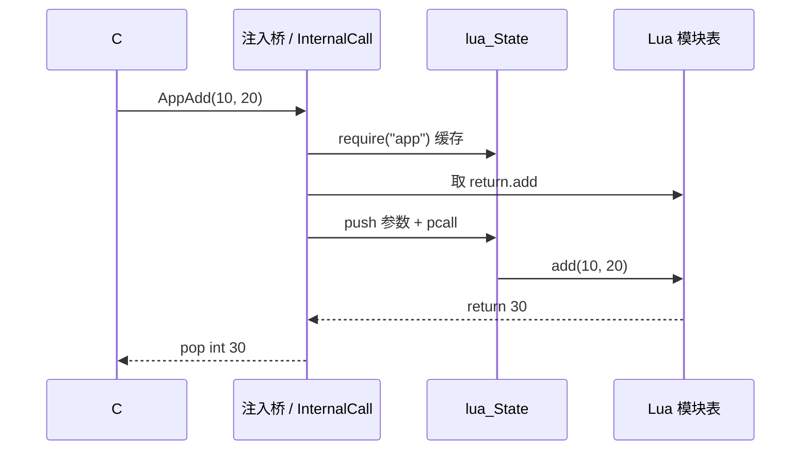
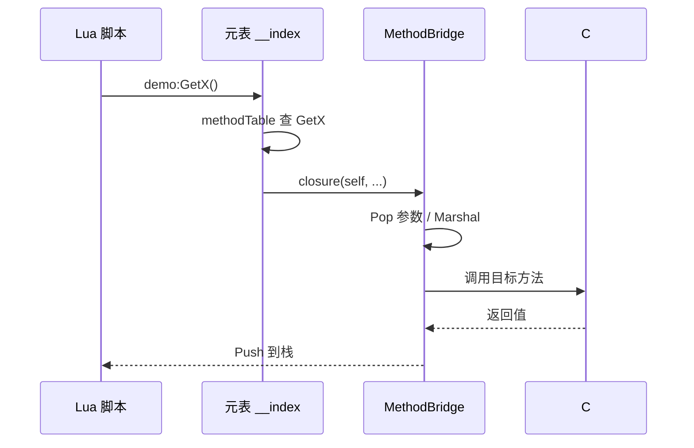

# 调用路径概览

:::tip 谁该读本文
**已了解 [设计概览](../concepts/design-overview)，需要快速对照「一次调用经过哪些层」的读者。** Il2Cpp C++ 细节见 [Il2Cpp 架构](./il2cpp-architecture)；Mono 优化见 [性能报告](./optimization-report)。
:::

## C# → Lua（`[LuaInvoke]`）

| 阶段 | Mono (Editor) | Il2Cpp (Player) |
|------|---------------|-----------------|
| 入口 | dnlib 注入 `RunLuaFunc` | `InternalCall` → C++ 模板 |
| 模块 | `require` + `package.loaded` | 同语义 |
| Marshal | C# 快速 Push/Pop | C++ 生成代码 |

## Lua → C#（`CSharp` 成员访问）

| 阶段 | Mono | Il2Cpp |
|------|------|--------|
| 首次访问 | `EnsureBinding` 反射注册三表 | Codegen 预生成（MVP 子集） |
| 调用 | Expression 编译桥 / dispatch | C++ `methodPointer`（目标） |
| 字段读 | getter closure 或 inline | offset 直读（目标） |

## 与 xLua 路径对照（简化）

| 步骤 | xLua（CodeEmit 档） | ZLua |
|------|---------------------|------|
| 类型入口 | 生成 Wrap 表 / delay loader | `CSharp` 懒加载 |
| 成员查找 | Wrap `__index` 组合表 | 三表 strict miss |
| C#→Lua | DelegateBridge / DoString | `[LuaInvoke]` |
| Player | 生成 Wrap 或 IL | C++ 直桥（设计目标） |

详见 [与 xLua 对比](../concepts/comparison-with-xlua)。

## 相关文档

- [设计概览](../concepts/design-overview)
- [元表模型](../concepts/metatable-model)
- [编组模型概览](../concepts/marshal-overview)
- [Il2Cpp 架构](./il2cpp-architecture)
