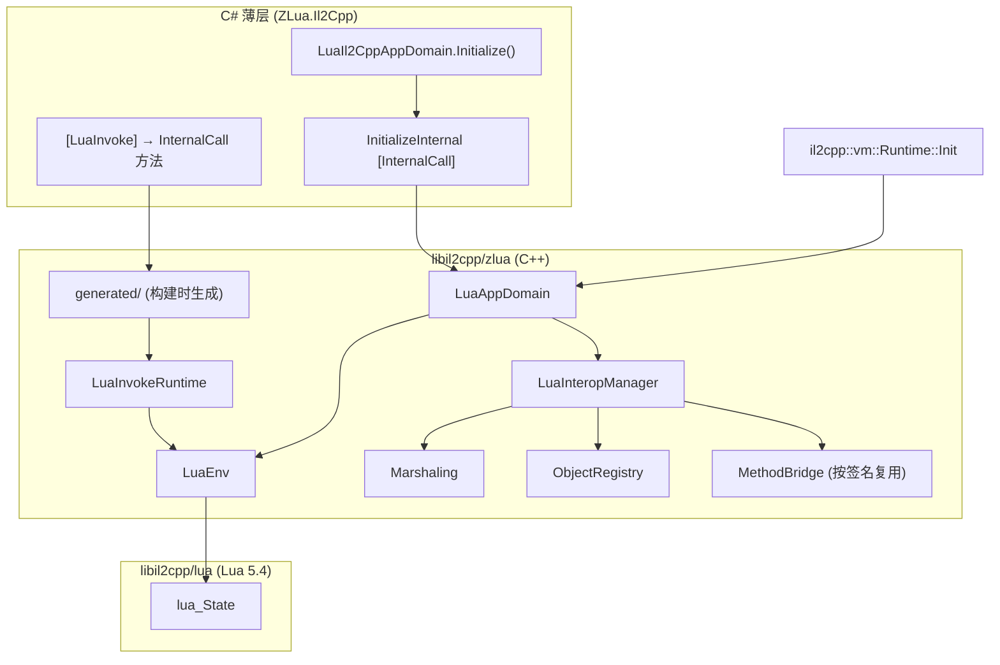

---
mdx:
  format: md
sidebar_position: 1
title: Il2Cpp 架构
description: ZLua 在 Il2Cpp 发布模式下的 C++ 实现方案。
---

# ZLua Il2Cpp 设计规范

本文档描述 ZLua 在 Il2Cpp 发布模式下的 C++ 实现方案，与 `DESIGN_SPEC.md` 中的总体设计目标保持一致。

---

## 1. 总体架构



### 1.1 设计原则

| 层级 | 职责 |
|------|------|
| C# | 仅门面 + InternalCall 声明，无反射、无 P/Invoke |
| C++ | 直接调用 lua API、通过 Il2Cpp 元数据访问类型/方法、通过 `methodPointer` 调用 |
| Editor | Player 构建前扫描 `[LuaInvoke]`、生成 C++ 绑定与桥接表 |

### 1.2 与 Mono 的分工

- **Editor / Mono**：`ZLua.Mono` 中的 `LuaMonoAppDomain`、`LuaEnv`、`LuaManagerObject` 等，基于反射与 P/Invoke，用于开发调试。
- **Player / Il2Cpp**：`ZLua.Il2Cpp` 仅保留极薄 C# 门面；对应逻辑全部在 `libil2cpp/zlua` 中以 C++ 实现。

C# 入口：

```csharp
public static class LuaIl2CppAppDomain
{
    [MethodImpl(MethodImplOptions.InternalCall)]
    private static extern void InitializeInternal(Func<string, string> moduleLoader);

    public static void Initialize(Func<string, string> moduleLoader)
    {
        InitializeInternal(moduleLoader);
    }
}
```

---

## 2. 源码目录结构

源码位于 `libil2cpp/zlua/`（Package 内路径为 `ZLua~/libil2cpp-2022/zlua/`），与 `libil2cpp/lua` 一同由 Unity 构建系统编译进 libil2cpp。

```
zlua/
├── LuaAppDomain.h/cpp          # 入口：IC 注册、Initialize/Shutdown
├── LuaEnv.h/cpp                # lua_State 生命周期、模块加载
├── LuaInteropManager.h/cpp     # CSharp 根表、程序集/类型懒注册、lua C 回调
├── LuaInvokeRuntime.h/cpp      # [LuaInvoke] 泛型 Call 模板（默认 marshal）
├── Marshaling.h/cpp            # Lua ↔ Il2Cpp 类型 push/pop
├── ObjectRegistry.h/cpp        # userdata 存 Il2CppObject* + GC root 列表
├── MethodBridge.h/cpp          # 按签名的通用桥接调用框架
├── BuiltinScripts.h/cpp        # 嵌入 globals.lua / zlualib.lua 的 dostring
├── MetadataUtil.h/cpp          # Type/Method/Field 元数据查询辅助
└── generated/                  # 构建时生成（写入 build 输出，不提交版本库）
    ├── LuaInvokeSites.h/cpp    # kSite_* 常量 + InitLuaInvokeSites()
    ├── LuaInvokeBindings.cpp   # IC 函数 + RegisterInternalCalls()
    └── MethodBridges.cpp       # Demo 所需签名的桥接函数表
```

`libil2cpp/vm/Runtime.cpp` 已 `#include "zlua/LuaAppDomain.h"`，需在 `Runtime::Init` 早期调用 `zlua::LuaAppDomain::Initialize()` 注册 InternalCall。

---

## 3. 启动与初始化流程

```
il2cpp::vm::Runtime::Init()
  └─ zlua::LuaAppDomain::Initialize()
       ├─ RegisterInternalCalls()              // InitializeInternal + generated IC
       └─ RegisterGeneratedBindings()         // generated/ 中的 [LuaInvoke] IC

[C#] Bootstrap.InitZLuaOnStartup()
  └─ LuaAppDomain.Initialize(moduleLoader)
       └─ LuaIl2CppAppDomain.InitializeInternal(moduleLoader)  // InternalCall
            ├─ 保存 Func<string,string> delegate（moduleLoader）
            ├─ LuaEnv::Create() → luaL_newstate + luaL_openlibs
            ├─ BuiltinScripts::LoadGlobals()      // 嵌入的 globals.lua
            ├─ LuaInteropManager::RegisterZLuaApi()
            ├─ BuiltinScripts::LoadZLuaLib()   // 嵌入的 zlualib.lua
            ├─ InitLuaInvokeSites()               // 解析 module/func ref
            └─ 注册 print 等基础全局函数
```

**moduleLoader**：C++ 通过 `il2cpp::vm::Runtime::Invoke` 调用 C# `Func<string,string>`，传入模块名，返回 lua 源码，与 Mono 语义一致。

---

## 4. 核心模块设计

### 4.1 LuaEnv（对应 Mono `LuaEnv.cs`）

职责：

- 持有全局 `lua_State*`
- `EnsureModuleLoaded(moduleName)`：调用 moduleLoader → loadstring → pcall → 缓存 registry ref
- 模块/函数 ref 缓存（`moduleName::methodName`）
- 提供 `GetState()` 供其他模块使用

### 4.2 LuaInteropManager（对应 Mono `LuaManagerObject.cs`）

**CSharp 根表结构（与 Mono 一致）：**

```
CSharp                          -- 全局表，__index → 懒加载程序集
  └─ Assembly-CSharp            -- 程序集表，__index → 懒加载类型
       └─ Demo                  -- 类型表
            ├─ Add / Multi     -- 静态方法 closure
            ├─ __call          -- 构造函数
            └─ __instance_mt   -- 实例方法 metatable
```

**Il2Cpp 与 Mono 的实现差异：**

| 能力 | Mono（当前） | Il2Cpp（目标） |
|------|-------------|----------------|
| 查类型 | `Assembly.GetType` / 反射 | `il2cpp_class_from_name` + MetadataCache |
| 调方法 | `MethodInfo.Invoke` | `MethodInfo::methodPointer` 直接调用 |
| userdata | GCHandle | `Il2CppObject*` + ObjectRegistry GC root |
| 静态方法 id | 运行时递增 id | 构建时或首次注册时绑定 MethodInfo |

**MVP 支持范围（Bootstrap + Demo/app.lua）：**

- 静态方法：`Add(int,int)`, `Multi(int,int)`
- 实例：`Demo()` 构造、`GetX()`, `Run(int)`
- 基础类型：int, bool, string, void

### 4.3 ObjectRegistry

设计 spec 要求：为托管对象生成 lua userdata 时，userdata 中直接记录 object 指针；native 维护 object 列表并注册为 GC roots；lua 释放 userdata 时从列表清除。

```cpp
// userdata layout: [ Il2CppObject* ]
struct ObjectRegistry {
    void Track(Il2CppObject* obj);      // 加入 GC root 列表
    void Untrack(Il2CppObject* obj);    // lua __gc 时移除
};
```

### 4.4 MethodBridge（签名复用）

相同签名的 C# 方法复用同一桥接函数，类似 HybridCLR：

```
桥接函数示例：
  void Bridge_void_int_int(Il2CppMethodPointer target, lua_State* L, int argStart);
  int32_t Bridge_int_int_int(Il2CppMethodPointer target, lua_State* L, int argStart);
```

- MVP：手写 Demo 所需常见签名桥
- 构建时 `MethodBridges.cpp` 生成桥接表
- 后续扩展为 Editor 扫描所有 MethodInfo 签名自动生成

### 4.5 内置 Lua 脚本

**策略：构建时嵌入 C++ 字符串**（不依赖 `Resources.Load`）。

构建时将 `globals.lua`、`zlualib.lua` 转为 C 字符串常量，初始化时 `luaL_dostring`：

```cpp
static const char kGlobalsLua[] = R"(...)";
static const char kZLuaLib[] = R"(...)";
```

---

## 5. LuaInvokeBinding 设计

### 5.1 Player 构建链路

```
[LuaInvoke("app","main")] extern void AppMain()
    ↓ LuaInvokeWeaver（已有）
[MethodImpl(InternalCall)] extern void AppMain()   // 移除 [LuaInvoke]
    ↓ Editor Codegen（新增）
generated/LuaInvokeBindings.cpp:
    static void IC_Bootstrap_AppMain() { ... }
    InternalCalls::Add("Bootstrap::AppMain", ...);
```

C# → Lua 调用链：C# 调用 InternalCall → C++ push 参数到 lua → pcall lua 函数 → pop 返回值回 C#。

### 5.2 效率优化：默认 marshal vs 非默认 marshal

| 分类 | 判定 | 生成策略 | 性能目标 |
|------|------|----------|----------|
| **默认 marshal** | 参数/返回值均无 `[LuaMarshalAs]`，或为 `LuaMarshalType.Default` | 生成 **一行** InternalCall 包装，调用 **模板化** `LuaInvokeRuntime::Call` | 与完全展开的手写代码 **等价**（内联 + 编译期类型） |
| **非默认 marshal** | 任意参数/返回值/方法级 `[LuaMarshalAs]` ≠ Default | 生成 **完整、精确** 的 push/pcall/pop 代码 | 零泛型分支，按声明的 marshal 语义直出 |

类比：默认 marshal ≈ blittable P/Invoke；非默认 marshal ≈ `[MarshalAs]` 专用 stub。

### 5.3 默认 marshal：泛型 `LuaInvokeRuntime::Call`

#### API 形态

```cpp
namespace zlua {

struct LuaInvokeSite {
    int moduleRef;
    int funcRef;
};

template<typename Ret, typename... Args>
IL2CPP_FORCE_INLINE Ret Call(const LuaInvokeSite& site, Args... args);

template<typename... Args>
IL2CPP_FORCE_INLINE void Call(const LuaInvokeSite& site, Args... args); // Ret = void

}
```

#### 生成的 ThinBinding（仅一行）

```cpp
// Bootstrap::AppAdd(int,int)  [LuaInvoke("app","add")]
static int32_t IC_Bootstrap_AppAdd(int32_t a, int32_t b)
{
    return zlua::LuaInvokeRuntime::Call<int32_t>(
        zlua::kSite_Bootstrap_AppAdd, a, b);
}

// Bootstrap::AppMain()  [LuaInvoke("app","main")]
static void IC_Bootstrap_AppMain()
{
    zlua::LuaInvokeRuntime::Call(zlua::kSite_Bootstrap_AppMain);
}
```

InternalCall 入口仍 **按方法生成**（签名必须与 C# 一致），函数体交给可内联的模板。

#### 模板实现要点

```cpp
namespace detail {

template<typename T> IL2CPP_FORCE_INLINE void PushDefault(lua_State* L, T v);
template<> IL2CPP_FORCE_INLINE void PushDefault<int32_t>(lua_State* L, int32_t v) {
    lua_pushinteger(L, v);
}
template<> IL2CPP_FORCE_INLINE void PushDefault<bool>(lua_State* L, bool v) {
    lua_pushboolean(L, v ? 1 : 0);
}
// int64, float, double, Il2CppString* ...

template<typename T> IL2CPP_FORCE_INLINE T PopDefault(lua_State* L, int idx);
// 同理特化

}

template<typename Ret, typename... Args>
IL2CPP_FORCE_INLINE Ret Call(const LuaInvokeSite& site, Args... args)
{
    lua_State* L = LuaEnv::GetState();
    const int top = lua_gettop(L);

    lua_rawgeti(L, LUA_REGISTRYINDEX, site.funcRef);
    (detail::PushDefault<Args>(L, args), ...);
    lua_pcall(L, sizeof...(Args), 1, 0);

    Ret ret = detail::PopDefault<Ret>(L, -1);
    lua_settop(L, top);
    return ret;
}
```

**与完全生成代码性能等价的原因：**

1. `PushDefault<T>` / `PopDefault<T>` 是编译期特化，无运行时 type dispatch
2. `IL2CPP_FORCE_INLINE` + 单行 wrapper → IC 入口与模板体通常合并为同一函数
3. `sizeof...(Args)`、`site.funcRef` 均为编译期常量
4. 无 `object[]`、无 boxing、无反射、无虚调用

#### LuaInvokeSite 构建期注册

Codegen 在 Initialize 阶段（非每次 Call）完成 module/func ref 解析：

```cpp
// generated/LuaInvokeSites.cpp
const LuaInvokeSite kSite_Bootstrap_AppAdd = { .moduleRef = 3, .funcRef = 7 };

void InitLuaInvokeSites()
{
    // EnsureModuleLoaded("app") → moduleRef
    // 从 module table 取 "add" → funcRef
}
```

默认 marshal 的 Call 路径不做字符串查找，与完全生成代码一致。

### 5.4 非默认 marshal：精确代码生成（FullBinding）

Codegen 扫描 `[LuaMarshalAs]`（Parameter / ReturnValue / Method），只要有一处 ≠ Default，整方法走专用 stub，**不调用**泛型 `Call`。

#### 判定规则

```
For each [LuaInvoke] method:
  if any(param[i].LuaMarshalAs != Default
      || returnValue.LuaMarshalAs != Default
      || method.LuaMarshalAs != Default):
      → emit FullBinding
  else:
      → emit ThinBinding (one-line template Call)
```

#### 生成示例

```csharp
[LuaInvoke("app", "getHandle")]
[return: LuaMarshalAs(LuaMarshalType.LightUserData)]
private static extern IntPtr GetHandle(int id);

[LuaInvoke("app", "setName")]
private static extern void SetName(
    [LuaMarshalAs(LuaMarshalType.CString)] string name);
```

生成：

```cpp
static void* IC_Bootstrap_GetHandle(int32_t id)
{
    lua_State* L = zlua::LuaEnv::GetState();
    const int top = lua_gettop(L);
    const auto& site = zlua::kSite_Bootstrap_GetHandle;

    lua_rawgeti(L, LUA_REGISTRYINDEX, site.funcRef);
    lua_pushinteger(L, id);
    zlua::Marshaling::LuaPCall(L, 1, 1);

    void* handle = zlua::Marshaling::PopLightUserData(L, -1);
    lua_settop(L, top);
    return handle;
}

static void IC_Bootstrap_SetName(Il2CppChar* name)
{
    lua_State* L = zlua::LuaEnv::GetState();
    const int top = lua_gettop(L);
    const auto& site = zlua::kSite_Bootstrap_SetName;

    lua_rawgeti(L, LUA_REGISTRYINDEX, site.funcRef);
    zlua::Marshaling::PushCString(L, name);
    zlua::Marshaling::LuaPCall(L, 1, 0);
    lua_settop(L, top);
}
```

#### Marshal 语义映射

| `LuaMarshalType` | Push | Pop |
|------------------|------|-----|
| `Default` | `PushDefault<T>` 模板特化 | `PopDefault<T>` 模板特化 |
| `Integer` | `lua_pushinteger` | `lua_tointeger` |
| `Number` | `lua_pushnumber` | `lua_tonumber` |
| `CString` | `Marshaling::PushCString` | `Marshaling::PopCString` |
| `UserData` | `Marshaling::PushUserData` | `Marshaling::PopUserData` |
| `LightUserData` | `lua_pushlightuserdata` | `lua_touserdata` |

---

## 6. Editor 构建管线

```
IPreprocessBuild / IL2CPP 前:
  1. 扫描 Player 程序集，收集 [LuaInvoke(module, method)] + 方法签名 + LuaMarshalAs
  2. 分类 ThinBinding / FullBinding
  3. 扫描 Demo 相关 MethodInfo，收集所需 MethodBridge 签名
  4. 读取 globals.lua + zlualib.lua，生成嵌入字符串
  5. 生成到 build 输出目录:
     build-win64/Il2CppOutputProject/IL2CPP/libil2cpp/zlua/generated/
       ├── LuaInvokeSites.h/cpp
       ├── LuaInvokeBindings.cpp
       ├── MethodBridges.cpp
       └── BuiltinScripts.inc
  6. 生成 RegisterGeneratedBindings() 供 LuaAppDomain::Initialize 调用
```

**生成代码位置**：写入 **build 输出**（`build-win64/.../libil2cpp/zlua/generated/`），不提交到 Package。每次 Player Build 前清空并重新生成。

**sync-runtime.bat**：同步 libil2cpp 时排除 `lua/` 目录；`generated/` 由构建流程生成，不被 sync 覆盖。

---

## 7. InternalCall 注册清单（MVP）

| InternalCall 名称 | 实现 |
|-------------------|------|
| `ZLua.LuaIl2CppAppDomain::InitializeInternal` | 创建 LuaEnv、加载内置脚本、InitLuaInvokeSites |
| 各 `[LuaInvoke]` 方法（generated） | ThinBinding 或 FullBinding |

C# 侧 `LuaIl2CppAppDomain` 保持薄层，MVP 不暴露 `RegisterType` 等额外 API。

---

## 8. 分阶段实施计划

### Phase 1 — 基础设施

- `LuaAppDomain` 完整 Initialize + `Runtime.cpp` 挂钩
- `LuaEnv` + moduleLoader
- `LuaInvokeRuntime` 泛型 Call + `Marshaling` 默认类型特化
- Editor Codegen：ThinBinding / FullBinding 分类与生成
- `BuiltinScripts` 嵌入加载
- 跑通 `AppMain()` + `AppAdd(10,20)`

### Phase 2 — CSharp 互操作（Demo 完整场景）

- `LuaInteropManager`：CSharp 懒注册
- `MethodBridge` + `ObjectRegistry`
- 跑通 `app.lua` 中 `test_call_static_method` / `test_call_instance_method`

### Phase 3 — 增强

- signature 重载（`zlua.signature`）
- `make_generic_type`
- 字段直接 offset 访问
- 完整 MethodBridge 自动生成

---

## 9. 与现有组件的关系

| 组件 | 状态 | Il2Cpp 侧处理 |
|------|------|--------------|
| `LuaInvokeWeaver.cs` | 已实现 Player → InternalCall | 保持不变，Codegen 扫描源程序集 |
| `LuaAppDomain.cpp` | 骨架 | 扩展为完整实现 |
| `sync-runtime.bat` | 同步 libil2cpp | 排除 `lua/`；`generated/` 由构建生成 |
| `link.xml` preserve ZLua.Il2Cpp | 已有 | 保持 |
| Mono `LuaManagerObject` | 反射原型 | C++ 用 metadata + methodPointer 重写 |

---

## 10. 约定与假设

1. **generated/ 生命周期**：每次 Player Build 前清空并重新生成；build 目录不存在则报错提示先构建 Il2Cpp。
2. **错误处理**：lua/C# 异常统一 `luaL_error` + C# `Exception` 包装（与 Mono Debug.Log 行为对齐）。
3. **线程模型**：MVP 假设主线程单 lua_State（与 Unity 主线程 Bootstrap 一致）。
4. **Editor vs Player 语义一致**：Editor 走 Mono（含 `object[]` boxing）；Player 走上述优化路径，性能分层但行为一致。
