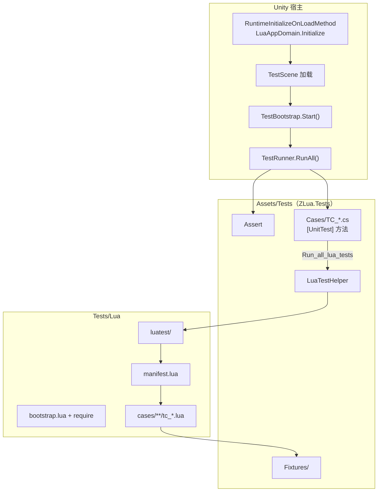

---
mdx:
  format: md
sidebar_position: 3
title: 测试框架
description: 5 分钟跑通 ZLua 测试；完整 Runner 设计见下文。
---

# 测试框架

## 快速上手（约 5 分钟）

ZLua 使用 **自研 Runner**（不依赖 Unity Test Framework），同一套用例在 **Editor（Mono）** 与 **Player（Il2Cpp）** 各跑一遍。

### 前置

- 克隆含 `ZLuaTest` 的 zlua 主仓库测试工程（或本地已配置 `TestScene`）
- 已安装 ZLua UPM 包

### Editor 跑测试

1. 打开 Unity，加载 **TestScene**（非 Demo 的 SampleScene）
2. 点击 **Play**
3. Console 查看输出，末尾应有：

```text
[SUMMARY] total=..., passed=..., failed=0
```

### Il2Cpp 验证（可选）

1. Build Settings 首场景设为 **TestScene**
2. Build Il2Cpp Player
3. 命令行 `-batchmode -nographics` 运行，**exit code 0** 为通过

### 测试什么

| 层级 | 内容 |
|------|------|
| C# `[UnitTest]` | 纯 C#、`[LuaInvoke]` 探针 |
| Lua `luatest` | 互操作主路径：`test_*` 函数 + manifest 注册 |
| Fixtures | `CSharp['ZLua.Tests']` 下的边界类型 |

失败时 Console 会输出 `TypeName.MethodName` 或 `suite/tc_*.test_name` 便于定位。

### 与 Demo 的关系

| 工程 | 用途 |
|------|------|
| **zlua-demo** | 文档 canonical 最小示例（Smoke） |
| **ZLuaTest** | 全量正确性回归 |

文档示例以 [zlua-demo](https://github.com/focus-creative-games/zlua-demo) 为准；语义正确性以 ZLuaTest 为准。

---

## 完整规范

以下为测试框架 **设计规范**（原 `TEST_FRAMEWORK.md`），供贡献者与实现者查阅。

本文档描述 ZLua **正确性测试**的目录布局、C# 自研 Runner、Lua 用例组织与执行方式。测试框架**不依赖 Unity Test Framework**，**不包含 benchmark**。

**相关文档：**

| 文档 | 内容 |
|------|------|
| `../design-spec.md` | 双运行时（Mono / Il2Cpp）总体架构 |
| `../type-system-spec.md` | 类型访问、泛型、数组、继承 |
| `../method-overload-spec.md` | 方法重载 dispatch |
| `../marshal/index.md` | 参数编组 |
| `../marshal/function.md` | Delegate、Lua 回调 |
| `../community/roadmap.md` | v1 功能清单与里程碑 |

**平台原则：** 同一套用例在 **Editor（Mono）** 与 **Player（Il2Cpp）** 下各运行一次；框架**不区分**具体实现，无 `skip` / `xfail` / `mono_only` 等运行时分支——任一后端失败即失败。

---

## 1. 设计目标

| 目标 | 说明 |
|------|------|
| **正确性** | 验证 Lua↔C# 互操作语义与各 spec 一致 |
| **双端一致** | Mono 与 Il2Cpp 共用同一程序集、同一 Lua 脚本、同一 pass/fail 标准 |
| **可回归** | 场景 Play 或 batchmode Player 一键跑全量 |
| **可定位** | 失败输出 `TypeName.MethodName` 与异常信息 |
| **实现无关** | Runner 只依赖 `LuaAppDomain` 等公开 API，不感知 Mono / Il2Cpp 分支 |

C# 测试基础设施对齐 [LeanCLR 测试 Common](https://github.com/focus-creative-games/hybridclr) 中的 `Assert`、`UnitTestAttribute`、`TestRunner`（反射扫描 + 逐方法 `Invoke`）模式。

---

## 2. 目录与程序集

测试资源分布在 **Package 文档** 与 **ZLuaTest 工程** 两处：

```
ZLuaTest/                          # Unity 工程根
├── Tests/                            # Lua 用例（非 Assets）
│   └── Lua/
│       ├── luatest/                  # Lua 测试框架（luatest）
│       │   ├── init.lua
│       │   ├── assert.lua
│       │   ├── runner.lua
│       │   ├── run_all.lua
│       │   └── helpers/
│       ├── bootstrap.lua
│       ├── manifest.lua              # 套件 / 模块注册表
│       └── cases/                    # tc_*.lua 用例模块
│           ├── type_system/
│           ├── method_overload/
│           ├── marshal/
│           ├── function_marshal/
│           └── luainvoke/
│
├── Assets/
│   ├── Tests/                        # C# 测试程序集（独立 asmdef）
│   │   ├── ZLua.Tests.asmdef
│   │   ├── Common/                   # 框架
│   │   ├── Fixtures/                 # 供 Lua 调用的 C# 类型
│   │   ├── Cases/                    # TC_* 测试类
│   │   └── TestBootstrap.cs          # 场景入口
│   ├── Scenes/
│   │   └── TestScene.unity           # 测试专用场景
│   └── Editor/
│       └── SyncTestsLuaToStreamingAssets.cs
│
Packages/com.code-philosophy.zlua/
└── Docs/
    └── TEST_FRAMEWORK.md             # 本文档
```

| 位置 | 内容 |
|------|------|
| `ZLuaTest/Tests/Lua/` | Lua 测试脚本 |
| `Assets/Tests/` | 全部 C# 测试代码（**单一程序集** `ZLua.Tests`） |
| `Packages/.../Docs/` | 设计规范（本文档） |

Fixture 类型、Runner、断言与用例类**同处** `ZLua.Tests` 程序集；Lua 侧通过 `CSharp['ZLua.Tests']` 访问 Fixture。

---

## 3. 总体架构



**三层：**

1. **Fixture 层**（C#，`Fixtures/`）：构造边界类型，供 Lua 调用。
2. **Lua 用例层**（`Tests/Lua/cases/`）：`test_*` 函数 + `luatest` 断言；由 **`luatest.runner`** 发现与执行。
3. **C# Runner 层**（`TestRunner.cs`）：反射跑 C# `[UnitTest]`；互操作测试仅 **`TC_LuaTestHost.Run_all_lua_tests`** 一条入口委托给 Lua Runner。

---

## 4. C# 框架（Common/）

### 4.1 `Assert.cs`

与 LeanCLR `Assert` 对齐，提供：

| API | 说明 |
|-----|------|
| `Fail` / `Fail(string)` | 显式失败 |
| `IsTrue` / `IsFalse` / `True` / `False` | 布尔断言 |
| `Null` / `NotNull` | 引用断言 |
| `Equal` | 重载：`int`、`long`、`float`、`double`、`string`、`bool`、`Type`、`char`、`T` 等 |
| `NotEqual` / `EqualAny` | 不等 / 任意对象相等 |
| `ExpectException<T>(Action)` | 期望抛出指定异常 |

失败时 `Debugger.Log` 并抛异常；Runner 捕获后记 `[FAIL]`。

### 4.2 标记属性

```csharp
[AttributeUsage(AttributeTargets.Method)]
public class UnitTestAttribute : Attribute { }

[AttributeUsage(AttributeTargets.Class | AttributeTargets.Method)]
public class IgnoreTestAttribute : Attribute { }
```

- `[UnitTest]`：标记测试方法；须为 `void`、无参数；实例或静态均可。
- `[IgnoreTest]`：跳过整个类或单个方法（用于临时禁用，**不**用于区分 Mono / Il2Cpp）。

### 4.3 `TestCaseBase.cs`

```csharp
public abstract class TestCaseBase { }
```

测试类可选继承，便于日后扩展 `[SetUp]` 等钩子；当前为空基类。

### 4.4 `TestRunner.cs`

逻辑对齐 LeanCLR `RunTests/Program.cs`：

1. 扫描目标程序集（至少 `ZLua.Tests`）。
2. 跳过带 `[IgnoreTest]` 的类。
3. 收集带 `[UnitTest]` 且签名合法的方法。
4. 实例方法：`Activator.CreateInstance(type)`；失败记 `[FAIL]`。
5. `method.Invoke`；`TargetInvocationException` 取 `InnerException`。
6. 输出 `[PASS]` / `[FAIL]` / `[SUMMARY] total=…, passed=…, failed=…`。
7. 返回是否全部通过；batchmode Player 下 `failed > 0` 时 `Application.Quit(1)`。

**RunAll 开始前**调用 `LuaTestHelper.EnsureInitialized()`，保证 Lua 状态与 `bootstrap.lua` 已就绪。

### 4.5 `LuaTestHelper.cs`（ZLua 专用）

仅依赖 `LuaAppDomain` 等公开 API，与 Mono / Il2Cpp 实现无关：

| API | 说明 |
|-----|------|
| `EnsureInitialized()` | 幂等；确保 `LuaAppDomain` 已初始化、加载 `bootstrap.lua`（依赖 ZLua 内置 `require`） |
| `RunModule(string module)` | 加载并执行 `Tests/Lua/{module}.lua` |
| `RunChunk(string lua)` | 执行 Lua 片段；Lua `error` → C# 异常 → 用例 fail |
| `Call<T>(…)` | C# 调 Lua（配合 `[LuaInvoke]` 探针） |

---

## 5. 场景入口与启动顺序

### 5.1 `TestBootstrap.cs`

挂载于 `TestScene` 中某 `GameObject`：

```csharp
public class TestBootstrap : MonoBehaviour
{
    void Start()
    {
        bool ok = TestRunner.RunAll();
#if !UNITY_EDITOR
        if (!ok)
            Application.Quit(1);
#endif
    }
}
```

### 5.2 启动顺序

```text
RuntimeInitializeOnLoadMethod (BeforeSceneLoad)
  → LuaAppDomain.Initialize(moduleLoader)

TestScene 加载完成
  → TestBootstrap.Start()
  → TestRunner.RunAll()
```

- **Demo 场景**（`SampleScene` + `Bootstrap.cs`）与测试场景分离，互不干扰。
- **CI / Il2Cpp 验证**：Build Settings 首场景设为 `TestScene`；Player 以 `-batchmode -nographics` 运行，检查进程退出码。

---

## 6. Lua 模块加载

| 环境 | 路径 |
|------|------|
| Editor | `{ProjectRoot}/Tests/Lua/{module}.lua` |
| Player | `StreamingAssets/Tests/Lua/{module}.lua.txt` |

`moduleLoader` 按模块名查找；路径规则与现有 `LuaScripts/` 一致（Editor 读源文件，Player 读 `.lua.txt`）。

构建前由 `SyncTestsLuaToStreamingAssets`（Editor 脚本）将 `Tests/Lua/**/*.lua` 同步到 StreamingAssets；模式同 `SyncLuaScriptsToStreamingAssets`。

### 6.1 `require` 与 `bootstrap.lua`

`LuaAppDomain.Initialize(moduleLoader)` 时，`LuaEnv.SetModuleLoader` 会向 `package.searchers` 注册 ZLua 模块 searcher（位置 2），并通过 C# 回调 `__zlua_load_module` 调用 `moduleLoader`：

- 模块名 `a.b.c` → 文件 `Tests/Lua/a/b/c.lua`（Player 为 `.lua.txt`）
- 结果由标准 `require` 缓存于 `package.loaded`
- C# 侧 `EnsureModuleLoaded` / `RunLuaFunc` 同样走 Lua `require`，并要求模块返回 **table**

`bootstrap.lua` 在框架加载前执行：

```lua
CSharp.T = CSharp['ZLua.Tests']
local luatest = require("luatest/init")
_G.luatest = luatest
```

---

## 7. Lua 测试框架（luatest）

Lua 侧测试基础设施，与 C# `Assert` / `[UnitTest]` / `TestRunner` **同构**。互操作正确性用例**全部写在 Lua**；C# 仅保留 `TC_LuaTestHost.Run_all_lua_tests` 单入口。

### 7.1 目录

```
Tests/Lua/luatest/
├── init.lua              # 导出 luatest 表
├── assert.lua            # 断言 API
├── runner.lua            # 发现、执行、汇总
├── run_all.lua           # C# RunModule 入口
└── helpers/
    └── type_system.lua   # 领域 helper（如 assert_type_name）
Tests/Lua/manifest.lua    # 套件 → 模块列表
Tests/Lua/cases/{suite}/tc_*.lua
```

### 7.2 `luatest.assert`

| API | 说明 |
|-----|------|
| `fail(msg?)` | 显式失败 |
| `is_true(v)` / `is_false(v)` | 布尔 |
| `equal(a, b)` / `not_equal(a, b)` | 相等 / 不等 |
| `not_nil(v)` / `is_nil(v)` | 空值 |
| `expect_error(fn, pattern?)` | 期望 `pcall` 失败 |

失败统一 `error(msg, 2)`；**不使用** Lua 原生 `assert()` 编写用例。

### 7.3 用例约定（类比 `[UnitTest]`）

每个 `cases/{suite}/tc_*.lua` **return 模块表**，其中 **`test_` 前缀** 函数为一条用例：

```lua
local types = require("luatest/helpers/type_system")
local TF = CSharp['ZLua.Tests']

local M = {}

function M.test_mscorlib_int32()
    types.assert_type_name(CSharp.mscorlib['System.Int32'], "System.Int32")
end

return M
```

- 用例 id：`{suite}/{tc_basename}.{test_name}`，例如 `type_system/tc_csharp_path.test_mscorlib_int32`
- 忽略：函数改名为 `ignore_test_*`，或从 `manifest.lua` 移除模块

### 7.4 `luatest.runner`

| API | 说明 |
|-----|------|
| `run_all()` | 跑 `manifest.lua` 全部套件；打印 Lua `[SUMMARY]` |
| `run_suite(name)` | 跑单个套件 |
| `run_module(path)` | 跑单个 `tc_*.lua` 模块 |

`run_all()` 返回：

```lua
{ total, passed, failed, success, failures = { { id, message }, ... } }
```

`failed > 0` 时 `luatest/run_all.lua` **`error`**，C# `TestRunner` 记 `[FAIL]`。

### 7.5 `manifest.lua`

```lua
return {
    suites = {
        type_system = {
            "cases/type_system/tc_csharp_path",
            "cases/type_system/tc_generic_type",
            "cases/type_system/tc_array_type",
        },
    },
}
```

新增用例：添加 `tc_*.lua` 并在 manifest 注册；**不扫描文件系统**（Editor / Player 一致）。

### 7.6 C# 入口

```csharp
public class TC_LuaTestHost : TestCaseBase
{
    [UnitTest]
    public void Run_all_lua_tests()
    {
        LuaTestHelper.RunModule("luatest/run_all");
    }
}
```

Console 先输出 Lua 侧逐条 `[PASS]`/`[FAIL]` 与 `[SUMMARY]`，再输出 C# 侧 `[PASS] TC_LuaTestHost.Run_all_lua_tests` 与总 `[SUMMARY]`。

### 7.7 与 C# 框架对照

| C# | Lua（luatest） |
|----|----------------|
| `Assert.Equal` | `luatest.assert.equal` |
| `[UnitTest]` | `function M.test_*()` |
| `[IgnoreTest]` | `ignore_test_*` / manifest 注释 |
| `TestRunner.RunAll` | `luatest.runner.run_all()` |
| `TestAssemblyMarker` + 反射 | `manifest.lua` |
| `TC_*` 类 | `cases/**/tc_*.lua` 模块 |

---

## 8. 用例编写模式（C# 补充）

### 8.1 模式 A：纯 C#（LeanCLR 风格）

适用于 **C# 调 Lua（`[LuaInvoke]`）** 或纯 C# 可验证逻辑：

```csharp
public class TC_LuaInvoke : TestCaseBase
{
    [LuaInvoke("test_luainvoke", "add")]
    static extern int Add(int a, int b);

    [UnitTest]
    public void Add_returns_sum()
    {
        Assert.Equal(30, Add(10, 20));
    }
}
```

### 8.2 模式 B：Lua 互操作（主路径，推荐）

见 **§7 Lua 测试框架**。新增互操作测试 = 新建 `tc_*.lua` + `test_*` + manifest 注册。

### 8.3 模式 C：C# 内嵌 Lua 片段

适用于短小场景：

```csharp
[UnitTest]
public void Quick_check()
{
    LuaTestHelper.RunChunk([[
        assert(CSharp.T.Fixtures.BasicTypes.Pi > 3)
    ]]);
}
```

**约定：** 互操作相关用 **§7 luatest**；`LuaInvoke` 反向探针用 **模式 A**；临时调试可用 **模式 C**。

---

## 9. Fixtures（`Assets/Tests/Fixtures/`）

public 类型，成员 public，供 Lua 与 C# 共用。按 spec 分模块：

| Fixture 类 | 对应文档 |
|------------|----------|
| `BasicTypes` | `../marshal/index.md` 基元 |
| `StructBox` | `../marshal/struct.md` |
| `ClassHierarchy` | `../type-system-spec.md` §5 继承 |
| `NamespacedTypes` / `MyGame.UI.Panel` | `../type-system-spec.md` §2.2 |
| `GenericFixtures` | `../type-system-spec.md` §2.5–§2.6 |
| `OverloadDemo` | `../method-overload-spec.md` |
| `ArrayFixtures` | `../type-system-spec.md` §7、`../lib-spec.md` §6 |
| `DelegateFixtures` | `../marshal/function.md` |
| `PropertyFixtures` / `EventFixtures` | `../type-system-spec.md` §4 |

约定：

- 类型带**可观测状态**（如 `Counter`、`LastCallArgs`），便于断言。
- 用例间通过实例化新对象或显式 Reset 避免顺序依赖。
- Fixture 程序集走 ZLua Codegen / Weaver，保证 Il2Cpp 桥接表完整。

---

## 10. 用例与 spec 映射

### 10.1 C# 用例（`Assets/Tests/Cases/`）

```
TC_LuaTestHost.cs          # Run_all_lua_tests（唯一 Lua 入口）
TC_LuaInvoke_*.cs          # 纯 C# / LuaInvoke 探针（按需）
```

### 10.2 Lua 用例（`Tests/Lua/cases/`）

```
type_system/tc_csharp_path.lua
type_system/tc_generic_type.lua
type_system/tc_array_type.lua
method_overload/
marshal/
function_marshal/
luainvoke/
```

每个 `tc_*.lua` 内多个 `test_*`；新增功能 **先写用例、再实现**。

---

## 11. 执行方式

| 场景 | 操作 |
|------|------|
| 日常开发（Mono） | 打开 `TestScene` → Play → Console 查看 `[SUMMARY]` |
| Il2Cpp 本地验证 | Build Player（`TestScene` 为首场景）→ 运行 |
| CI（可选） | Player `-batchmode -nographics` → 检查 exit code |

Runner 可在 `[SUMMARY]` 旁**只读**输出当前后端（Editor / Player）以便调试，**不参与** pass/fail 判定。

---

## 12. 与 Demo 工程的关系

| 现有 | 测试框架 |
|------|----------|
| `Assets/Bootstrap.cs` + `SampleScene` | 保留为 smoke demo |
| `LuaScripts/app.lua` | 不纳入 Runner |
| `Assets/Demo.cs` | 可逐步迁入 `Fixtures/`，或保留作最小示例 |

`ZLua.Tests.asmdef` 引用 ZLua 运行时程序集与 `UnityEngine`；**不引用** Unity Test Framework。

---

## 13. 实施分期

| 阶段 | 内容 |
|------|------|
| **P0** | C# `Common/*`、`TestRunner`、`TestScene`；`luatest` + `require` + `manifest` |
| **P1** | `Fixtures`、`SyncTestsLuaToStreamingAssets`、type_system `tc_*` |
| **P2** | 按 `../community/roadmap.md` v1 补全各 suite 的 `tc_*.lua` |

---

## 14. 实现清单（参考）

- [x] `ZLua.Tests.asmdef` 与程序集引用
- [x] C# `Common/*`（`Assert`、`TestRunner`、`LuaTestHelper`、`TestModuleLoader` 等）
- [x] `TestBootstrap.cs` + `TestScene.unity`
- [x] `luatest/`（assert、runner、run_all、helpers）
- [x] `manifest.lua` + `require`
- [x] `SyncTestsLuaToStreamingAssets.cs`
- [x] `TC_LuaTestHost.Run_all_lua_tests`
- [x] `Fixtures/TypeAccessFixtures.cs` + type_system `tc_*`
- [ ] 其余 spec 套件与 `../community/roadmap.md` v1 对齐
