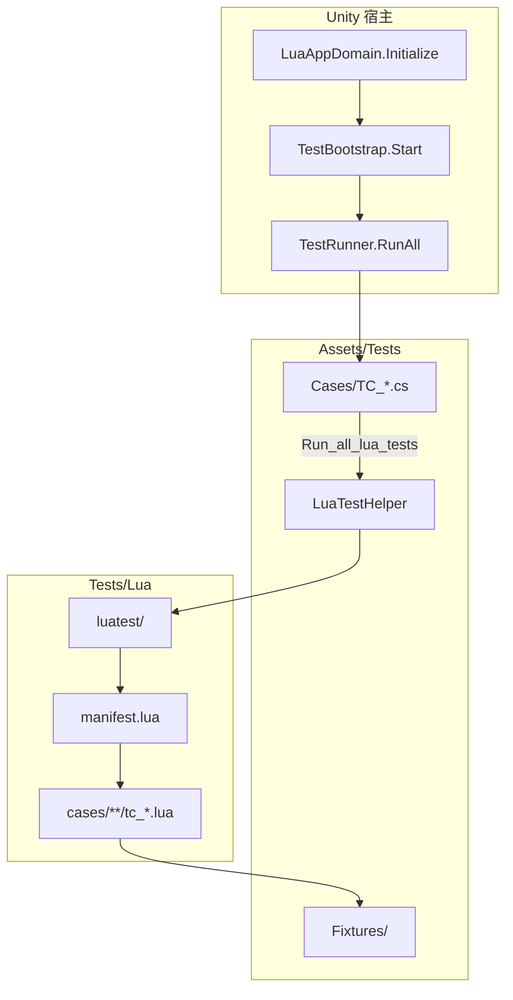

# 测试框架

> ZLua **正确性测试**的目录布局、C# Runner、Lua 用例组织与执行方式。  
> **原则：** 不依赖 Unity Test Framework；**不包含 benchmark**（性能见 [compare/PERFORMANCE.md](/docs/compare/PERFORMANCE/)）。

---

## 1. 设计目标

| 目标 | 说明 |
|------|------|
| **正确性** | 验证 Lua↔C# 互操作语义与各 `spec/**` 一致 |
| **双端一致** | Mono（Editor）与 Il2Cpp（Player）共用同一程序集、同一 Lua 脚本、同一 pass/fail 标准 |
| **可回归** | 场景 Play 或 batchmode Player 一键跑全量 |
| **可定位** | 失败输出用例 id 与异常信息 |
| **实现无关** | Runner 只依赖 `LuaAppDomain` 等公开 API |

C# 测试基础设施对齐 LeanCLR 测试 Common 中的 `Assert`、`UnitTestAttribute`、`TestRunner` 模式。

**平台原则：** 同一套用例在 **Editor** 与 **Player** 下各运行一次；框架 **不区分** 具体实现，无 `skip` / `xfail` / `mono_only` 等运行时分支——**任一后端失败即失败**。

---

## 2. 目录与程序集

```
ZLuaTest/                          # Unity 工程根
├── Tests/                            # Lua 用例（非 Assets）★ 只在此编辑 Lua
│   └── Lua/
│       ├── luatest/                  # Lua 测试框架
│       ├── bootstrap.lua
│       ├── manifest.lua              # 套件 / 模块注册表
│       └── cases/                    # tc_*.lua 用例模块
│
├── Assets/
│   ├── Tests/                        # C# 测试程序集 ZLua.Tests
│   │   ├── Common/
│   │   ├── Fixtures/
│   │   ├── Cases/
│   │   └── TestBootstrap.cs
│   ├── Scenes/TestScene.unity
│   └── Editor/
│       └── SyncTestsLuaToStreamingAssets.cs   # 构建自动同步，勿手改 StreamingAssets
│
Packages/com.code-philosophy.zlua/
└── Runtime/ ...
```

| 位置 | 内容 |
|------|------|
| `Tests/Lua/` | **唯一** Lua 测试编辑入口 |
| `Assets/Tests/` | 全部 C# 测试（`ZLua.Tests`） |
| `Assets/StreamingAssets/Tests/` | **构建产物**；`SyncTestsLuaToStreamingAssets` 自动生成 |

### ⚠️ Lua 脚本编辑规则

- **只改** `Tests/Lua/**`。
- **不要** 手动复制、同步或编辑 `Assets/StreamingAssets/Tests/**` 或 `build-win64/**/StreamingAssets/Tests/**`。
- 构建 / 预处理时 Editor 脚本会将 `Tests/Lua` 同步到 StreamingAssets；Player 从 `.lua.txt` 加载。

Fixture 类型与 Runner 同处 `ZLua.Tests`；Lua 侧通过 `CSharp['ZLua.Tests']` 访问 Fixture。

---

## 3. 总体架构


```mermaid
flowchart TB
    subgraph Unity["Unity 宿主"]
        Init["LuaAppDomain.Initialize"]
        TB["TestBootstrap.Start"]
        TR["TestRunner.RunAll"]
    end

    subgraph CS["Assets/Tests"]
        Cases["Cases/TC_*.cs"]
        Fix["Fixtures/"]
        LTH["LuaTestHelper"]
    end

    subgraph Lua["Tests/Lua"]
        LT["luatest/"]
        Manifest["manifest.lua"]
        Scripts["cases/**/tc_*.lua"]
    end

    Init --> TB --> TR
    TR --> Cases
    Cases -->|"Run_all_lua_tests"| LTH
    LTH --> LT
    LT --> Manifest --> Scripts
    Scripts --> Fix
```

**三层：**

1. **Fixture 层**（C#）：构造边界类型，供 Lua 调用。
2. **Lua 用例层**（`cases/`）：`test_*` + `luatest.assert`。
3. **C# Runner 层**：反射跑 `[UnitTest]`；互操作测试经 **`TC_LuaTestHost.Run_all_lua_tests`** 委托 Lua Runner。

---

## 4. C# 框架要点

### 4.1 `Assert` / `[UnitTest]` / `TestRunner`

- `[UnitTest]`：标记 `void` 无参测试方法。
- `[IgnoreTest]`：跳过类或方法（**不**用于区分 Mono/Il2Cpp）。
- `TestRunner.RunAll()`：扫描 `ZLua.Tests`，输出 `[PASS]`/`[FAIL]`/`[SUMMARY]`；Player batchmode 失败时 `Application.Quit(1)`。
- RunAll 前调用 `LuaTestHelper.EnsureInitialized()`。

### 4.2 `LuaTestHelper`

| API | 说明 |
|-----|------|
| `EnsureInitialized()` | 幂等初始化 + 加载 `bootstrap.lua` |
| `RunModule(module)` | 执行 `Tests/Lua/{module}.lua` |
| `RunChunk(lua)` | 执行片段 |
| `Call<T>(…)` | C# 调 Lua（配合 `GetFunction`） |

---

## 5. Lua 模块加载

| 环境 | 路径 |
|------|------|
| Editor | `{ProjectRoot}/Tests/Lua/{module}.lua` |
| Player | `StreamingAssets/Tests/Lua/{module}.lua.txt` |

`bootstrap.lua` 示例：

```lua
CSharp.T = CSharp['ZLua.Tests']
local luatest = require("luatest/init")
_G.luatest = luatest
```

---

## 6. Lua 测试框架（luatest）

### 6.1 用例约定

每个 `cases/{suite}/tc_*.lua` **return 模块表**，**`test_` 前缀** 函数为一条用例：

```lua
local M = {}

function M.test_example()
    luatest.assert.equal(1 + 1, 2)
end

return M
```

- 用例 id：`{suite}/{tc_basename}.{test_name}`
- 忽略：改名为 `ignore_test_*`，或从 `manifest.lua` 移除

### 6.2 `luatest.assert`

| API | 说明 |
|-----|------|
| `fail(msg?)` | 显式失败 |
| `is_true` / `is_false` | 布尔 |
| `equal` / `not_equal` | 相等 |
| `not_nil` / `is_nil` | 空值 |
| `expect_error(fn, pattern?)` | 期望失败 |

**不用** Lua 原生 `assert()` 编写用例。

### 6.3 `manifest.lua`

显式注册套件与模块；**不扫描文件系统**（Editor / Player 一致）。

当前工程示例见仓库 `Tests/Lua/manifest.lua`（`type_system`、`marshal`、`method_overload` 等）。

### 6.4 C# 入口

```csharp
[UnitTest]
public void Run_all_lua_tests()
{
    LuaTestHelper.RunModule("luatest/run_all");
}
```

---

## 7. 用例编写模式

| 模式 | 适用 |
|------|------|
| **A：纯 C#** | `GetFunction` 探针、纯 C# 可验证逻辑 |
| **B：Lua 互操作（主路径）** | 新建 `tc_*.lua` + `test_*` + manifest 注册 |
| **C：C# 内嵌片段** | `LuaTestHelper.RunChunk` 临时调试 |

**约定：** 互操作语义测试 **优先模式 B**。

---

## 8. 条款 → 测试映射

规范条款应能在测试中追溯。新增功能：**先写用例、再实现**（或同 PR 齐套）。

### 8.1 spec 文档 → 套件

| spec 文档 | manifest 套件 | 典型 `tc_*.lua` |
|-----------|---------------|-----------------|
| [spec/02-TYPE-SYSTEM.md](/docs/spec/02-TYPE-SYSTEM/) | `type_system` | `tc_csharp_path`、`tc_generic_type`、`tc_array_type`、`tc_field_access`、`tc_property_access`、`tc_box_unbox` |
| [spec/metatable/](/docs/spec/metatable/) | `type_system`（索引/绑定） | `tc_field_*`、`tc_property_*`、`tc_event_access` |
| [spec/04-METHOD-OVERLOAD.md](/docs/spec/04-METHOD-OVERLOAD/) | `method_overload` | `tc_method_call`、`tc_register_method` |
| [spec/marshal/](/docs/spec/marshal/) | `marshal` | `tc_default_marshal`、`tc_marshal_struct`、`tc_marshal_enum`、`tc_marshal_delegate` 等 |
| [spec/marshal/09-FUNCTION.md](/docs/spec/marshal/09-FUNCTION/) | `function_marshal` | `tc_delegate_marshal` |
| [spec/01-HOST-API.md](/docs/spec/01-HOST-API/) | `getfunction` | `tc_getfunction_marshal`、`tc_getfunction_unity_vector` |
| [spec/05-LIB.md](/docs/spec/05-LIB/) | `zlualib` | `tc_typeof`、`tc_make_generic_type`、`tc_box`、`tc_to_delegate` 等 |
| [spec/10-LIFETIME.md](/docs/spec/10-LIFETIME/) | 分散在 marshal / delegate | Opaque、ref 相关 `tc_*` |

### 8.2 条款 → 用例 id 示例

| 规范条款（摘要） | 用例 id |
|------------------|---------|
| 含 namespace 类型须括号键 | `type_system/tc_csharp_path.test_namespaced_type_bracket` |
| `__index` miss → nil | `type_system/tc_field_access.test_missing_field_nil` |
| `zlua.make_generic_type` | `zlualib/tc_make_generic_type.test_list_int32` |
| Lua→C# 默认 marshal | `marshal/tc_default_marshal.test_*` |
| Opaque get/set | `zlualib/tc_get_opaquevalue.test_*` |
| Delegate 隐式 marshal | `function_marshal/tc_delegate_marshal.test_*` |

编写新 spec 条款时，在 PR 中同步：

1. `Tests/Lua/cases/{suite}/tc_*.lua` 增加 `test_*`
2. `manifest.lua` 注册（若新文件）
3. spec 文档末尾或表格注明 **测试用例 id**

### 8.3 Fixtures 与 spec 对应

| Fixture（示例） | spec |
|-----------------|------|
| `BasicTypes` | marshal 基元 |
| `StructBox` | [marshal/05-STRUCT.md](/docs/spec/marshal/05-STRUCT/) |
| `ClassHierarchy` | [02-TYPE-SYSTEM.md](/docs/spec/02-TYPE-SYSTEM/) 继承 |
| `OverloadDemo` | [04-METHOD-OVERLOAD.md](/docs/spec/04-METHOD-OVERLOAD/) |
| `DelegateFixtures` | [marshal/09-FUNCTION.md](/docs/spec/marshal/09-FUNCTION/) |

Fixture 须 public，走 ZLua Codegen（Il2Cpp stub），保证桥接表完整。

---

## 9. 执行方式

| 场景 | 操作 |
|------|------|
| 日常开发（Mono） | 打开 `TestScene` → Play → Console 查看 `[SUMMARY]` |
| Il2Cpp 本地验证 | Build Player（`TestScene` 首场景）→ 运行 |
| CI | Player `-batchmode -nographics` → 检查 exit code |

Runner 可在 `[SUMMARY]` 旁只读输出当前后端；**不参与** pass/fail。

---

## 10. 与 Demo 的关系

| 现有 | 测试框架 |
|------|----------|
| `SampleScene` + `Bootstrap.cs` | 保留 smoke demo |
| `LuaScripts/app.lua` | 不纳入 Runner |

`ZLua.Tests` **不引用** Unity Test Framework。

---

## 11. 相关文档

| 文档 | 内容 |
|------|------|
| [CONTRIBUTING.md](/docs/community/contributing/) | 改 spec 与改代码流程 |
| [spec/00-OVERVIEW.md](/docs/spec/00-OVERVIEW/) | 双运行时 |
| [compare/PERFORMANCE.md](/docs/compare/PERFORMANCE/) | 性能基准（非本框架） |

---

*测试框架以仓库 `Tests/Lua/manifest.lua` 与 `Assets/Tests/` 为准。*
