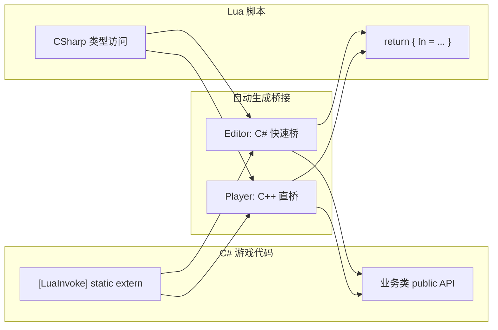
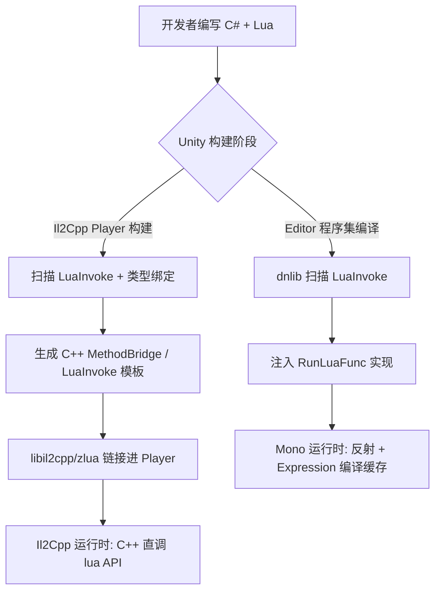

# 设计概览

:::tip 谁该读本文
**选型者、新接入开发者、需要理解「为什么这样设计」的读者。** 日常 API 用法请直接看 [使用指南](../guides/csharp-to-lua)；实现细节见 [规范文档](../spec/design-spec)。
:::

ZLua 把 Lua 当作另一种 **Native**：类比 P/Invoke，用声明式特性统一双向互操作，底层桥接由 CodeGen 自动生成。

## P/Invoke 与 L/Invoke 对照

| C# 互操作 | 职责 | ZLua 对应 |
|-----------|------|-----------|
| **P/Invoke** | C# 调用 native 函数 | **`[LuaInvoke]`**（L/Invoke）— C# 调用 Lua |
| **MonoPInvokeCallback** | native 回调 C# | **`[MonoLuaCallback]`** — 仅 `int (IntPtr L)` 原生回调 |
| **MarshalAs** | 覆盖默认编组 | **`[LuaMarshalAs]`** — C# ↔ Lua 编组覆盖 |

## 核心原则

| 原则 | 说明 |
|------|------|
| **统一双向调用** | C#→Lua：`[LuaInvoke]`；Lua→C#：`CSharp` 懒注册，语法贴近 C# |
| **自动生成** | Editor 注入 C# 桥；Il2Cpp 发布生成 C++ 桥；开发者只写 `extern` 声明 |
| **深度集成** | `LuaAppDomain.Initialize` 一次完成 CLR + `lua_State` + `zlua` 库 |
| **C++ 直桥** | Player 字段 offset 直读、方法经 `methodPointer`，无海量 C# Wrap |
| **零 Wrapper 膨胀** | 相同签名共享桥接函数，而非每成员一个 Wrap |

## 自动生成流水线

| 阶段 | Mono (Editor) | Il2Cpp (Player) |
|------|---------------|-----------------|
| LuaInvoke | dnlib → `RunLuaFunc` | IL → InternalCall + C++ |
| Lua→C# 成员 | 首次访问 `EnsureBinding` + 桥接缓存 | Codegen 预生成（MVP 为子集） |
| 开发者感知 | **无** | **无** |

## 与 xLua 的路径差异（摘要）

| 维度 | xLua 常见路径 | ZLua |
|------|---------------|------|
| 类型暴露 | 生成 C# Wrap / CodeEmit | `CSharp` 根表 + 元表三表 |
| C#→Lua | `LuaEnv.DoString` / DelegateBridge | `[LuaInvoke]` 声明式 |
| Player 性能 | Wrap 或生成 C++（视配置） | 设计目标：C++ 直桥 + 签名复用 |

详见 [ZLua 与 xLua 技术架构对比](./comparison-with-xlua)、[调用路径概览](../architecture/call-path-overview)。

## 何时读哪份文档

| 你的问题 | 推荐阅读 |
|----------|----------|
| 怎么从 C# 调 Lua？ | [C# 调用 Lua 指南](../guides/csharp-to-lua) |
| Lua 怎么访问 C# 类型？ | [类型系统概览](./type-system-overview) |
| 参数怎么传递？ | [编组模型概览](./marshal-overview) |
| Editor 与 Player 差别？ | [双运行时](./dual-runtime) |
| 完整设计语义？ | [设计规范](../spec/design-spec) |

## 相关文档

- [设计规范](../spec/design-spec)
- [双运行时架构](./dual-runtime)
- [Il2Cpp 架构](../architecture/il2cpp-architecture)
