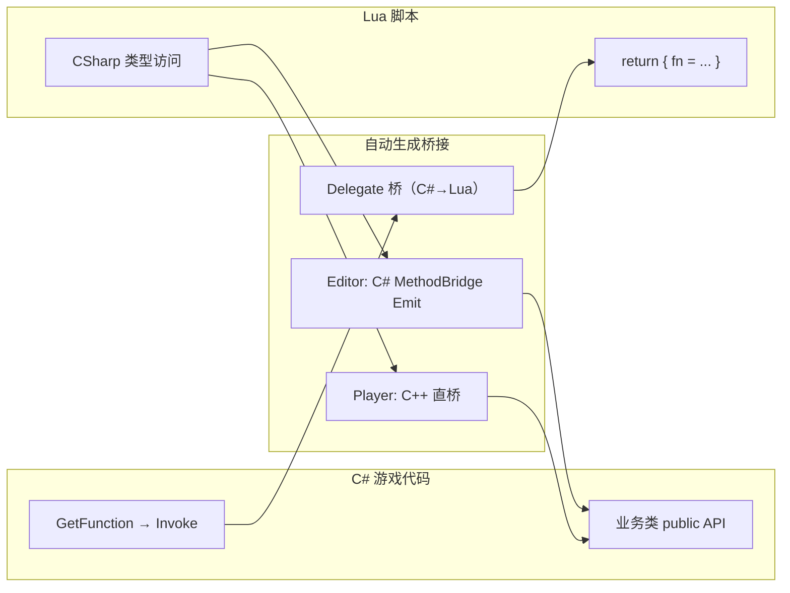
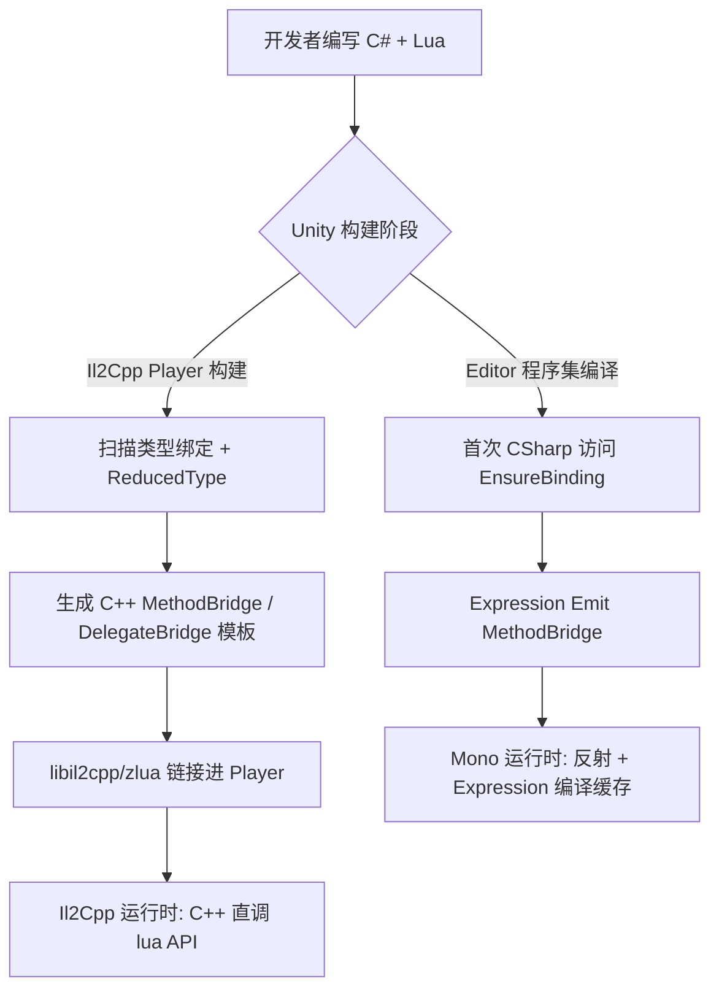

# 设计概览

:::tip 谁该读本文
**选型者、新接入开发者、需要理解「为什么这样设计」的读者。** 日常 API 用法请直接看 [使用指南](../guides/csharp-to-lua)；实现细节见 [规范文档](../spec/00-OVERVIEW)。
:::

ZLua 把 Lua 当作另一种 **Native**：类比 P/Invoke，用声明式 API 统一双向互操作；Il2Cpp 侧生成 **C++ stub**（`ZLua/Generate/All`），**不是** xLua 式 C# Wrap。

## P/Invoke 与 ZLua 对照

| C# 互操作 | 职责 | ZLua 对应 |
|-----------|------|-----------|
| **P/Invoke** | C# 调用 native 函数 | **`GetFunction<T>`** — C# 调用 Lua |
| **MonoPInvokeCallback** | native 回调 C# | **`[MonoLuaCallback]`** — 仅 `int (IntPtr L)` 原生回调 |
| **MarshalAs** | 覆盖默认 Marshal | **`[LuaMarshalAs]`** — C# ↔ Lua Marshal 覆盖 |

```mermaid
flowchart LR
    subgraph CSharp["C# 游戏代码"]
        GF["GetFunction → Invoke"]
        APP["业务类 public API"]
    end

    subgraph Bridge["自动生成桥接"]
        MonoB["Editor: C# MethodBridge Emit"]
        Il2B["Player: C++ 直桥"]
        DelB["Delegate 桥（C#→Lua）"]
    end

    subgraph Lua["Lua 脚本"]
        MOD["return { fn = ... }"]
        CS["CSharp 类型访问"]
    end

    GF --> DelB
    DelB --> MOD
    CS --> MonoB
    CS --> Il2B
    MonoB --> APP
    Il2B --> APP
```

## 核心原则

| 原则 | 说明 |
|------|------|
| **统一双向调用** | C#→Lua：`GetFunction<T>`；Lua→C#：`CSharp` 懒注册，语法贴近 C# |
| **自动生成（Lua→C#）** | Editor Emit / Il2Cpp Generate C++ stub；C#→Lua 无 per-call codegen |
| **深度集成** | `LuaAppDomain.Initialize` 一次完成 CLR + `lua_State` + `zlua` 库 |
| **C++ 直桥** | Player 字段 offset 直读、方法经 `methodPointer`，无海量 C# Wrap |
| **零 Wrapper 膨胀** | 相同签名共享桥接函数，而非每成员一个 Wrap |

## 自动生成流水线（Lua→C#）

```mermaid
flowchart TB
    A[开发者编写 C# + Lua] --> B{Unity 构建阶段}
    B -->|Editor 程序集编译| C[首次 CSharp 访问 EnsureBinding]
    C --> D[Expression Emit MethodBridge]
    B -->|Il2Cpp Player 构建| E[扫描类型绑定 + ReducedType]
    E --> F[生成 C++ MethodBridge / DelegateBridge 模板]
    F --> G[libil2cpp/zlua 链接进 Player]
    D --> H[Mono 运行时: 反射 + Expression 编译缓存]
    G --> I[Il2Cpp 运行时: C++ 直调 lua API]
```

| 阶段 | Mono (Editor) | Il2Cpp (Player) |
|------|---------------|-----------------|
| C#→Lua | `GetFunction` + Delegate 桥 | 同左（native 路径） |
| Lua→C# 成员 | 首次访问 `EnsureBinding` + Emit | EnsureBinding + C++ stub（Generate） |
| 开发者感知 | **无 C# Wrap** | **无 C# Wrap**；须 Generate stub |

## 与 xLua 的路径差异（摘要）

| 维度 | xLua 常见路径 | ZLua |
|------|---------------|------|
| 类型暴露 | 生成 C# Wrap / CodeEmit | `CSharp` 根表 + 元表三表 |
| C#→Lua | `LuaEnv.DoString` / DelegateBridge | `GetFunction<T>` + `Invoke` |
| Player 性能 | Wrap + 多次 LuaDLL | C++ 直桥 + 签名复用（见 [PERFORMANCE](../compare/PERFORMANCE)） |

详见 [选型对比](../compare/)、[Il2Cpp 实现](../impl/IL2CPP)。

## 何时读哪份文档

| 你的问题 | 推荐阅读 |
|----------|----------|
| 怎么从 C# 调 Lua？ | [C# 调用 Lua 指南](../guides/csharp-to-lua) |
| Lua 怎么访问 C# 类型？ | [类型系统概览](./type-system-overview) |
| 参数怎么传递？ | [Marshal 模型概览](./marshal-overview) |
| Editor 与 Player 差别？ | [双运行时](./dual-runtime) |
| 完整设计语义？ | [设计规范](../spec/00-OVERVIEW) |

## 相关文档

- [设计规范](../spec/00-OVERVIEW)
- [双运行时架构](./dual-runtime)
- [Il2Cpp 架构](../impl/IL2CPP)
