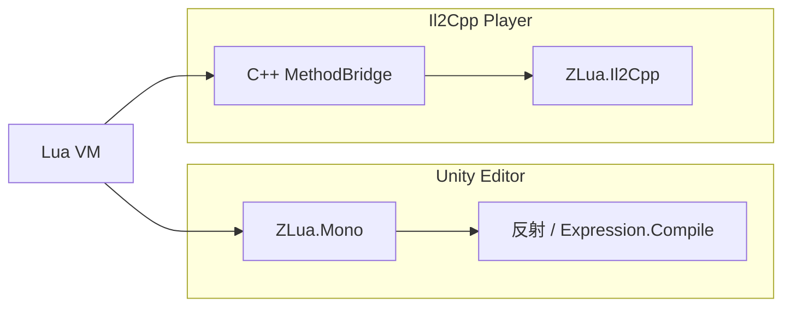

# 双运行时架构

- **Editor（Mono）** — `ZLua.Mono`：v1.0 **全量功能已实现**，基于反射 + 表达式编译，适合日常开发
- **Player（Il2Cpp）** — `ZLua.Il2Cpp`：**MVP 阶段**，C++ 直桥建设中，当前仅 Demo 级基础互操作

:::info 进度差异
Mono 与 Il2Cpp **目标**是 Lua 可见语义一致；**当前** Player 能力远少于 Editor。发布前请查阅 [项目状态](../getting-started/project-status)。
:::

公共特性（`LuaInvokeAttribute` 等）定义在 `ZLua.Common` 模块。

## 相关规范

- [设计规范](../spec/design-spec)
- [Il2Cpp 架构](../architecture/il2cpp-architecture)
