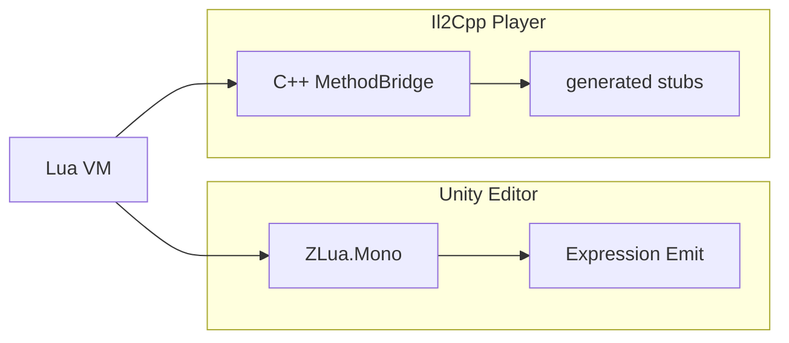

# 双运行时架构

```mermaid
flowchart LR
  subgraph Editor["Unity Editor"]
    Mono["ZLua.Mono"]
    Emit["Expression Emit"]
  end

  subgraph Player["Il2Cpp Player"]
    Native["C++ MethodBridge"]
    Stub["generated stubs"]
  end

  Lua["Lua VM"] --> Mono
  Lua --> Native
  Mono --> Emit
  Native --> Stub
```

- **Player（Il2Cpp）** — 权威实现：内嵌 Lua、C++ 直桥、签名 stub 复用（需 `ZLua/Generate/All`）
- **Editor（Mono）** — Expression Emit；目录对齐 Il2Cpp；与 Player **Lua 可见语义一致**

公共特性（`LuaMarshalAsAttribute`、`LuaAliasAttribute` 等）与 `LuaAppDomain` 在 `ZLua.Common`。

:::info 状态
**Mono 与 Il2Cpp 均已完成。** 日常在 Editor 开发；发版与性能以 Il2Cpp Player 为准。详见 [项目状态](../getting-started/project-status)。
:::

## 相关文档

- [规范总览](../spec/00-OVERVIEW)
- [Il2Cpp 实现](../impl/IL2CPP)
- [Mono 实现](../impl/MONO)
- [Editor 与 Player](../guides/editor-vs-player)
