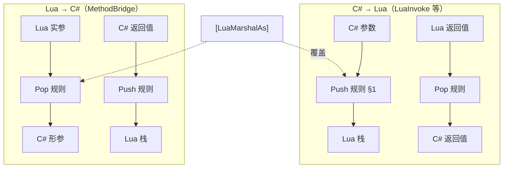
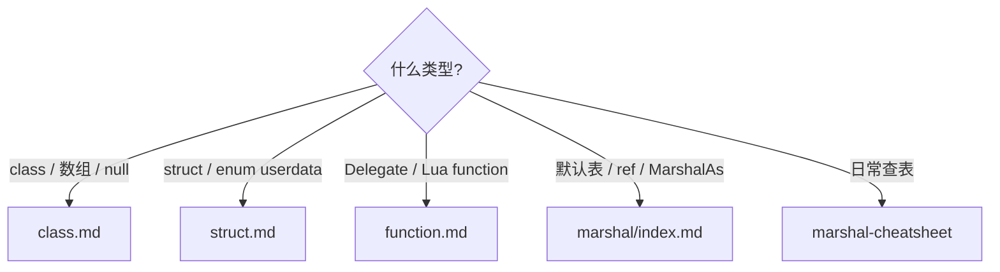

# 编组模型概览

:::tip 谁该读本文
**需要理解参数如何在 C# 与 Lua 间转换、何时用 `new_ref` / `[LuaMarshalAs]` 的开发者。** 查表用 [编组速查表](../reference/marshal-cheatsheet)；`ref/out` 实操见 [指南](../guides/marshal-ref-out-in)。
:::

ZLua 在 Mono 与 Il2Cpp 上 **Lua 可见编组语义一致**；Il2Cpp 侧重零 GC 与生成代码快速路径。

## 双向调用路径

## 默认规则摘要

| 类别 | C# → Lua | Lua → C# |
|------|----------|----------|
| 基元 / enum | integer / number / boolean | 同左 |
| string | string | string |
| class | ClassUserData | userdata / nil |
| struct | OpaqueValue (lightuserdata) | StructUserData / table |
| delegate | DelegateUserData | **function** 或 userdata |
| array | ArrayUserData | ArrayUserData |

完整表格：[编组速查表](../reference/marshal-cheatsheet)。

## ref / out / in（Lua → C#）

Lua 侧 **不区分** ref/out/in，统一按 ref 语义处理：

| Lua 实参 | 行为 |
|----------|------|
| `zlua.new_ref(T)` / struct userdata | **真 ref**，C# 修改写回 |
| 裸 number / string / table | **拷贝**到临时槽，**不写回** local |

`[LuaInvoke]` 与 delegate bridge **不支持** ref/out 形参。

## `[LuaMarshalAs]` 覆盖

| LuaMarshalType | 典型用途 |
|----------------|----------|
| **UserData** | 强制 boxed userdata（基元、enum、string） |
| **Bytes** | `byte[]` ↔ Lua string |
| **OpaqueLightUserData** | C#→Lua 栈上 struct 临时句柄 → `zlua.to_user_data` |

合法组合见 [LuaMarshalAs 参考](../reference/csharp/lua-marshal-as)。

## 分册索引（何时读哪本）

| 类型 | 规范 |
|------|------|
| 总览与 §1 默认表 | [编组规范](../spec/marshal/) |
| class / 引用 / 数组 | [Class 编组](../spec/marshal/class) |
| struct / enum userdata | [Struct 编组](../spec/marshal/struct) |
| Delegate / 回调 | [Function 编组](../spec/marshal/function) |

## 相关文档

- [编组速查表](../reference/marshal-cheatsheet)
- [enum / struct 指南](../guides/enums-and-structs)
- [回调与 Delegate](../guides/callbacks-and-delegates)
