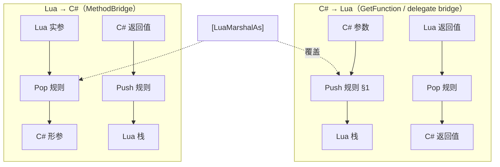

# Marshal 模型概览

:::tip 谁该读本文
**需要理解参数如何在 C# 与 Lua 间转换、何时用 `new_ref` / `[LuaMarshalAs]` 的开发者。** 查表用 [Marshal 速查表](/docs/reference/marshal-cheatsheet/)；`ref/out` 实操见 [指南](/docs/guides/ref-out-in/)。
:::

ZLua 在 Mono 与 Il2Cpp 上 **Lua 可见 Marshal 语义一致**；Il2Cpp 侧重零 GC 与生成代码快速路径。

## 双向调用路径

```mermaid
flowchart TB
    subgraph C2L["C# → Lua（GetFunction / delegate bridge）"]
        C1[C# 参数] --> P1[Push 规则 §1]
        P1 --> L1[Lua 栈]
        L2[Lua 返回值] --> Pop1[Pop 规则]
        Pop1 --> C2[C# 返回值]
    end

    subgraph L2C["Lua → C#（MethodBridge）"]
        L3[Lua 实参] --> Pop2[Pop 规则]
        Pop2 --> C3[C# 形参]
        C4[C# 返回值] --> P2[Push 规则]
        P2 --> L4[Lua 栈]
    end

    MA["[LuaMarshalAs]"] -.->|覆盖| P1
    MA -.-> Pop2
```

## 默认规则摘要

| 类别 | C# → Lua | Lua → C# |
|------|----------|----------|
| 基元 / enum | integer / number / boolean | 同左 |
| string | string | string |
| class | ClassUserData | userdata / nil |
| struct | ByValUserData 或 OpaqueValue | StructUserData / `Type(...)`（默认不接受 table） |
| delegate | DelegateUserData | **function** 或 userdata |
| array | ArrayUserData | ArrayUserData |

完整表格：[Marshal 速查表](/docs/reference/marshal-cheatsheet/)。

## ref / out / in（Lua → C#）

Lua 侧 **不区分** ref/out/in，统一按 ref 语义处理：

| Lua 实参 | 行为 |
|----------|------|
| `zlua.new_ref(T)` / struct userdata | **真 ref**，C# 修改写回 |
| 裸 number / string / table | **拷贝**到临时槽，**不写回** local |

**GetFunction 取得的 delegate 调用**与 **delegate bridge** 上 `ref`/`out`/`in` 默认 Push **OpaqueValue**（见 [OPAQUE](/docs/spec/marshal/04-OPAQUE/)）；`params` 仍不支持。

## `[LuaMarshalAs]` 覆盖

| LuaMarshalType | 典型用途 |
|----------------|----------|
| **UserData** | 强制 boxed userdata（基元、enum、string） |
| **Bytes** | `byte[]` ↔ Lua string |
| **OpaqueLightUserData** | C#→Lua 栈上 struct 临时句柄 → `zlua.to_user_data` |

合法组合见 [LuaMarshalAs 参考](/docs/reference/csharp/lua-marshal-as/)。

## 分册索引（何时读哪本）

| 类型 | 规范 |
|------|------|
| 总览与默认表 | [Marshal 规范](/docs/spec/marshal/01-OVERVIEW/) |
| byref / Opaque | [BYREF](/docs/spec/marshal/03-BYREF/)、[OPAQUE](/docs/spec/marshal/04-OPAQUE/) |
| struct | [STRUCT](/docs/spec/marshal/05-STRUCT/) |
| class / 引用 | [CLASS](/docs/spec/marshal/06-CLASS/) |
| Delegate / 回调 | [FUNCTION](/docs/spec/marshal/09-FUNCTION/) |
| 日常查表 | [Marshal 速查表](/docs/reference/marshal-cheatsheet/) |

## 相关文档

- [Marshal 速查表](/docs/reference/marshal-cheatsheet/)
- [enum / struct 指南](/docs/guides/value-types/)
- [Function 与 Delegate](/docs/guides/functions/)
