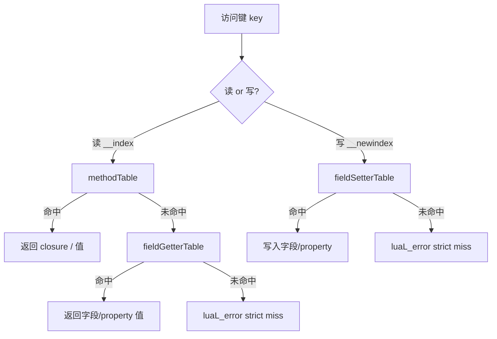
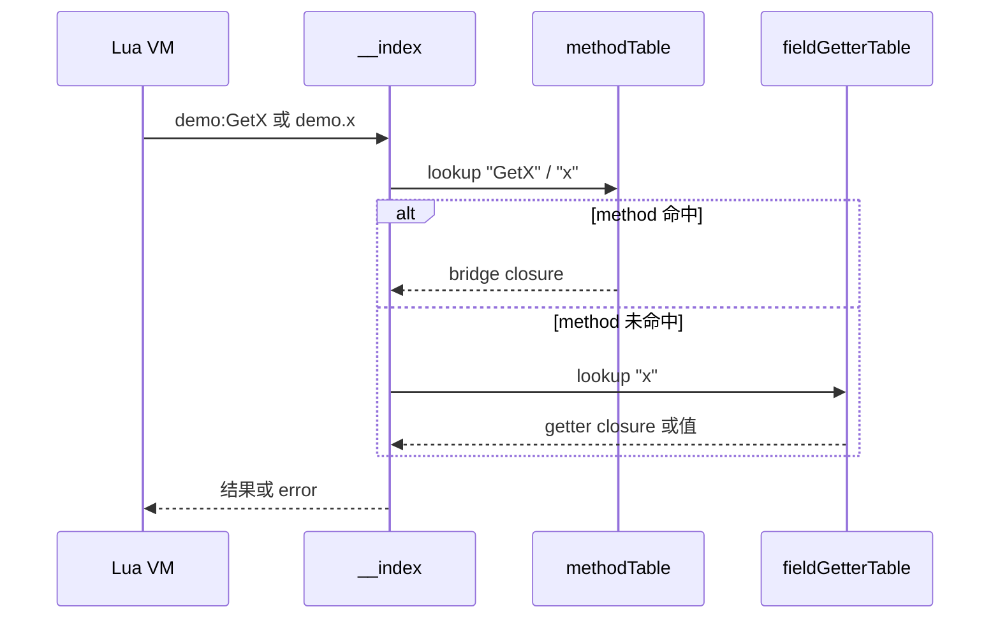

# 元表模型

:::tip 谁该读本文
**需要理解 `obj:Member` 底层如何查表、为何报错「member not found」的开发者。** 日常用法见 [字段与属性](../guides/fields-and-properties)、[方法重载](../guides/methods-and-overloads)。
:::

Lua 通过 **`__index` / `__newindex`** 访问 C# 静态与实例成员。ZLua 采用 **三表分派 + strict miss**：未注册成员直接 `luaL_error`，**不**回退到 C# 反射。

## 三表分派

每个静态域或实例域各维护三张表：

| 表 | 读 (`__index`) | 写 (`__newindex`) |
|----|----------------|-------------------|
| **methodTable** | 方法、dispatch、别名、Event 表 | — |
| **fieldGetterTable** | 字段、无参 property 读 | — |
| **fieldSetterTable** | — | 字段、无参 property 写 |



:::note 写路径
`__newindex` **不**查 methodTable；赋值给不存在键直接报错。
:::

## 查表时序（实例读）



## strict miss 示例

以下均 **直接报错**，不会尝试反射查找 private 或父类未注册成员：

```lua
local demo = CSharp.AC.Demo()
demo.nonExistentField = 1   -- error: member not found
demo:PrivateMethod()        -- error（private 未注册）
```

**与 dispatch 的区别：** 多重重载时 `demo:Run(x)` 在 methodTable 上可能是 **单个 dispatch closure**，内部分派到具体桥接，仍算 methodTable 命中。

## 方法重载在三表中的形态

| 情况 | methodTable["Run"] |
|------|-------------------|
| 单一 public 重载 | 直接桥接 closure |
| 多个重载 | dispatch closure（运行时分派） |
| `[LuaAlias("run_i32")]` | 额外键 `run_i32` → 单桥接 closure |

签名字符串 **不是** methodTable 的 Lua 键；禁止 `demo[sig](demo, ...)`。

## 平台实现

| 运行时 | `__index` / `__newindex` 实现 |
|--------|-------------------------------|
| Mono (Editor) | Lua function，C# 侧查三表 |
| Il2Cpp (Player) | C closure `DispatchIndex` / `DispatchNewIndex` |

**Lua 可见语义一致**；Il2Cpp 可内联字段 offset 读，仍走同一分派顺序。

## 何时读规范

| 问题 | 文档 |
|------|------|
| dispatch 算法 | [方法重载规范](../spec/method-overload-spec) |
| Property / Event 注册 | [类型系统规范](../spec/type-system-spec) |
| 完整 obj_indexer 规格 | [元表索引规范](../spec/meta-table-spec) |
| 远期 VM 快路径 | [VM 索引规范](../spec/vm-index-spec) |

## 相关文档

- [类型系统概览](./type-system-overview)
- [CSharp 根表参考](../reference/lua/csharp-root)
- [元表索引规范](../spec/meta-table-spec)
