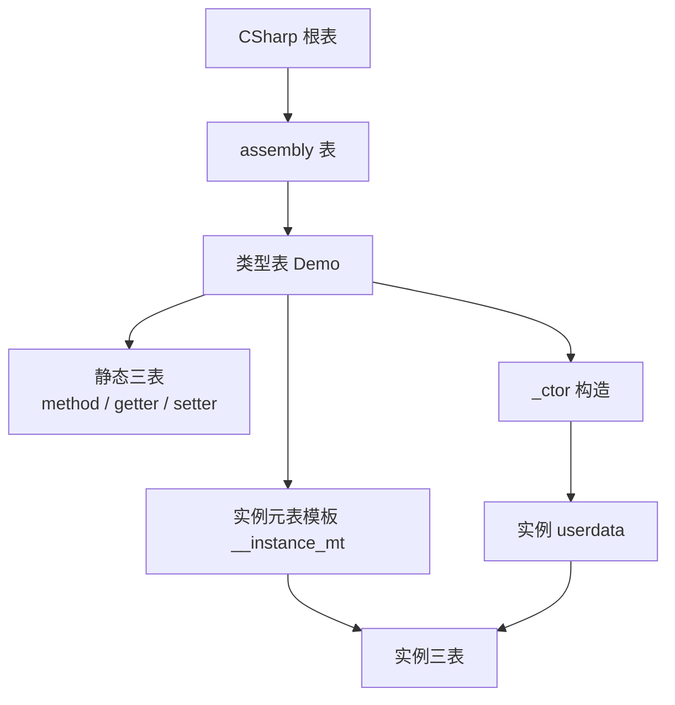
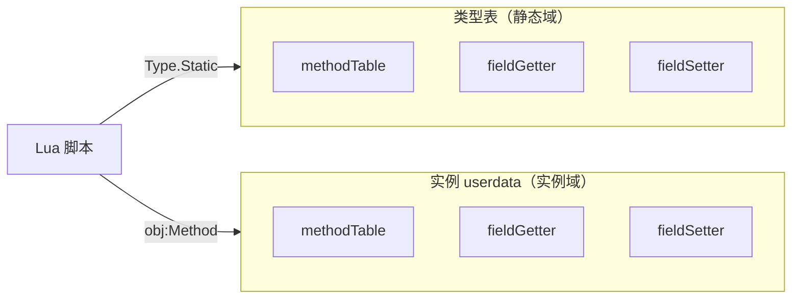
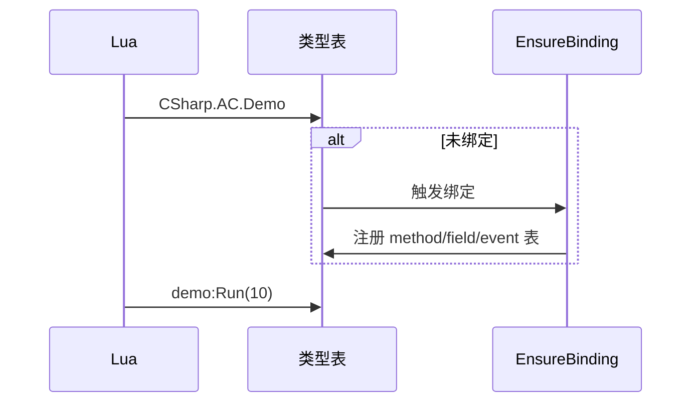

# 类型系统概览

:::tip 谁该读本文
**已在 Lua 中访问 C#、需要理解 `CSharp` 表结构与静/实例隔离的开发者。** 入门语法见 [Lua 访问 C# 基础](../guides/lua-to-csharp-basics)；查 API 见 [CSharp 根表参考](../reference/lua/csharp-root)。
:::

## 设计目标

| 目标 | 说明 |
|------|------|
| 统一入口 | 所有类型经 **`CSharp`** 根表懒加载 |
| 语义贴近 C# | `Type()` 构造、`obj:Method()`、`Type.Static()` |
| 静实例隔离 | 静态与实例成员使用 **独立** 元数据表 |
| 仅 public | Lua 仅可访问 public 成员 |
| 可优化 | Il2Cpp 字段/无参 property 可走快速路径 |

## CSharp 表结构

```
CSharp                          -- 全局根表
  └─ {assemblyName}             -- 程序集表（如 Assembly-CSharp）
       └─ {typeFullName}        -- 类型表（含 namespace 时用括号键）
            ├─ 静态 methodTable / fieldGetter / fieldSetter
            ├─ _ctor / __call   -- 构造
            └─ __instance_mt    -- 指向实例元表模板
```



**程序集别名（Demo 惯例）：**

```lua
CSharp['AC'] = CSharp['Assembly-CSharp']
local demo = CSharp.AC.Demo()
```

## 静实例隔离

静态成员与实例成员 **不得混用**：

| 操作 | 正确 | 错误 |
|------|------|------|
| 静态方法 | `CSharp.AC.Demo.Add(1, 2)` | `demo.Add(1, 2)` |
| 实例方法 | `demo:GetX()` | `CSharp.AC.Demo.GetX()` |
| 静态字段 | `CSharp.AC.Demo.s_x = 1` | `demo.s_x = 1` |

:::info 例外
`zlua.get_method(demo, "StaticMethod", sig, true)` 等 **显式 API** 允许用实例解析声明类型上的静态重载。
:::



## 懒加载与 EnsureBinding

首次访问某类型时，运行时扫描 public 成员并填充三表：



Il2Cpp Player 在构建期预生成绑定（MVP 为 Demo 子集）；Mono Editor 运行时反射 + 缓存。

## 命名空间与泛型（摘要）

| 场景 | 写法 |
|------|------|
| 无 namespace | `CSharp.AC.Demo` |
| 含 namespace | `CSharp.AC['MyGame.UI.Panel']` |
| 开放泛型 | `CSharp.mscorlib['System.Collections.Generic.List`1']` |
| 闭合泛型 | `zlua.make_generic_type(ListDef, zlua.types.int32)` |

详见 [泛型与数组指南](../guides/generics-and-arrays)。

## 何时读规范

| 问题 | 文档 |
|------|------|
| 成员如何分派？ | [元表模型](./metatable-model) |
| 重载与别名？ | [方法重载规范](../spec/method-overload-spec) |
| 数组 / 继承？ | [类型系统规范](../spec/type-system-spec) |

## 相关文档

- [CSharp 根表参考](../reference/lua/csharp-root)
- [元表模型](./metatable-model)
- [类型系统规范](../spec/type-system-spec)
