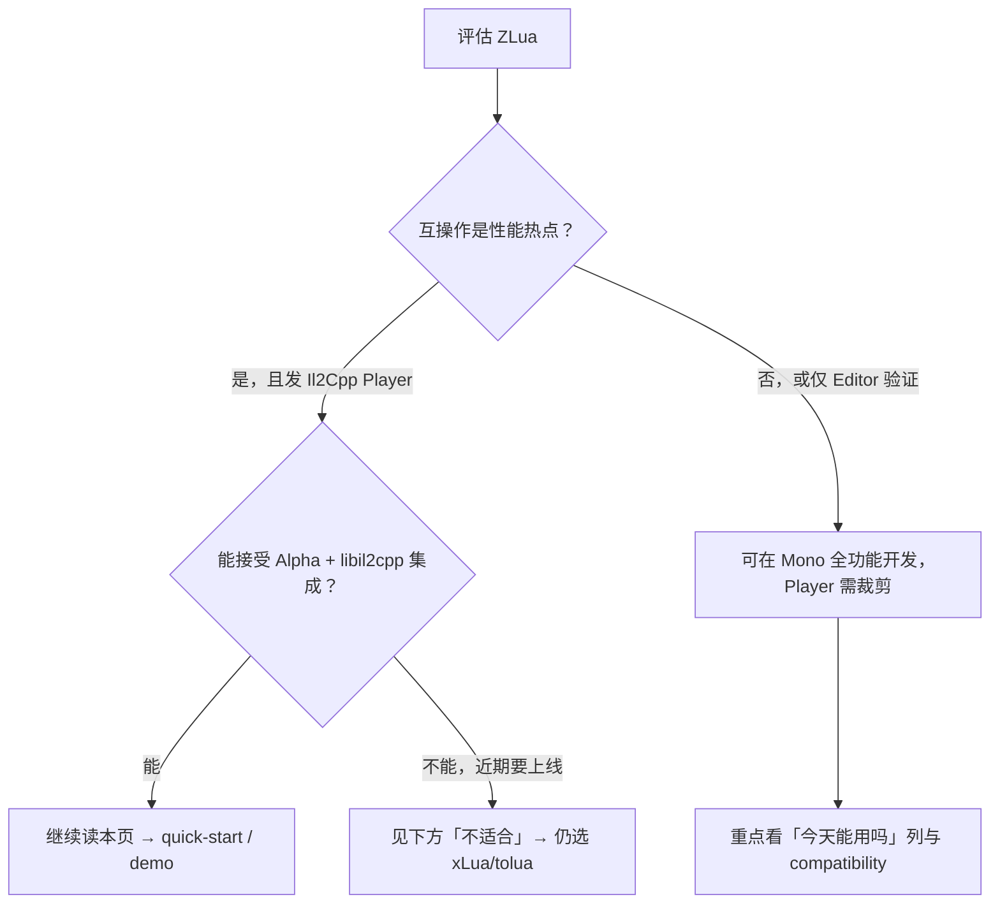
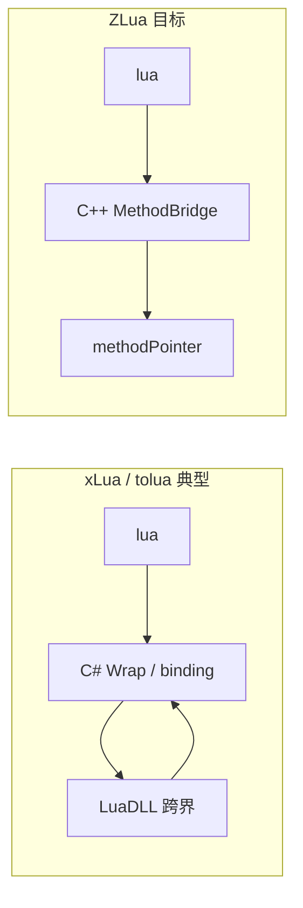

# 为什么选择 ZLua

xLua、tolua 已是 Unity Lua 绑定的成熟选择。ZLua 不是「多一个绑定库」，而是面向 **Il2Cpp Player 极致互操作性能** 与 **C# 语义统一** 的重新设计——把 Lua 当作另一种 **Native**，互操作类比 P/Invoke。

---

## 一句话

**更少生成与配置、更贴近 C# 的 Lua 访问方式、Player 侧 C++ 直桥（目标态）与多路径低 GC struct 传递**；代价是 **Alpha 阶段**、**Il2Cpp Player 尚未全量**、以及 **libil2cpp 集成维护成本**。

---

## 30 秒结论

| # | 理由 | 一句话 | Editor (Mono) 今天 | Player (Il2Cpp) 今天 |
|---|------|--------|:------------------:|:--------------------:|
| 1 | **设计易用** | `[LuaInvoke]` 声明式 C#→Lua，`CSharp` 懒加载 Lua→C# | ✅ | ✅（MVP 子集） |
| 2 | **C# 支持全** | 泛型、数组、重载、ref/out/in、Event | ✅ 全量 | ❌ 逐步对齐 |
| 3 | **互操作更快** | C++ 直桥、无 libxlua 折返、字段 offset 直读 | ✅（Mono 已优化） | 🚧 目标态，MVP 未体现 |
| 4 | **GC 更省** | Opaque / 字段展开 / StructUserData 多路径 | ✅ 规范+实现 | 🚧 逐步对齐 |
| 5 | **无 C# Wrap** | 不 Generate 海量 Wrap，签名复用原生桥 | ✅ | 🚧 Codegen 进行中 |

:::info 读前须知
- 上表 **Player** 列以 [项目状态](../getting-started/project-status) 为准；性能/GC 的 **设计目标** 不等于 **当前 MVP 实测**。
- 路径级性能倍数为 **理论推演**，尚无官方 benchmark → [与 xLua 对比](./comparison-with-xlua)。
- Il2Cpp 完整版预计 **2026 年 8 月** → [路线图](../community/roadmap)。
:::

---

## 我是谁？该不该继续读



| 你是谁 | 建议 |
|--------|------|
| **新项目、性能敏感、愿跟路线图** | 读本页 → [5 分钟快速开始](../getting-started/quick-start) → [zlua-demo](https://github.com/focus-creative-games/zlua-demo) |
| **已有 xLua/tolua 存量、近期上线** | 先看 [不适合](#不适合选-zlua) 与 [迁移草稿](../community/migration-from-xlua) |
| **架构 / 性能 reviewer** | 本页 + [与 xLua 对比](./comparison-with-xlua) + [Il2Cpp 架构](../architecture/il2cpp-architecture) |
| **只关心 API 能不能用** | [兼容性矩阵](../getting-started/compatibility) + Mono Editor 开发 |

---

## 1. 设计易用：Lua 当作 Native

### 痛点（xLua / tolua）

- C#→Lua 常是 **命令式**：`LuaEnv`、`GetInPath<LuaFunction>`、`Call`、Delegate 类型匹配
- Lua→C# 要配 **生成列表**（`LuaCallCSharp` 等），改 API 要重新 Generate
- 心智模型是「Lua 插件 API」，不是「另一种 native 调用约定」

### ZLua 怎么做

| C# 互操作 | ZLua | 作用 |
|-----------|------|------|
| P/Invoke | `[LuaInvoke]` | C# `static extern` 调 Lua 模块函数 |
| MarshalAs | `[LuaMarshalAs]` | 覆盖编组 |
| — | `CSharp` 根表 | Lua 侧懒加载类型，语法贴近 C# |

```csharp
// C# → Lua：声明即可，编译期注入桥接
[LuaInvoke("app", "add")]
private static extern int AppAdd(int a, int b);
```

```lua
-- Lua → C#：无需预生成 Wrap
CSharp['AC'] = CSharp['Assembly-CSharp']
print(CSharp.AC.Demo.Add(3, 5))
```

### Workflow 对比：新增「C# 调 Lua 函数 add(a,b)」

| 步骤 | xLua | ZLua |
|------|------|------|
| 1. Lua 写函数 | `app.lua` 里定义 | 同左，`return { add = add }` |
| 2. C# 侧绑定 | `GetInPath` / 生成 Delegate | `[LuaInvoke("app","add")] static extern` |
| 3. 生成配置 | 常涉及 Generate / 路径约定 | **无** |
| 4. 调用 | `func.Call(10, 20)` | `AppAdd(10, 20)` |

### 今天能用吗

| 环境 | 状态 |
|------|------|
| Editor (Mono) | ✅ 与文档一致 |
| Player (Il2Cpp) | ✅ `[LuaInvoke]` + 基础模块加载（MVP）；复杂 marshal 见 [兼容性](../getting-started/compatibility) |

→ [C# 调用 Lua 指南](../guides/csharp-to-lua) · [设计概览](./design-overview)

---

## 2. C# 支持完整

### 痛点

- 泛型、`ref/out/in`、Event、多维数组等在 Lua 绑定里常是 **边角能力**，依赖生成配置或 C# 包装层中转
- 团队要在「Lua 能写什么」与「生成白名单」之间反复拉扯

### ZLua 怎么做（Mono 已实现）

| 能力 | Lua 侧要点 |
|------|------------|
| 泛型类 | `zlua.make_generic_type` |
| 泛型方法 | `make_generic_inst` |
| 数组 | `make_szarray_type` / `new_szarray_*` |
| 重载 | `obj:Run(x)` dispatch；热路径 `[LuaAlias]` / `get_method` |
| ref / out / in | `zlua.new_ref(T)` 真 ref；裸 number 为拷贝语义 |
| Event / Delegate | Event 表；delegate 形参直传 `function` |

```lua
-- 重载 + 显式绑定（Mono）
local run_i32 = zlua.get_method(demo, "Run", zlua.signature(zlua.types.int32), false)
run_i32(demo, 10)
```

### 与 xLua 差异（能力层）

| 场景 | xLua 常见做法 | ZLua |
|------|---------------|------|
| `List<int>` | 包装类或避免 Lua 侧闭合泛型 | Lua 侧 `make_generic_type` |
| `ref int` | 有支持，语义因版本/生成而异 | 规范统一 + `new_ref` |
| 重载热路径 | 生成 Wrap 内分派 | dispatch + 别名 / 显式 `get_method` |

### 今天能用吗

| 环境 | 状态 |
|------|------|
| Editor (Mono) | ✅ [路线图 v1.0 清单](../community/roadmap) 已实现 |
| Player (Il2Cpp) | ❌ 泛型 / Event / ref / 重载 dispatch 等 **尚未**；仅 Demo 级 |

→ [兼容性矩阵](../getting-started/compatibility)

---

## 3. 互操作性能：更少的「折返」

### 痛点

xLua / tolua 典型路径：**Lua VM → C# Wrap → LuaDLL (P/Invoke) → C#**，栈操作多次跨界；读字段常经 Wrap/getter。热循环里 **函数体极短** 时，互调固定开销占主导。

### ZLua 原理（Il2Cpp 目标态）



| 环节 | xLua 类方案 | ZLua 目标 |
|------|-------------|-----------|
| Lua 引擎 | 独立 libxlua | 嵌入 libil2cpp |
| Lua → C# | C# Wrap + 多次 LuaDLL | C++ 内联 lua API + `methodPointer` |
| C# → Lua | C# 循环 LuaDLL | `[LuaInvoke]` 一次 InternalCall |
| 读 `int` 字段 | 常经 Wrap | **offset 直读**（规范） |
| 桥接体积 | 每类型大量 Wrap | **按签名复用** MethodBridge |

**为何有机会快数倍（热路径、理论值）：** 消灭 libxlua 往返与 C# Wrap 层；具体场景倍数见 [与 xLua 对比 §4](./comparison-with-xlua#4-分场景理论估计)（**非实测**）。

### 今天能用吗

| 环境 | 状态 |
|------|------|
| Editor (Mono) | ✅ Expression 编译桥，对标 xLua CodeEmit 档（见 [性能报告](../architecture/optimization-report)） |
| Player (Il2Cpp) | 🚧 MVP **不能**代表设计目标；勿用当前 Player 做 xLua 性能对比 |

→ [调用路径概览](../architecture/call-path-overview) · [Il2Cpp 架构](../architecture/il2cpp-architecture)

---

## 4. GC 优化：互调不只是 CPU

### 痛点

struct、坐标、战斗公式中间值若走 **table 或 boxing**，热路径会产生 **大量 GC Alloc**，Profiler 里互操作「又慢又抖」。

### ZLua 三条路径（选型表）

| 路径 | GC | 适用场景 |
|------|-----|----------|
| **OpaqueLightUserData** | 零 GC（lightuserdata） | C#→Lua 同步链内临时 struct / 形参槽 |
| **ComposeFromStack / LuaStackFields** | 零 GC（多个 number） | `Vector2` 等 blittable 小 struct 热路径 |
| **StructUserData** | 仅 userdata 自身 | 持有、改字段、`ref` 传参 |
| table 默认 | 有 table 分配 | 脚本便捷写法 |

```lua
-- 热路径：两个 number，无 userdata
Foo(1.0, 2.0)   -- C# void Foo(Vector2)，ComposeFromStack

-- 长生命周期 + ref
local p = CSharp.AC.Point2D(1, 2)
Demo.Process(ref p)
```

> 规范命名：`ComposeFromStack`（从栈上标量**构造** struct）≈ ConstructorFromUnpackedFields；`LuaStackFields`（**解构**为多值）≈ DeconstructorToUnpackedFields。

### 与 xLua

xLua 传 `Vector2` 等常见为 **table 或 Wrap 属性**，易分配；ZLua 允许在热路径 **显式选零 GC 路径**（细节 → [Struct 编组](../spec/marshal/struct)）。

### 今天能用吗

| 环境 | 状态 |
|------|------|
| Editor (Mono) | ✅ Opaque / StructUserData / ref 等已实现 |
| Player (Il2Cpp) | 🚧 随 v1.0 对齐 |

→ [编组模型概览](./marshal-overview)

---

## 5. 不需要配置 Wrapper 生成

### 痛点（xLua / tolua 共性）

```text
N 类型 × M 成员 → 海量 Wrap / binding 代码 → 工程体积膨胀、CI 必跑 Generate、合并冲突
```

tolua 依赖 **导出的 binding 代码**；xLua 依赖 **Generate + LuaCallCSharp 白名单**。两者都是「**先生成，再调用**」模型。

### ZLua 怎么做

- **public 类型** 首次访问自动 `EnsureBinding`，**无** LuaCallCSharp 列表
- Player 侧生成 **C++ MethodBridge**（按签名复用），**不**膨胀 C# Wrap
- 改 C# public API → 下次访问自动更新绑定（Editor）；Player 走 Codegen 重建

### Workflow 对比：新增 C# 类型给 Lua 用

| 步骤 | xLua / tolua | ZLua |
|------|--------------|------|
| 标记可导出 | `[LuaCallCSharp]` / 导出列表 | **不需要**（public 即可） |
| 生成 | Generate / 跑 tolua 工具 | **无 C# Wrap 步骤** |
| Lua 访问 | `CS.Foo` / 生成命名空间 | `CSharp.asm.Foo()` |
| 发 Player | 确认 Wrap 进包 | 确认 Codegen + MVP 能力清单 |

### 今天能用吗

| 环境 | 状态 |
|------|------|
| Editor (Mono) | ✅ 无 Wrap 生成 |
| Player (Il2Cpp) | 🚧 Codegen 覆盖范围随 MVP → v1.0 扩大 |

---

## 不适合选 ZLua

| 情况 | 更稳妥的选择 |
|------|--------------|
| **现在就要上生产**，不能接受 Player 能力缺口 | xLua（成熟生态） |
| **已有大量 xLua/tolua 资产**，短期无迁移预算 | 维持现状；评估 [迁移草稿](../community/migration-from-xlua) |
| **不愿维护 libil2cpp fork** / 升级 Unity 要 merge 引擎层 | xLua 插件形态更轻 |
| **Player 性能对比 xLua** 作为立项依据 | 等 Il2Cpp v1.0 + 官方 benchmark（当前 MVP 不具代表性） |
| 只需要 **Lua 跑逻辑、极少 C# 互调** | 任意方案差异不大，成熟度优先 |

两者 **不是** 插件级替换；迁移需单独评估。

---

## 典型场景速查

| 场景 | ZLua 优势点 | 注意 |
|------|-------------|------|
| 战斗公式 / 每帧上千次 `int` 互调 | §3 少折返 + §4 少分配 | Player 需等 v1.0；Editor 可验证 API |
| UI 事件 / 低频 C#↔Lua | §1 声明式 `[LuaInvoke]` | Player MVP 通常够用 |
| `Vector2` / 碰撞 struct 热路径 | §4 ComposeFromStack 零 GC | 需显式 `[LuaMarshalAs]` |
| 复杂泛型容器 Lua 侧构造 | §2 完整类型系统 | **仅 Mono 今天可用** |
| 新项目从零接入 | §1 + §5 无 Generate | 接受 Alpha 与双运行时差异 |

---

## 下一步

1. **5 分钟上手** — [快速开始](../getting-started/quick-start) + [zlua-demo](https://github.com/focus-creative-games/zlua-demo)  
2. **确认 Player 边界** — [项目状态](../getting-started/project-status) · [兼容性](../getting-started/compatibility)  
3. **深度对比** — [与 xLua 对比](./comparison-with-xlua)（路径与理论性能）  
4. **已有 xLua** — [迁移对照草稿](../community/migration-from-xlua)

---

## 延伸阅读

| 文档 | 内容 |
|------|------|
| [与 xLua 对比](./comparison-with-xlua) | 调用栈、ns 量级推演 |
| [设计概览](./design-overview) | L/Invoke 与自动生成流水线 |
| [Il2Cpp 架构](../architecture/il2cpp-architecture) | Player C++ 实现 |
| [Struct 编组](../spec/marshal/struct) | GC 路径完整规范 |
| [路线图](../community/roadmap) | v1.0 功能与时间线 |
