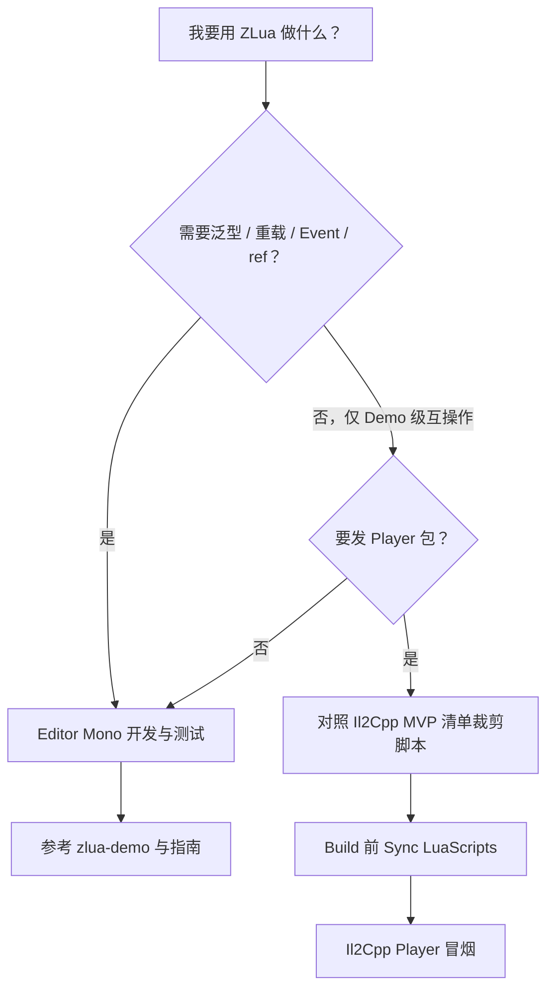

# 项目状态与路线图

## 当前状态

:::info Alpha · 双运行时进度不同
ZLua 在 **Unity 2022.3.62f3 + Lua 5.4** 上测试通过。

| 运行时 | 环境 | 状态 |
|--------|------|------|
| **Mono** | Unity Editor | **v1.0 功能已全部实现**，适合完整功能开发与验证 |
| **Il2Cpp** | Player 发布 | **MVP 阶段**，仅实现 Demo 所需的基础互操作 |

**Il2Cpp 正式版**（完整 C++ 直桥与性能优化）预计 **2026 年 8 月** 发布。
:::

:::tip 开发建议
日常开发、API 验证请在 **Editor（Mono）** 下进行；构建 Player 前请对照下方 [Il2Cpp 已支持清单](#il2cpp-mvp) 确认依赖能力是否可用。
:::

## 我应该在哪里开发 / 测什么？

| 场景 | 建议 |
|------|------|
| 新项目原型、热更逻辑 | Editor Mono，clone [zlua-demo](https://github.com/focus-creative-games/zlua-demo) |
| 验证 Player 可行性 | 仅用 [app.lua](https://github.com/focus-creative-games/zlua-demo/blob/main/LuaScripts/app.lua) 同等能力 |
| 性能对比 xLua | 等待 Il2Cpp 完整版；当前 MVP 不具代表性 |
| 查完整 API 语义 | Mono 行为 + [规范文档](../spec/) |

## Mono（Editor）— 已实现

### Lua 调用 C#

- [x] 访问 class、struct 类
- [x] 访问成员变量和静态成员变量
- [x] 调用函数和静态函数
- [x] 函数重载（dispatch、`get_method`、`[LuaAlias]`）
- [x] Property（含 index 访问器）
- [x] Event
- [x] 泛型类与泛型函数
- [x] Array 等集合类型

### C# 调用 Lua

- [x] `[LuaInvoke]`

### Marshal

- [x] 值类型、string、class、struct、enum、array
- [x] 指针、函数指针、TypedReference
- [x] `in` / `out` / `ref`
- [x] `[LuaMarshalAs]`

### 其他

- [x] `zlua` 标准库（`typeof`、`make_generic_type` 等）
- [x] Mono 侧性能优化
- [x] 测试框架与用例

## Il2Cpp（Player）— 当前已支持（MVP） {#il2cpp-mvp}

### 已支持

- [x] `[LuaInvoke]`
- [x] class 访问与构造（Demo 范围）
- [x] 实例 / 静态**字段**访问
- [x] 实例 / 静态**方法**调用（手写桥接，常见签名）
- [x] 基础类型：`int`、`bool`、`string`、`void`

### 尚未支持

- [ ] struct 完整互操作
- [ ] 函数重载 / `zlua.get_method`
- [ ] Property、Event
- [ ] 泛型、Array
- [ ] enum、delegate、ref/out/in
- [ ] 全量 MethodBridge 自动生成
- [ ] 设计目标中的 C++ 性能优化

详见 [Il2Cpp 架构](../architecture/il2cpp-architecture) 与 [路线图](../community/roadmap)。

## v1.0 总目标

Il2Cpp Player **追平 Mono 已实现的全量功能**，并完成 C++ 直桥性能优化。

## v2.0 计划

- Unity 2021+ LTS、团结引擎
- Lua 5.1 / 5.3+ / LuaJIT / Luau
- **xLua / tolua 迁移指南**

## 下一步

- [路线图详情](../community/roadmap)
- [Editor 与 Player 差异](../guides/editor-vs-player)
- [开发贡献](../community/contributing)
