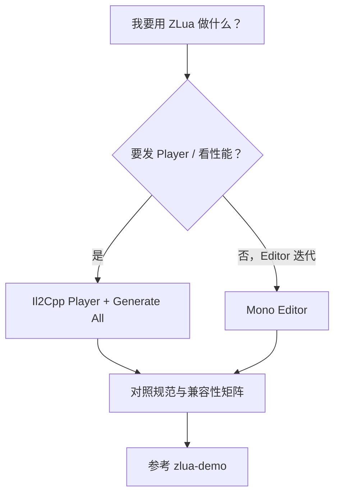

# 项目状态与路线图

## 当前状态

:::info 双运行时
[兼容性矩阵](/docs/getting-started/compatibility/) 所列 Unity / Lua 组合均已覆盖；Mono 与 Il2Cpp 双运行时已完成。

| 运行时 | 环境 | 状态 |
|--------|------|------|
| **Il2Cpp** | Player 发布 | **已完成**（规范与实现以 Il2Cpp `zlua/` 为准） |
| **Mono** | Unity Editor | **已完成**（与 Il2Cpp **Lua 可见语义一致**） |

权威规范：本仓库 **`docs/spec/`**（唯一语义标准）；冲突时以 **spec → Il2Cpp 源码 → impl** 裁决。详见 [规范总览](/docs/spec/00-OVERVIEW/)。
:::

:::tip 开发建议
- **日常开发**：Editor（Mono）迭代脚本与功能。
- **发布 / 性能**：以 **Il2Cpp Player** 为准；构建前执行 **`ZLua/Generate/All`**（生成 C++ stub，**不是** xLua 式 C# Wrap）。
:::

## 我应该在哪里开发 / 测什么？

```mermaid
flowchart TD
    A[我要用 ZLua 做什么？] --> B{要发 Player / 看性能？}
    B -->|是| C[Il2Cpp Player + Generate All]
    B -->|否，Editor 迭代| D[Mono Editor]
    C --> E[对照规范与兼容性矩阵]
    D --> E
    E --> G[参考 zlua-demo]
```

| 场景 | 建议 |
|------|------|
| 新项目原型 | Editor Mono + [zlua-demo](https://github.com/focus-creative-games/zlua-demo)；发 Player 前跑 Generate |
| 验证 Player | Il2Cpp；语义以 [规范](/docs/spec/00-OVERVIEW/) 为准 |
| 性能对比 xLua | **Il2Cpp Player**；见 [性能对比](/docs/compare/PERFORMANCE/) |
| 查完整 API 语义 | [规范文档](/docs/spec/00-OVERVIEW/) |

## Il2Cpp（Player）

Player 侧 C++ 直桥、签名 stub 复用、`GetFunction` Delegate 桥、懒绑定与 Marshal 路径已落地。实现对照见 [Il2Cpp 实现](/docs/impl/IL2CPP/)、Codegen 见 [Stubs](/docs/impl/codegen/STUBS-IL2CPP/)。

**注意：** 「无 C# Wrap 白名单」≠「完全无 codegen」。Il2Cpp 仍需 **`ZLua/Generate/All`** 生成 **C++ MethodBridge** 等 Lua→C# stub；**C#→Lua 无额外 stub**。

## Mono（Editor）

与 Il2Cpp 共用同一套 **Lua 可见语义**（spec）；实现为 Expression Emit，目录对齐 Il2Cpp 模块。见 [Mono 实现说明](/docs/impl/MONO/)。

要点：

- 无 Event 专用元表；使用 `add_Xxx` / `remove_Xxx` 普通方法
- 桥接：每成员 Expression Emit（对照 Il2Cpp ReducedType stub）
- Editor 下**不需要** Generate C++ stub；发 Player 时再 Generate

## 能力边界（摘要）

| 主题 | 说明 |
|------|------|
| Event | 无 `{ get, set, fire }`；`obj:add_EventName(fn)` |
| Generate | 无 per-type C# Wrap；Il2Cpp 有 C++ stub Generate |
| Opaque / ByVal / ByObj | 见 [Struct Marshal](/docs/spec/marshal/05-STRUCT/) |
| 双端差异 | 实现路径不同，语义以 spec 为准 |

完整矩阵见 [兼容性](/docs/getting-started/compatibility/)。

## 版本计划

### 近期

- [ ] 性能 / GC / 体积实测持续更新 [compare](/docs/compare/)
- [ ] 规范与用户指南持续校正
- [ ] 迁移指南与社区反馈

### 后续

- Luau
- 更多平台与设备实测
- 迁移指南完善（见 [迁移](/docs/community/migration/)）

## 下一步

- [兼容性矩阵](/docs/getting-started/compatibility/)
- [路线图](/docs/community/roadmap/)
- [Editor 与 Player](/docs/guides/editor-vs-player/)
- [贡献约定](/docs/community/contributing/)
