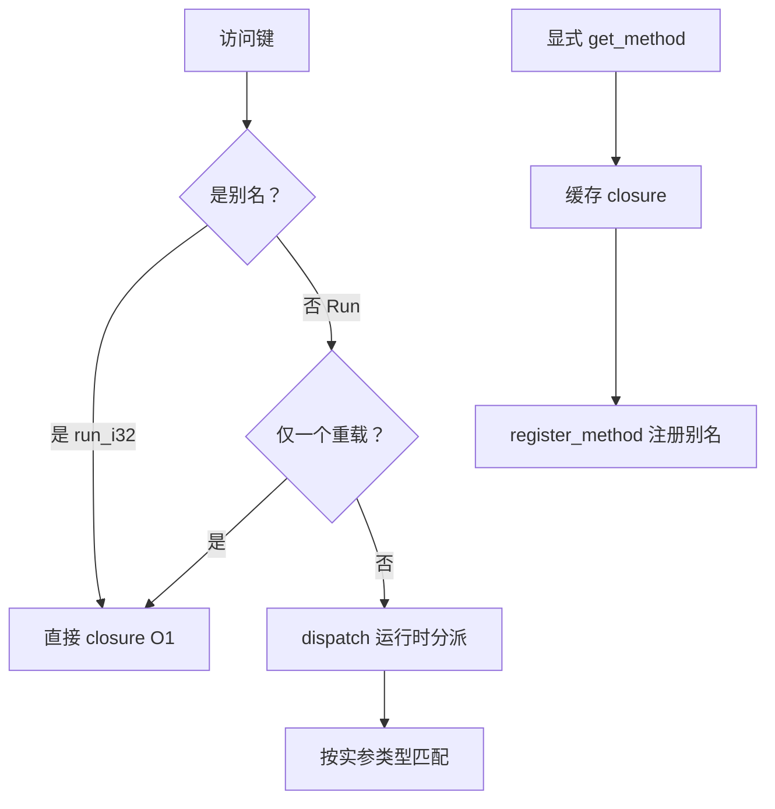

# 方法重载

C# 允许同名不同签名的方法；Lua 无静态类型，无法仅靠 `obj:Run(x)` 在编译期选定重载。ZLua 提供 **三层机制**，优先级从高到低。

参考：[Demo.cs Run 重载](https://github.com/focus-creative-games/zlua-demo/blob/main/Assets/Demo.cs)、[app.lua test_overload_signature](https://github.com/focus-creative-games/zlua-demo/blob/main/LuaScripts/app.lua)

## 三层机制



| 优先级 | 机制 | 适用 |
|--------|------|------|
| 1 | **`[LuaAlias]`** / XML 别名 | 编译期固定名称，热路径首选 |
| 2 | **默认 dispatch** | `obj:Run(x)` 单重载直接调；多重载运行时分派 |
| 3 | **显式签名** | `zlua.signature` + `get_method` / `register_method` |

:::warning 反模式
不推荐 `obj[sig](obj, ...)` 按签名字符串键查找 — 每次查表、难缓存。
:::

## 默认 dispatch

仅 **一个** public 重载时，`obj:Method(args)` 直接绑定 closure，零分派开销。

多个重载时，按实参 **个数 + Lua 类型** 与 C# 形参匹配（详见 [方法重载规范](../spec/method-overload-spec) §3）。

```lua
local demo = CSharp.AC.Demo()
demo:Run(10)        -- Run(int)
demo:Run("hello")   -- Run(string)
```

## C# 侧别名：`[LuaAlias]`

在 C# 方法上标记唯一别名，Lua 侧以别名 O(1) 访问：

```csharp
public class Demo
{
    [LuaAlias("run_i32")]
    public void Run(int value) { x = value; }

    public void Run(string value) { x = value?.Length ?? 0; }
}
```

```lua
demo:run_i32(10)    -- 直接命中，无 dispatch
```

别名在类型 `EnsureBinding` 时写入 method 表；**不得**与同类型默认方法名冲突。

## 显式签名绑定

热路径或 dispatch 不明确时，显式查找并缓存：

```lua
local demo = CSharp.AC.Demo()

local sig_i32 = zlua.signature(zlua.types.int32)
local run_i32 = zlua.get_method(demo, "Run", sig_i32, false)
run_i32(demo, 10)

-- 注册实例别名，后续 demo:run_i32(20)
zlua.register_method(demo, "run_i32", run_i32)
```

与 [zlua-demo `test_overload_signature`](https://github.com/focus-creative-games/zlua-demo/blob/main/LuaScripts/app.lua) 一致；Play 后 Console 应依次输出 `After Run(int): 10`、`After run_i32 alias: 20`。

### API 摘要

| 函数 | 说明 |
|------|------|
| `zlua.signature(typeArg, ...)` | 构造参数类型签名 |
| `zlua.get_method(target, name, sig, isStatic)` | target 为实例或类型表 |
| `zlua.register_method(target, alias, closure)` | 注册实例或静态别名 |

`typeArg` 可为 `zlua.types.int32`、`zlua.typeof(CSharp.AC.Demo)` 等，见 [zlua 库规范](../spec/lib-spec) §3。

### 静态方法

```lua
local sig = zlua.signature(zlua.types.int32, zlua.types.int32)
local add = zlua.get_method(CSharp.AC.Demo, "Add", sig, true)
-- 或注册静态别名到类型表
```

## 构造函数重载

多构造函数与实例方法相同：默认 dispatch 或 `get_method` + `_ctor` 签名。见 [类型系统规范](../spec/type-system-spec) §4.6。

## 已废弃写法

以下 API 与用法**不要**在新代码中使用：

| 废弃 | 正确 |
|------|------|
| `zlua.corlibtypes.*` | `zlua.types.*` |
| `zlua.signature("Run", zlua.types.int32)`（把方法名传入 signature） | `zlua.signature(zlua.types.int32)` |
| `zlua.get_method(demo, sig)`（两参数） | `zlua.get_method(demo, "Run", sig, false)` |
| `demo[sig](demo, ...)`（签名字符串键查表） | `get_method` 缓存 closure 后 `run_i32(demo, ...)` 或 `register_method` 别名 |

## Mono / Il2Cpp 支持

| 能力 | Mono | Il2Cpp |
|------|:----:|:------:|
| 单重重载 | ✅ | ⚠️ |
| 多重重载 dispatch | ✅ | ❌ |
| `[LuaAlias]` | ✅ | ❌ |
| `get_method` / `register_method` | ✅ | ❌ |

## 常见错误

| 现象 | 处理 |
|------|------|
| 调用了错误重载 | 使用 `[LuaAlias]` 或 `get_method` 显式绑定 |
| `ambiguous overload` | 实参类型同时匹配多个候选；收窄类型或显式绑定 |
| `get_method` 返回 nil | 签名与 C# 不一致；检查 `isStatic` 参数 |

## 学习路径

| | |
|---|---|
| **上一篇** | [字段与属性](./fields-and-properties) |
| **下一篇** | [回调与 Delegate](./callbacks-and-delegates) |

## 相关文档

- [方法重载规范](../spec/method-overload-spec)
- [zlua 标准库](../reference/lua/zlua-lib)
- [最佳实践](./best-practices)
