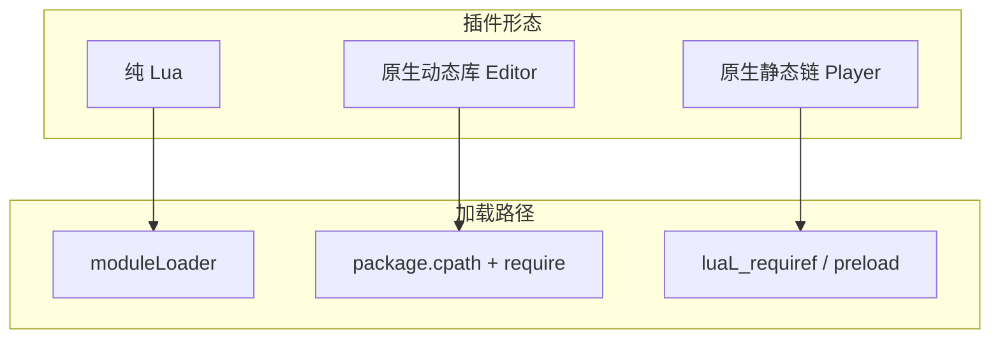
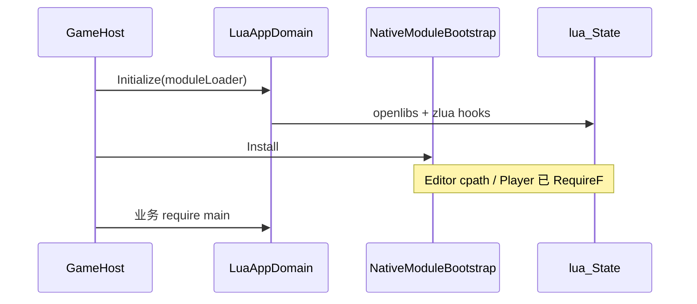

# 第三方原生插件

zlua **不**随包提供 luasocket、lua-cjson 等第三方 C 库。接入方式与 VM 本身一致：**Editor 动态加载、Player 静态注册**。业务侧统一 `require("cjson")` / `require("socket")`，底层形态对调用方透明。

权威细则见 [构建 · 第三方原生模块](/docs/spec/build/05-NATIVE-MODULES/)。C 模块先例：[EmmyLua 调试器](/docs/guides/debugger/)（`package.cpath` + `require('emmy_core')`）。

> 「0 原生」优先：纯 Lua 实现可只走 `moduleLoader`，见下文形态 A。

## 三种形态

| 形态 | 适用 | 加载方式 |
|------|------|----------|
| **A. 纯 Lua** | json 纯实现、协议外壳、工具库 | `Initialize(moduleLoader)` 返回源码 |
| **B. 原生 · Editor** | 本机调试 / 跑逻辑 | `package.cpath` + `require` → `luaopen_*` |
| **C. 原生 · Player** | Android / iOS / Windows / WebGL 等 | 静态链接 + `luaL_requiref` / `package.preload` |



## 原则

1. **同 ABI**：按 Settings `luaVersionId` 系列（`lua55` / `luajit21` 等）编译，与 [多版本](/docs/spec/11-MULTI-VERSION/) 一致。
2. **Editor 动态、Player 静态**：勿假设「丢个 dll 进 Plugins 就全平台可用」。
3. **PluginImporter 全关**：C 模块二进制不要当 Unity 原生插件启用，否则易与 Lua `require` **双载**（同 EmmyLua 约定）。
4. **不进 zlua 核心包**：具体库留在游戏工程；zlua 仅预留可选薄钩子（见规范）。

## 形态 A：纯 Lua

源码放入工程（如 `Assets/Lua/ThirdParty/`），在 `moduleLoader` 中按名返回字符串即可：

```csharp
LuaAppDomain.Initialize(name =>
{
    // 含 "cjson" 纯 Lua 实现、socket.lua 外壳等
    return LoadLuaText(name);
});
```

全平台一致、无 ABI。大 JSON / 真 TCP 等再考虑形态 B/C。

## 形态 B：Editor（仿 EmmyLua）

### 目录约定

```text
Assets/Plugins/zlua-native-modules/   # 或非 Plugins 扫描路径
  lua55/
    windows/cjson.dll                 # 导出 luaopen_cjson
    windows/socket_core.dll           # 导出 luaopen_socket_core
    macos/cjson.dylib
  luajit21/
    ...
```

每个二进制的 PluginImporter：**全部平台 Disabled**。

### 初始化

在 `LuaAppDomain.Initialize` **之后**、业务脚本 **之前**，仿 EmmyLua 注入（防重复 append `cpath`）：

```lua
package.cpath = package.cpath .. ";" .. absDir .. "/?." .. ext  -- dll / dylib / so
local cjson = require("cjson")
```

C# 可用 `DoString` 拼路径；参考包内 `EmmyLuaDebugger.BuildInitChunk`。

### 编译约束

- **动态链接**到同系列 Editor VM（如 `Plugins/lua/lua55/lua55.dll`），**不要**把 Lua 静态链进插件（双 VM）。
- 架构与 Editor 一致（通常 Windows x64）。

## 形态 C：Il2Cpp Player（静态注册）

1. 将插件 `.c` / 预编译 `.a` 纳入与 Player 相同的链接单元（PUC 与 `libil2cpp` 一并编译，或平台静态库；iOS 常用 `__Internal`）。
2. 在 `luaL_openlibs` **之后**注册：

```cpp
luaL_requiref(L, "cjson", luaopen_cjson, 1);
lua_pop(L, 1);
// luasocket：先 preload socket.core 等，再经 moduleLoader 加载纯 Lua 外壳
```

3. 业务仍 `require("cjson")`。

**不要**在 Player 上依赖 `package.cpath` 动态加载（iOS / WebGL 不可用或极受限；Android 与一体链接模型也不友好）。

## 项目侧统一封装

```text
MyGame.ZLuaNativeModules
  NativeModuleBootstrap.cs   # Editor: cpath；Player: 通常空（已 RequireF）
  native/                    # 源码与各平台构建脚本
  lua/                       # 纯 Lua 外壳（socket.lua 等）
```



## 示例：cjson / socket

| 库 | Editor | Player | 注意 |
|----|--------|--------|------|
| **lua-cjson** | `cjson.dll` + `require("cjson")` | `luaopen_cjson` + `luaL_requiref` | 与 Lua 5.3+ integer / LuaJIT 分别编 |
| **luasocket** | `socket.core` 动态库 + 官方纯 Lua 外壳 | 静态注册 core + 同套外壳 | 主线程阻塞、移动端网络策略；亦可用 C# `TcpClient` 再桥到 Lua |
| **纯 Lua json** | 仅 moduleLoader | 同左 | 默认兜底 |

## 常见错误

| 现象 | 原因 |
|------|------|
| 换系列后崩溃 / 错乱 | 未按新 `luaVersionId` **重编**插件 |
| Editor 双载异常 | PluginImporter 误启用 |
| Player 缺符号 | 未静态链入或未重新出包 |
| `require` 失败但 dll 在 | 模块名与 `luaopen_*` 不一致（如 `socket.core` ↔ `luaopen_socket_core`） |
| 插件内又链了一份 Lua | 双 `lua_State` / 双运行时 |


## 学习路径

| | |
|---|---|
| **上一篇** | [常用 zlua 库](/docs/guides/zlua-lib/) |
| **下一篇** | [迁移指南](/docs/guides/migration/) |

## 相关文档

- [构建 · 第三方原生模块](/docs/spec/build/05-NATIVE-MODULES/)  
- [EmmyLua 调试器](/docs/guides/debugger/) · [规范 04](/docs/spec/build/04-EMMYLUA-DEBUGGER/)  
- [Editor 与 Player](/docs/guides/editor-vs-player/)  
- [多版本](/docs/spec/11-MULTI-VERSION/) · [官方 Lua 构建](/docs/spec/build/01-OFFICIAL-LUA/)
