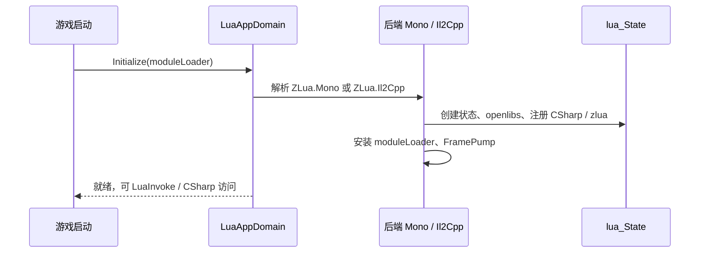

# LuaAppDomain

`LuaAppDomain` 是 ZLua 的 **唯一公开初始化入口**。应用启动时调用一次，完成 Lua 状态创建、`zlua` 标准库加载、`CSharp` 根表注册，并按 Editor / Player 转发到对应后端。

Canonical 示例：[zlua-demo Bootstrap.cs](https://github.com/focus-creative-games/zlua-demo/blob/main/Assets/Bootstrap.cs)

## API

```csharp
namespace ZLua
{
    public class LuaAppDomain
    {
        public static void Initialize(Func<string, object> moduleLoader);
    }
}
```

### `Initialize(moduleLoader)`

| 参数 | 说明 |
|------|------|
| `moduleLoader` | `Func<string, object>`，按模块名返回 Lua 源码 **string** 或 **byte[]** |

典型挂载点：

```csharp
[RuntimeInitializeOnLoadMethod(RuntimeInitializeLoadType.BeforeSceneLoad)]
private static void InitZLuaOnStartup()
{
    LuaAppDomain.Initialize(LoadLuaModule);
}
```

`LoadLuaModule` 负责 Editor（`LuaScripts/*.lua`）与 Player（`StreamingAssets/*.lua.txt`）路径差异，见 [安装指南](../../getting-started/installation)。

## 初始化流程



## 双运行时转发

`LuaAppDomain` 本身在 `ZLua.Common`；实际逻辑由后端程序集实现：

| 环境 | 程序集 | 实现类型 |
|------|--------|----------|
| Unity Editor | `ZLua.Mono` | `LuaMonoAppDomain` |
| Il2Cpp Player | `ZLua.Il2Cpp` | `LuaIl2CppAppDomain` |

`Application.isEditor` 决定加载哪个后端；**对外 API 不变**。

## 生命周期与 FramePump

初始化后会注册 `LuaFramePump`，在 Unity 帧循环中处理：

- ref / userdata 延迟释放（`ProcessPendingRefReleases`）
- 与 Lua GC 协同的 pending 清理

一般 **无需** 手动调用；高级调试时可关注 Editor 日志中的 ZLua 初始化信息。

## 与 `LuaEnv` 的关系

| 类型 | 可见性 | 说明 |
|------|--------|------|
| `LuaAppDomain` | **public** | 游戏代码唯一入口 |
| `LuaEnv` | public（Mono 模块） | 底层 `lua_State` 包装；由后端内部创建，**不建议**业务代码自行 `new LuaEnv()` |

标准集成路径：`LuaAppDomain.Initialize` → `[LuaInvoke]` / `CSharp` 访问。

## 模块加载约定

`moduleLoader("app")` 的返回值会被 `require` 语义加载。与 `[LuaInvoke("app", "main")]` 的 **module** 参数必须一致。

Demo 约定：

| 环境 | 路径 |
|------|------|
| Editor | `{ProjectRoot}/LuaScripts/app.lua` |
| Player | `StreamingAssets/LuaScripts/app.lua.txt` |

## 常见错误

| 现象 | 处理 |
|------|------|
| `Lua module loader is not configured` | 未调用 `Initialize` 或 loader 为 null |
| `require` 失败 | 检查模块名、文件路径、`.lua.txt` 后缀 |
| Player 无 Lua 脚本 | 确认 Sync 脚本已执行，StreamingAssets 含目标文件 |

## 相关文档

- [C# 调用 Lua 指南](../../guides/csharp-to-lua)
- [Lua 模块加载](../../guides/lua-module-loading)
- [设计规范](../../spec/design-spec)
- [源码 LuaAppDomain.cs](https://github.com/focus-creative-games/zlua/blob/main/Runtime/Common/LuaAppDomain.cs)
