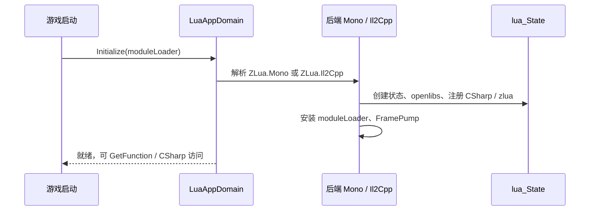

# LuaAppDomain

`LuaAppDomain` 是 ZLua 的 **唯一公开宿主入口**：初始化 Lua，以及用 **`GetFunction`** 从模块按名取得 Lua 函数对应的 Delegate。

Canonical 示例：[zlua-demo Bootstrap.cs](https://github.com/focus-creative-games/zlua-demo/blob/main/Assets/Bootstrap.cs)

## API

```csharp
namespace ZLua
{
    public static class LuaAppDomain
    {
        public static void Initialize(Func<string, object> moduleLoader);

        public static T GetFunction<T>(string luaModule, string luaMethodName)
            where T : MulticastDelegate;
    }
}
```

权威细则：[spec/01-HOST-API.md](/docs/spec/01-HOST-API/)。

---

### `Initialize(moduleLoader)`

| 参数 | 说明 |
|------|------|
| `moduleLoader` | `Func<string, object>`，按模块名返回 Lua 源码 **string** 或 **byte[]** |

```csharp
[RuntimeInitializeOnLoadMethod(RuntimeInitializeLoadType.BeforeSceneLoad)]
private static void InitZLuaOnStartup()
{
    LuaAppDomain.Initialize(LoadLuaModule);
}
```

`LoadLuaModule` 负责 Editor（`LuaScripts/*.lua`）与 Player（`StreamingAssets/*.lua.txt`）路径差异，见 [安装指南](/docs/getting-started/installation/)。

---

### `GetFunction<T>(luaModule, luaMethodName)`

按模块名与方法名解析 Lua `function`，绑定为委托类型 `T` 并返回。

```csharp
var add = LuaAppDomain.GetFunction<Func<int, int, int>>("app", "add");
int sum = add(10, 20);

var onTick = LuaAppDomain.GetFunction<Action<float>>("game", "OnTick");
onTick(0.016f);
```

| 规则 | 说明 |
|------|------|
| `T` | 必须是具体 `MulticastDelegate` 类型（如 `Action<>` / `Func<>`） |
| `luaModule` / `luaMethodName` | 与 `LoadLuaModule` 模块名、Lua `return { ... }` 键名一致 |
| 缓存 | **由调用方负责**（热路径请存到字段 / 局部变量后再调） |
| Marshal | 对返回的 delegate `Invoke` 时遵循 [Marshal 速查表](/docs/reference/marshal-cheatsheet/)；可用 `[LuaMarshalAs]` |

模块缺失、键不是 function、或无法绑定为 `T` → 抛 C# 异常。

---

## 初始化流程


```mermaid
sequenceDiagram
    participant App as 游戏启动
    participant LAD as LuaAppDomain
    participant BE as 后端 Mono / Il2Cpp
    participant L as lua_State

    App->>LAD: Initialize(moduleLoader)
    LAD->>BE: 解析 ZLua.Mono 或 ZLua.Il2Cpp
    BE->>L: 创建状态、openlibs、注册 CSharp / zlua
    BE->>BE: 安装 moduleLoader、FramePump
    LAD-->>App: 就绪，可 GetFunction / CSharp 访问
```

## 双运行时转发

`LuaAppDomain` 本身在 `ZLua.Common`；实际逻辑由后端程序集实现：

| 环境 | 程序集 | 实现类型 |
|------|--------|----------|
| Unity Editor | `ZLua.Mono` | `LuaMonoAppDomain` |
| Il2Cpp Player | `ZLua.Il2Cpp` | `LuaIl2CppAppDomain` |

`Application.isEditor` 决定加载哪个后端；**对外 API 不变**。

## 生命周期与 FramePump

初始化后会注册 `LuaFramePump`，在 Unity 帧循环中处理：

- ref / userdata 延迟释放（`ProcessPendingRefReleases`）
- 与 Lua GC 协同的 pending 清理

一般 **无需** 手动调用。

## 与 `LuaEnv` 的关系

| 类型 | 可见性 | 说明 |
|------|--------|------|
| `LuaAppDomain` | **public** | 游戏代码唯一入口 |
| `LuaEnv` | public（Mono 模块） | 底层 `lua_State` 包装；由后端内部创建，**不建议**业务代码自行 `new LuaEnv()` |

标准集成路径：`LuaAppDomain.Initialize` → `GetFunction` / `CSharp` 访问。

## 模块加载约定

`moduleLoader("app")` 的返回值会被 `require` 语义加载。与 `GetFunction(..., "app", ...)` 的 **module** 参数必须一致。

| 环境 | 路径 |
|------|------|
| Editor | `{ProjectRoot}/LuaScripts/app.lua` |
| Player | `StreamingAssets/LuaScripts/app.lua.txt` |

## 常见错误

| 现象 | 处理 |
|------|------|
| `Lua module loader is not configured` | 未调用 `Initialize` 或 loader 为 null |
| `require` / GetFunction 失败 | 检查模块名、文件路径、`.lua.txt` 后缀、`return` 表键名 |
| Player 无 Lua 脚本 | 确认 Sync 脚本已执行，StreamingAssets 含目标文件 |
| Marshal / 绑定失败 | 对照 [Marshal 速查表](/docs/reference/marshal-cheatsheet/) 与 `T` 签名 |

## 相关文档

- [C# 调用 Lua 指南](/docs/guides/csharp-to-lua/)
- [回调与 Delegate](/docs/guides/callbacks-and-delegates/)
- [Lua 模块加载](/docs/guides/lua-module-loading/)
- [设计规范](/docs/spec/00-OVERVIEW/)
- [源码 LuaAppDomain.cs](https://github.com/focus-creative-games/zlua/blob/main/Runtime/Common/LuaAppDomain.cs)
