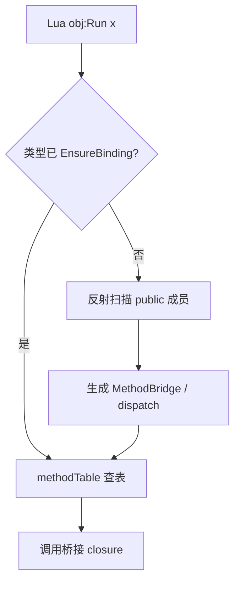

# MonoLuaCallback

ZLua 文档中的 **`[LuaCallback]`** 概念对应实现为 **`MonoLuaCallbackAttribute`**（类比 Unity 的 `MonoPInvokeCallback`）：标记 **可从 native / Lua 直接调用的 C# 函数指针**。

```csharp
using ZLua;

[MonoLuaCallback(typeof(LuaCSFunction))]
private static int MyNativeEntry(IntPtr L)
{
    // 仅允许 int (IntPtr L) 签名
    return 0;
}
```

:::info 一般无需手动使用
Lua 调用 C# 成员时，桥接函数在 **首次调用时自动注册**，**不需要** 为每个 C# 方法加 `[MonoLuaCallback]`。仅在需要把 **C# 函数指针** 交给 Lua C API（如 `lua_pushcfunction`）时才需要。
:::

## 属性定义

```csharp
[AttributeUsage(AttributeTargets.Method)]
public sealed class MonoLuaCallbackAttribute : Attribute
{
    public Type DelegateType { get; }
    public MonoLuaCallbackAttribute(Type delegateType);
}
```

| 参数 | 说明 |
|------|------|
| `delegateType` | 通常为 `typeof(LuaCSFunction)`，即 `int (IntPtr L)` |

## 签名限制

Lua C API 回调 **仅支持**：

```csharp
delegate int LuaCSFunction(IntPtr L);
```

因此 MonoLuaCallback **不能** 用于：

- 任意 C# 方法签名直接暴露给 Lua（应走 MethodBridge）
- 带 ref/out、多参数的业务 API

## 使用场景

| 场景 | 是否需要 |
|------|----------|
| `obj:Method()` / `Type.Static()` | ❌ 自动桥接 |
| Lua function → C# delegate 形参 | ❌ 隐式 marshal，见 [回调指南](../../guides/callbacks-and-delegates) |
| ZLua 内部 `__zlua_*` native 回调注册 | ✅ 框架内部使用 |
| 扩展 native 模块、自定义 `lua_pushcfunction` | ✅ 高级场景 |

## 与 Lua 调用 C# 自动注册的关系



自动注册的桥接函数内部可能 **自身** 带 `[MonoLuaCallback]`，对游戏代码透明。

## Il2Cpp 说明

Player 侧 native 桥由 C++ 生成；游戏 C# 代码 **极少** 需要 MonoLuaCallback。若扩展 Il2Cpp 插件，遵循与 Mono 相同的 `int (lua_State* L)` 约束。

## 相关文档

- [回调与 Delegate 指南](../../guides/callbacks-and-delegates)
- [Function 编组规范](../../spec/marshal/function)
- [设计规范](../../spec/design-spec)
