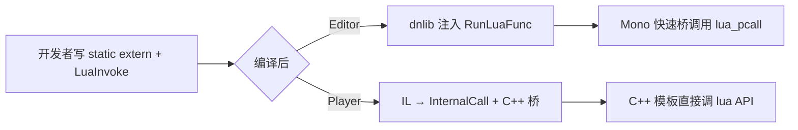

# LuaInvoke

C# 调用 Lua 的 **L/Invoke** 入口。声明 `static extern` 方法并标注模块名与函数名，编译后由 CodeGen 注入实现。

Canonical：[zlua-demo Bootstrap.cs](https://github.com/focus-creative-games/zlua-demo/blob/main/Assets/Bootstrap.cs)

## 属性定义

```csharp
[AttributeUsage(AttributeTargets.Method, AllowMultiple = false)]
public sealed class LuaInvokeAttribute : Attribute
{
    public string Module { get; }
    public string Function { get; }

    public LuaInvokeAttribute(string module, string function);
    public LuaInvokeAttribute();  // 空构造；module/function 由 Weaver 推断（不推荐）
}
```

## 声明模板

```csharp
[LuaInvoke("app", "main")]
private static extern void AppMain();

[LuaInvoke("app", "add")]
private static extern int AppAdd(int a, int b);
```

| 规则 | 说明 |
|------|------|
| 必须是 `static extern` | 实例方法、普通 static 方法不可用于 LuaInvoke |
| 不能是泛型方法 | 也不能位于泛型类的实例成员上 |
| module / function | 与 `LoadLuaModule` 模块名、Lua `return { ... }` 键名一致 |
| 访问修饰符 | 通常 `private static`；Player 经 InternalCall 仍可从同程序集调用 |

## 参数与返回值

遵循 [编组速查表](../marshal-cheatsheet) 默认规则；可用 `[LuaMarshalAs]` 覆盖（Mono 全功能）。

| 方向 | 常见支持类型 |
|------|--------------|
| C# → Lua（参数 push） | bool、整型、float/double、string、enum、class、struct（含 OpaqueLightUserData） |
| Lua → C#（返回值 pop） | 同上；`void` 无返回值 |

:::warning Il2Cpp MVP 限制
Player 当前仅覆盖 Demo 级签名（int、bool、string、void 等）。超出类型见 [兼容性](../../getting-started/compatibility)。
:::

**不支持：** ref / out / in 形参（LuaInvoke 路径）；delegate 作为参数需专用 bridge。

## CodeGen 与双运行时



| 阶段 | Mono (Editor) | Il2Cpp (Player) |
|------|---------------|-----------------|
| 触发 | 程序集编译后 Editor CodeGen | 发布构建 / Weaver |
| 注入体 | `LuaMonoAppDomain.RunLuaFunc` | `extern` + 生成 C++ |
| 开发者感知 | **无** | **无** |

编译后检查：方法应带 `[LuaInvokeWeaverProcessed]`（internal，表示已注入）。

## 调用流程

1. `LuaAppDomain.Initialize(LoadLuaModule)` 完成
2. C# 调用 `[LuaInvoke]` 方法
3. 后端按 module 名 `require` / 缓存模块表
4. 从 return 表取出 function 引用并 `pcall`
5. 按签名 marshal 参数与返回值

模块缓存与 `require` 语义见 [Lua 模块加载](../../guides/lua-module-loading)。

## 常见错误

| 现象 | 处理 |
|------|------|
| 找不到 Lua 函数 | 检查 module 名、return 表键名、是否 `return { fn = fn }` |
| Marshal 类型错误 | 对照速查表；Player 确认 MVP 是否支持该类型 |
| 编译失败：非 static extern | 修正声明 |
| 泛型类内 LuaInvoke | 移到非泛型类或 static 辅助类 |

## 相关文档

- [C# 调用 Lua 指南](../../guides/csharp-to-lua)
- [LuaAppDomain](./lua-app-domain)
- [LuaMarshalAs](./lua-marshal-as)
- [设计规范](../../spec/design-spec)
