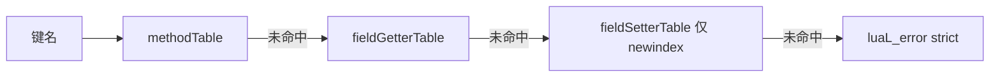
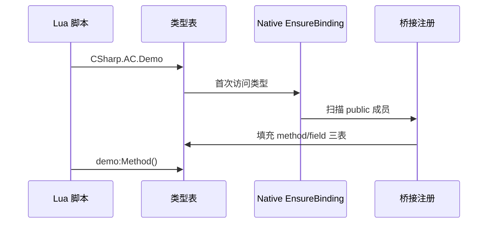

# CSharp 根表

全局 **`CSharp`** 是 Lua 访问所有托管类型的 **唯一入口**。程序集与类型均为 **懒加载**：首次访问时才注册元表与成员桥接。

## 访问语法

```lua
CSharp                           -- 根表
CSharp['Assembly-CSharp']        -- 程序集（简单名，无 .dll）
CSharp.AC.Demo                   -- 无 namespace 类型（需先设别名 CSharp['AC'] = CSharp['Assembly-CSharp']）
CSharp.AC['MyGame.UI.Panel']     -- 含 namespace 类型（强制括号）
```

| 层级 | `__index` 行为 |
|------|----------------|
| `CSharp` | 懒加载程序集表 |
| `{assembly}` | 懒加载类型表 |
| `{type}` | 静态成员表 + `_ctor` / `__call` |

简写别名（Demo 惯例，非框架强制）：

```lua
CSharp['AC'] = CSharp['Assembly-CSharp']
```

## 类型表能力

| 操作 | 写法 | 说明 |
|------|------|------|
| 构造实例 | `CSharp.AC.Demo()` | 调用 `_ctor` / `__call` |
| 静态字段 | `CSharp.AC.Demo.s_x = 10` | 经 fieldGetter / fieldSetter |
| 静态方法 | `CSharp.AC.Demo.Add(3, 5)` | methodTable |
| 静态 Property | `Type.prop` | 与字段相同语法（无参） |
| enum 常量 | `CSharp.AC['MyGame.Color'].Red` | integer/number 常量字段 |

## 实例 userdata

```lua
local demo = CSharp.AC.Demo()
demo.x = 10
demo:GetX()
demo:Run(10)
```

实例成员经 **实例元表（IMT）** 分派，与类型表 **静实例隔离**：不得 `obj.StaticMethod()` 隐式访问静态成员。

## 三表分派（strict miss）

成员访问顺序：



| 表 | 读 (`__index`) | 写 (`__newindex`) |
|----|----------------|-------------------|
| methodTable | 方法、dispatch、别名 | — |
| fieldGetterTable | 字段、无参 property | — |
| fieldSetterTable | — | 字段、无参 property |

**无反射 fallback**：未注册成员直接 **Lua error**，便于尽早发现 API 误用。

## 懒加载流程



Il2Cpp Player 在 Codegen 阶段预生成绑定；Mono Editor 在运行时反射 + 缓存。

## 常见错误信息

| 消息（示例） | 原因 |
|--------------|------|
| `type not found` / 程序集 nil | 程序集名错误、类型未 public、Player 未包含该程序集 |
| `member 'X' not found` | 成员非 public、拼写错误、Il2Cpp MVP 未生成桥 |
| 含 namespace 点号访问失败 | 须 `CSharp.asm['Ns.Type']` 括号形式 |
| `invalid userdata` | 实例已释放或类型不匹配 |

排错步骤见 [故障排查](../../guides/troubleshooting)。

## Mono / Il2Cpp 差异（Lua 可见语义一致）

| 项 | Mono | Il2Cpp MVP |
|----|------|------------|
| 懒加载 | ✅ 反射 | ⚠️ 预生成子集 |
| 字段直读 | ✅ | ✅（Demo 级） |
| 重载 dispatch | ✅ | ❌ |
| 泛型 / Event | ✅ | ❌ |

## 相关文档

- [Lua 访问 C# 基础](../../guides/lua-to-csharp-basics)
- [元表模型](../../concepts/metatable-model)
- [类型系统规范](../../spec/type-system-spec)
- [类型系统概览](../../concepts/type-system-overview)
