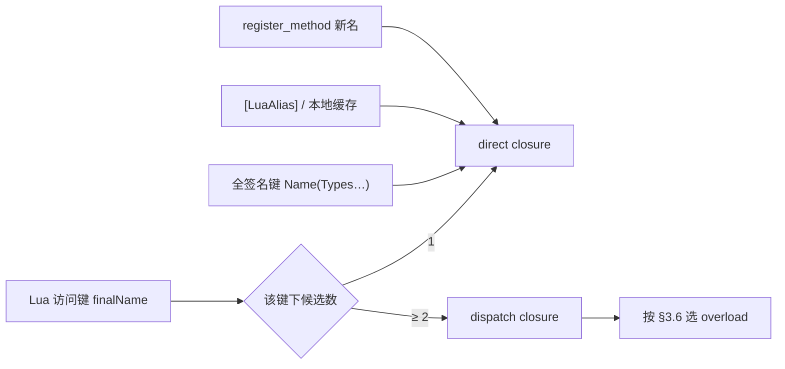

---
sidebar_position: 4
title: "方法重载"
---

# 04 — 方法重载

> C# 方法重载在 Lua 侧的解析与调用策略。适用于 **Il2Cpp（Player）** 与 **Mono（Editor）**。  
> 继承与 Bind 规则见 [02-TYPE-SYSTEM.md](/docs/spec/02-TYPE-SYSTEM/) §5；`zlua` API 见 [05-LIB.md](/docs/spec/05-LIB/)。

---

## 1. 问题与目标

C# 允许同名方法因参数类型/个数不同而重载；Lua 无静态类型，无法仅凭 `obj:Run(x)` 在编译期选定重载。

| 目标 | 说明 |
|------|------|
| 易用 | `obj:Run(10)` 在常见场景下应能工作 |
| 精确 | 同名冲突时 Bind 期自动挂 **全签名键**；亦可 `[LuaAlias]` / `register_method` 挂短名 |
| 性能 | 热路径优先单候选 direct（全签名键、别名、或本地缓存 closure），避免反复走 dispatch |
| 一致 | Mono 与 Il2Cpp 选中同一重载，错误信息一致 |

---

## 2. 三层机制（优先级）



1. **按最终名字分组**（§3、§5）：绑定时每个方法以其 **最终 Lua 名**（C# 默认名、`[LuaAlias]` / XML 别名）进入分组；**同名允许多个候选**（仅 Bind 期别名机制）。
2. **单候选 → direct；多候选 → dispatch**（§3.6）。
3. **同名多候选时额外挂全签名键**（§3.7）：每个冲突重载再注册一条 **direct** 键 `MethodName(ParamTypeFullNames…)`（**不含**返回类型），脚本可精确点名某一重载而 **不必** 先 `register_method`。
4. **运行时**（§6）：`register_method` 仅允许挂到 **尚不存在** 的新最终名（§6.1），把已有 direct closure（常来自全签名键或 `[LuaAlias]`）挂成 **短名**，便于 `obj:alias(...)` 冒号调用。

---


## 3. 默认名与 dispatch

### 3.1 注册规则（按最终名字分组）

在同一类型、同一 `is_static` 域、同一实例形态（ByVal / ByObj）内，先收集每个方法的 **最终 Lua 名集合**（见 §5），再按名字聚合：

| 该最终名下的候选方法数 | 元表键绑定 |
|------------------------|------------|
| 1 | 该候选的 **direct method closure** |
| ≥ 2 | **dispatch closure**（调用时按 §3.6 选具体重载） |

来源可以是：

- 多个 C# 同名重载（默认名相同）；或
- `[LuaAlias]` / XML 把不同方法挂到 **同一最终名**（与默认名或其他别名重复均允许）。

> **`zlua.register_method` 除外：** 运行时注册 **禁止** 使用已存在的最终名（见 §6.1），因此不会通过该 API 扩大已有 overload 组。

静态与实例分表存放（`staticMap` vs `byvalInstanceMap` / `byobjInstanceMap`）。C# 允许 `static void Foo()` 与 `void Foo()` 同名，二者互不影响。

### 3.2 重载候选顺序

分派时遍历候选列表，在 **applicable** 重载中按 **§3.6 better function member** 选优；**不得**因 metadata 声明顺序靠前就选中 `ImplicitBoxing` 而跳过更优的 `Identity` 重载。

候选遍历顺序（仅用于 **同分 tie-break**）：

1. **Codegen 声明顺序**（Il2Cpp / Mono 生成元数据中的顺序）
2. 反射兜底：确定性排序（如完整签名字典序）

### 3.3 参数匹配规则

在 **Lua 栈槽个数**可接受的前提下，按栈光标逐 **CLR 形参**判断是否可绑定（`UnpackedValues` 等可占用多槽，见下表与 [marshal/02-MARSHAL-AS.md](/docs/spec/marshal/02-MARSHAL-AS/) §5.6）。规则与 [marshal/](/docs/spec/marshal/) 的 `ReadValue` / `TryPop` 一致，包括但不限于：

| Lua 实参 | C# 形参 | 规则 |
|----------|---------|------|
| `integer` | `int` / `long` 等 | 在目标类型范围内 |
| `number`（非整数） | `int` | **不匹配** |
| `number` | `float` / `double` | 允许 |
| `string` | `string` | 允许 |
| `nil` | 引用类型 / `Nullable<T>` | 允许 |
| `nil` | 值类型（非 Nullable） | 不匹配 |
| userdata | 引用类型 | 运行时类型可赋值 |
| 基元 / `string` | **`object`** | 允许；`ImplicitBoxing` 或 `ImplicitReference` |
| ByVal 值类型 | **`object` / 其实现的 interface** | 可隐式装箱时 `ImplicitBoxing` |
| 基元 | **`class` / `interface`（非 `object`）** | **不匹配** |
| 多参 + `params T[]` | `params` | **单栈槽**；与 szarray 相同（table / userdata / `nil`）；**不**多槽隐式收集 |
| `UnpackedValues` 形参 | 连续 N 槽 | 该 CLR 形参占用 **N** 个 Lua 实参槽（`N = Members.Length`）；匹配时按栈槽累加，见 [marshal/02-MARSHAL-AS.md](/docs/spec/marshal/02-MARSHAL-AS/) §5.6 |

**可选 / 默认参数：** Lua 实参少于形参时，若剩余形参有 C# 默认值，仍可匹配。

**构造函数：** `Type(...)` / `SMT.__call` 使用与实例方法相同的分派逻辑。

### 3.4 性能说明

dispatch 每次调用需遍历候选并重算匹配，为**低效路径**。热点若只需固定重载，应使用：

- 该重载的 **全签名键**（§3.7，已是 direct）；或
- **只含单候选** 的最终名（例如独立 `[LuaAlias("run_i32")]`）；或
- `register_method` 挂短名后冒号调用；或
- 在脚本内 **本地缓存** direct closure（如 `local run = demo['Run(System.Int32)']`）。

### 3.5 失败错误

无匹配重载时 `luaL_error`，并列出候选签名，例如：

```
no overload for Demo.Run matching (number); candidates: Run(System.Int32), Run(System.String)
```

错误文案中的候选名与 §3.7 全签名键一致，便于脚本对照改写。

### 3.6 隐式转换分类与最优重载选择

重载分派须与 **C# better function member** 一致。

#### 3.6.1 设计原则

1. **`ConversionKind` 只描述 C# 隐式转换类别**，不描述 Lua userdata 载荷形态。
2. **选优规则与 C# 一致**。
3. **Mono / Il2Cpp** 对同一组 Lua 实参须选中同一 C# 重载。

#### 3.6.2 `ConversionKind`

| Kind | C# 对应 | 含义 |
|------|---------|------|
| `Identity` | 恒等转换 | 类型相同 |
| `ImplicitNumeric` | 隐式数值转换 | 仅拓宽 |
| `ImplicitEnum` | 隐式枚举转换 | integer → enum |
| `NullLiteral` | null 字面量 | `nil` → 引用 / Nullable |
| `ImplicitReference` | 隐式引用转换 | 子类→父类；`string`→`object` |
| `ImplicitBoxing` | 隐式装箱 | 值类型→`object` / interface |
| `None` | — | 不匹配 |

Kind 优劣链：

`Identity` ≻ `ImplicitNumeric` ≻ `ImplicitEnum` ≻ `NullLiteral` ≻ `ImplicitReference` ≻ `ImplicitBoxing`

#### 3.6.3 Better function member

1. 逐形参计算 `GetConversionKind`；任一 `None` → 不适用。
2. M 优于 N：存在形参 i 使 M 更优，且不存在 j 使 N 更优。
3. 无 strictly better → §3.2 声明顺序 tie-break。

**示例：**

| Lua 调用 | 结论 |
|----------|------|
| `Run(10)`，`Run(int)` vs `Run(object)` | 选 `Run(int)`（Identity ≻ Boxing） |
| `SetValue(10, 0)`，`SetValue(object,int)` vs `SetValue(object,long)` | 选 `(object,int)`（p1 Identity ≻ Numeric） |

#### 3.6.4 invoke 期隐式 Box

仅当 Kind 为 `ImplicitBoxing` 时，在 **已选定重载** 的 `TryPop` 内 `Object::Box`。**禁止**在 `GetConversionKind` 循环内 Box。

### 3.7 同名冲突：全签名键（Bind 期自动）

当某一最终名（通常为 C# 默认方法名）下 **候选数 ≥ 2** 时，除将该名绑定为 **dispatch closure** 外，还须为 **每一个** 候选重载再注册一条 **direct** 元表键：

```text
<MethodName>(<Type0.FullName>,<Type1.FullName>,…)
```

| 规则 | 说明 |
|------|------|
| 何时注册 | **仅** 该最终名下存在名字冲突（≥ 2 候选）时；单候选方法 **不** 强制挂全签名键 |
| 方法名 | C# `MethodInfo.Name`（与默认最终名一致；不是 `[LuaAlias]` 短名） |
| 参数列表 | 与 §4.1 签名字符串相同：括号 + 逗号分隔的 **`Type.FullName`**；**不含** 返回类型；byref / 数组 / 泛型写法与元数据一致 |
| 绑定值 | 该候选的 **direct method closure**（与单重载 direct 相同） |
| 静 / 实例 | 与方法域一致，写入对应 `staticMap` 或 instance map |

**示例：** `Foo` 上有 `int Run(int)` 与 `int Run(string)`：

| 元表键 | 绑定 |
|--------|------|
| `Run` | dispatch（运行时按 §3.6 选） |
| `Run(System.Int32)` | direct → `Run(int)` |
| `Run(System.String)` | direct → `Run(string)` |

```lua
local demo = CSharp.AC.Foo()

demo:Run(5)                              -- dispatch → Run(int)
demo:Run("hi")                           -- dispatch → Run(string)

-- 无需 register_method，直接精确点名（点号 + 显式 self）
demo['Run(System.Int32)'](demo, 5)
demo['Run(System.String)'](demo, "hi")
```

> **冒号语法：** 键名含 `(` / `)`，不能写 `demo:Run(System.Int32)(...)`；须用括号键 + 点号调用。若需要 `demo:run_i32(5)` 这类短名冒号调用，再用 `[LuaAlias]` 或 `register_method`（§5、§6）。

构造函数多重载时，全签名键落在类型表侧（与 `_ctor` / `__call` 分派配套的实现约定以实现为准），参数列表格式同本节。

---

## 4. 签名字符串规范

### 4.1 `zlua.signature`

```lua
local sig = __zlua_create_signature(zlua.types.int32)
-- sig == "(System.Int32)"

local sig0 = __zlua_create_signature()
-- sig0 == "()"
```

**约定：**

- 参数为 C# 类型：类型表、`zlua.types.*` 或 mscorlib 字符串（与 [05-LIB.md](/docs/spec/05-LIB/) typeArg 相同）
- **不包含** 方法名（方法名由调用方拼接，见 §3.7）
- 格式：括号包裹、逗号分隔的 **`Type.FullName`** 列表
- 泛型、数组格式与 Codegen 元数据一致

Native 回调：`__zlua_create_signature`（`ZLuaLib.cpp`）。建议在项目 `zlualib` 扩展中封装为 `zlua.signature(...)`。

### 4.2 全签名键 = 方法名 + §4.1

```
"Run" + "(System.Int32)"  →  Lua 元表键 "Run(System.Int32)"
```

该键在 **同名多候选** 时 **暴露** 为 `methodTable` 的 `__index` 字符串键（§3.7）。  
**禁止** 把 **仅** 参数括号（如 `"(System.Int32)"`）当作方法键；必须带方法名。

---


## 5. 别名机制（`[LuaAlias]`）

### 5.1 模型：换名注册 + 按最终名分组

`[LuaAlias]` / XML 为该方法指定 **唯一最终 Lua 名**，**替换**（而非追加）C# 默认名 `MethodInfo.Name`。有别名时 **不再** 以默认名注册该方法。

对每个 public 方法，其 **最终 Lua 名** 为（优先级由高到低）：

| 来源 | 条件 |
|------|------|
| `[LuaAlias("…")]` | Attribute 存在且非空 → 用该字符串 |
| XML `Method/@alias` | 无 Attribute 时，若 XML 有规则 → 用该字符串 |
| C# 默认名 `MethodInfo.Name` | 以上皆无 |

随后在同一绑定域内：

```
按 finalName 聚合候选方法 → 候选数 1 → direct；≥ 2 → dispatch（§3.6）
```

因此：

- **允许**别名与其它方法的默认名或其它别名重复（撞名则并入同一 overload 组）；
- **不允许**「既挂别名又保留本方法默认名」——别名即换名；
- 调用该重名键时，与普通 C# 重载相同，走 **函数重载规则** 选合适候选。

### 5.2 允许重复（示例）

```csharp
public class Demo
{
    public void Run(int value) { }
    public void Run(string value) { }   // 默认名相同 → "Run" 自然成组

    public void Foo(int x) { }

    [LuaAlias("Foo")]                   // 允许：与已有方法名 Foo 重复 → 并入 "Foo"；本方法不再挂 "Bar"
    public void Bar(string s) { }

    [LuaAlias("print")]
    public void LogA(int x) { }

    [LuaAlias("print")]                 // 允许：别名彼此重复 → "print" 成组
    public void LogB(string s) { }

    [LuaAlias("run_i32")]               // 仅该最终名下多一个候选 → 通常为 direct；不再挂默认名 "Run"
    public void Run(long value) { }
}
```

```lua
local d = CSharp.AC.Demo()

d:Run(10)         -- "Run" 组（int/string；不含 long）→ dispatch
d:Foo("hi")       -- "Foo" 组含 Foo(int) 与 Bar(string) → dispatch → Bar(string)
d:print(1)        -- "print" 组 → dispatch
d:run_i32(10)     -- "run_i32" 单候选 → direct → Run(long)
-- d:Bar("x")     -- 不可用：Bar 已换名为 Foo
```

### 5.3 C# Attribute

```csharp
[LuaAlias("run_i32")]
public void Run(int value) { ... }
```

- 定义于 `ZLua.Common`。
- 与 XML：同一方法上 **Attribute 优先于 XML**（有 Attribute 则用 Attribute 作为最终名，忽略该槽位 XML；无 Attribute 才用 XML）。二者都是 **换名**，不是「默认名 + 别名」双挂。

### 5.4 XML 配置（独立于 MarshalAs）

`[LuaAlias]` 与 `[LuaMarshalAs]` **目标不同**（最终 Lua 名 vs 形参/返回值/成员 Marshal），绝大多数场景无交集。XML 可 **共享类似的 `Assembly` / `Type` / `Method` 定位风格**，但必须：

| 约束 | 说明 |
|------|------|
| **独立路径列表** | Editor Settings 字段 **`luaAliasXmlPaths`**（与 `marshalAsXmlPaths` **并列、分开配置**） |
| **独立根元素** | **`ZLuaAlias`**；**不得**使用 `ZLuaMarshalAs` |
| **独立文件** | Alias 与 MarshalAs **分文件**书写（可共享 `Assembly`/`Type`/`Method` 定位风格） |

```xml
<?xml version="1.0" encoding="utf-8"?>
<ZLuaAlias version="1">
  <Assembly name="Assembly-CSharp">
    <Type fullName="Demo">
      <Method name="Run" signature="(System.Int32)" alias="run_i32"/>
    </Type>
  </Assembly>
</ZLuaAlias>
```

| 元素 / 属性 | 含义 |
|-------------|------|
| `version` | 必填；当前仅 `"1"`。未知 version → **失败** |
| `Assembly/@name` | `Assembly.GetName().Name`（与 MarshalAs XML 相同约定） |
| `Type/@fullName` | CLR 全名（嵌套 `Outer+Inner`；开放泛型写 ``Foo`1`` 作挂载容器） |
| `Method/@name` | CLR `MethodInfo.Name` |
| `Method/@signature` | 参数类型列表，圆括号包裹：`()` / `(T1,T2)`；byref 后缀 `&`；数组 `T[]`；**不含**返回类型（与 MarshalAs 的 Method 定位约定一致） |
| `Method/@alias` | **必填**；非空；作为该方法的 **唯一最终 Lua 名**（§5.1，替换默认名） |

**本文件允许的内容：** 仅 `Assembly` → `Type` → 带 `@alias` 的 `Method`。  
**禁止：** `MarshalAs` / `Param` / `Return` / `Field` / `Property` 子元素，或 Method 缺少 `@alias` → **失败**。

| 其它约束 | 说明 |
|----------|------|
| 换名 | 有 `@alias` 时 **不**再以 `MethodInfo.Name` 注册该方法 |
| 与 Attribute | 同一方法若有 Attribute，以 Attribute 为准（§5.3）；XML 该条可记录为未使用（可选诊断） |
| 平台 | Mono 运行时按 `luaAliasXmlPaths` 解析；Il2Cpp **Generate** 成静态 alias 表，Player **不**读 XML（加载/Generate 模式对齐 [marshal/02-MARSHAL-AS.md](/docs/spec/marshal/02-MARSHAL-AS/) §9.6–§9.7，但是 **独立** registry / 生成物） |
| 重复 | 合并全部 alias XML 后，同一 `(assembly, type, methodName, signature)` 出现多条 `@alias` → **失败**（不得后文件覆盖）。不同方法撞同一最终名 **允许**（并入 overload 组，§5.1） |
### 5.5 静态 / 实例

- 实例最终名 → `byvalInstanceMap` / `byobjInstanceMap`（与 closure 域一致）
- 静态最终名 → `staticMap`

分组 **不得**跨静/实例或跨 ByVal/ByObj。

### 5.6 与 field / property 同名

若最终方法名与 field / 无参 property 同名，`__index` 仍 **methodTable 优先**（见 [metatable/02-INDEX.md](/docs/spec/metatable/02-INDEX/)）。这与「方法—方法」重名进 overload 组是不同层规则。

---

## 6. 运行时 API

显式点名某一重载时，优先顺序：

1. **全签名键**（§3.7，Bind 期自动，无需 API）  
2. Bind 期 **`[LuaAlias]`** 短名  
3. 从全签名键 / 别名取出 direct closure 后 **`register_method`** 挂自定义短名（便于冒号调用）

`zlua.signature(...)`（§4.1）用于拼出 / 对照参数括号部分，**不是**单独的元表键。

### 6.1 `zlua.register_method`

**须与 `ZLuaLib.cpp` / `zlualib.lua` 一致：两参数形式。**

```lua
zlua.register_method(aliasName, methodOrClosure) → void
```

**用途：** 把已有的 **direct** closure 挂到一个 **尚不存在** 的短名上。注册成功后，实例方法可用 **冒号** 调用（不必再写括号键 + 显式 `self`）。

```lua
local demo = CSharp.AC.Demo()

-- 1) 全签名键：无需 register，但须点号 + self
demo['Run(System.Int32)'](demo, 5)

-- 2) 取出 direct closure，挂短名
local run_i32 = demo['Run(System.Int32)']
zlua.register_method("run_i32", run_i32)

-- 3) 之后任意该类型实例均可冒号调用
demo:run_i32(5)
```

```lua
local Demo = CSharp.AC.Demo
local calc = Demo()

-- 亦可从 [LuaAlias] 单候选键取得 direct closure
local run = calc.run_i32
zlua.register_method("run_custom_i32", run)
calc:run_custom_i32(20)

local add = Demo.add_i32
zlua.register_method("add_custom_i32", add)
assert(Demo.add_custom_i32(3, 5) == 8)
```

| 参数 | 说明 |
|------|------|
| `aliasName` | 非空字符串；作为 **新的** 最终 Lua 名写入 method 表 |
| `methodOrClosure` | **direct method closure**（单一候选；`MetaBinding::IsDirectMethodClosure` 等） |

**写入目标（由 closure 内嵌 `TypeBinding` 推断）：**

| closure 域 | 写入 |
|------------|------|
| 静态方法 | `binding->staticMap` + 静态 method 索引表 |
| 实例 ByVal | `binding->byvalInstanceMap` |
| 实例 ByObj | `binding->byobjInstanceMap` |

**与已有键的关系（简化重载管理）：**

为避免运行时改写已有 overload 组，`register_method` **不允许** `aliasName` 在目标 method 表（对应静/实例 map / `methodTable`）中 **已经存在**——无论该键当前是：

- 单个 **direct** 方法；还是
- **dispatch** 重载组；还是
- 全签名键或其它已占用的 method 槽。

| 情况 | 行为 |
|------|------|
| `aliasName` **不存在** | 写入 **direct** closure（该名下仅此候选） |
| `aliasName` **已存在**（direct 或 dispatch 等） | **`luaL_error`**，不覆盖、不并入 |
| 传入 **dispatch** closure | **`luaL_error`**（只接受可解析为单一候选的 direct closure） |

与 §5 `[LuaAlias]` 的差异：别名在 **Bind 期** 允许撞名并组成 overload；`register_method` 在 **运行时** 只做「空位挂名」，**不**参与重载合并。

与 §3.7 的差异：全签名键已由 Bind 提供精确入口；`register_method` 解决的是 **可读短名 + 冒号语法**，不是「唯一能点名重载的方式」。

**错误：**

| 条件 | 行为 |
|------|------|
| 参数个数 ≠ 2 | `luaL_error` |
| 无法识别为合法 direct method closure | `luaL_error` |
| `aliasName` 已在元表 method 侧占用 | `luaL_error` |

Native：`__zlua_register_method`（Il2Cpp 已实现）。

> **签名说明：** 仅接受两参数 `(aliasName, closure)`；目标表由 closure 绑定域决定，**无需**传入类型表或实例。

### 6.2 `zlua.types`

预置 mscorlib 类型名字符串，见 [05-LIB.md](/docs/spec/05-LIB/) §4.2。

---

## 7. 调用约定摘要

| 场景 | 写法 |
|------|------|
| 默认分派 | `demo:Run(10)` |
| 精确重载（全签名键，§3.7） | `demo['Run(System.Int32)'](demo, 10)` |
| `[LuaAlias]` 短名 | `demo:run_i32(20)` |
| `register_method` 后 | `demo:run_custom_i32(20)` |
| 静态 | `Demo.Add(3, 5)` / `Demo['Add(System.Int32,System.Int32)'](3, 5)` |
| ~~仅参数括号当键~~ | ~~`demo['(System.Int32)'](...)`~~ **禁止** |

实例方法：全签名键用 **点号** 并显式传 `self`；短别名（`[LuaAlias]` / `register_method`）可用 **冒号**。

---

## 8. Mono / Il2Cpp 一致性

| 项 | 要求 |
|----|------|
| 按最终名分组 + dispatch §3 / §5 | 一致 |
| 同名多候选时全签名键 §3.7 | 一致 |
| 别名允许与默认名 / 其它别名重复 | 一致 |
| 签名格式 §4.1 | 一致 |
| dispatch §3.3、§3.6 | 一致 |
| 选中重载 | 相同实参 → 相同 C# 重载 |
| `register_method` 两参数；**已占用名拒绝** | 一致 |
| 错误文案 | 一致或等价 |

---

## 9. 完整示例

```csharp
public class Demo
{
    public void Run(int value) { }

    [LuaAlias("run_str")]   // 换名为 "run_str"；不再挂默认名 "Run"
    public void Run(string value) { }

    public void Foo(int x) { }

    [LuaAlias("Foo")]       // 与默认名 Foo 重复 → "Foo" 组含 Foo(int)+Bar(string)；Bar 不再挂 "Bar"
    public void Bar(string s) { }

    public static int Add(int a, int b) => a + b;

    [LuaAlias("add_i32")]
    public static int Add(int x) => x;
}
```

```lua
local demo = CSharp.AC.Demo()

demo:Run(10)        -- "Run" 多候选 → dispatch → Run(int)
demo:Run("ab")      -- dispatch → Run(string)
demo['Run(System.Int32)'](demo, 10)   -- 全签名键 → direct，无需 register_method
demo:run_str("x")   -- 单候选别名 → direct

demo:Foo("hi")      -- "Foo" 含 Foo(int) 与 Bar(string) → dispatch → Bar(string)

local run_i32 = demo['Run(System.Int32)']
zlua.register_method("run_cached", run_i32)   -- 须为尚未占用的新名
demo:run_cached(20)                           -- 短名 + 冒号

local add = CSharp.AC.Demo.add_i32
zlua.register_method("add_one", add)           -- OK：新名
-- zlua.register_method("Add", add)            -- error：默认名 / 重载组已存在
assert.equal(CSharp.AC.Demo.add_one(7), 7)
```

---

## 10. 实现落点（参考）

| 模块 | 职责 |
|------|------|
| `ValueMarshaling` / Mono 等价 | `ConversionKind`、`GetConversionKind`、`TryPop` |
| `FindMatchingMethod` | applicable + better member |
| `MetaBinding` | dispatch、direct closure、`register_method` |
| `ZLuaLib.cpp` | `__zlua_create_signature`、`__zlua_register_method` |
| Codegen | `[LuaAlias]` 写入元数据 |
