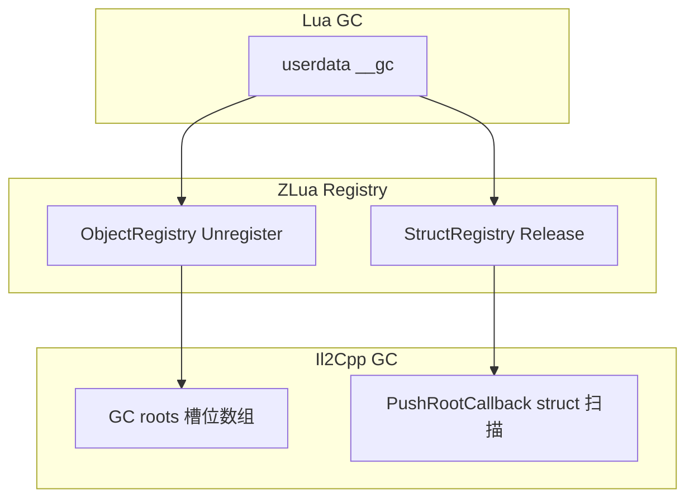

---
sidebar_position: 6
title: "生命周期与 GC"
---

# 10 — 生命周期、GC 与异常边界

> `ObjectRegistry`、Struct 相关 Registry、Opaque 有效期、单 `lua_State` 与 C#↔Lua 异常转换。  
> Opaque 细节 → [marshal/04-OPAQUE.md](marshal/04-OPAQUE.md)；Registry 实现 → [impl/marshal/REGISTRIES.md](../impl/marshal/REGISTRIES)。

---

## 1. 设计原则

| 原则 | 说明 |
|------|------|
| **Lua 语义优先** | 托管对象存活须与 Lua userdata / ref 生命周期一致 |
| **Il2Cpp GC 集成** | ByObj 槽位数组注册 **GC root**；non-blittable struct 须扫描 struct 内存 |
| **Opaque 临时性** | 仅同步 C#→Lua 调用帧内有效；**禁止**持久化 |
| **单主状态** | 默认一个 `lua_State`；ref 释放经帧泵批量处理 |
| **异常可预测** | C# 异常 ↔ Lua error 在边界统一转换 |

Mono 与 Il2Cpp **对外行为一致**；内部机制可不同（GCHandle vs Il2CppObject*）。

---

## 2. `ObjectRegistry`（ByObj userdata）

### 2.1 职责

管理 **class / string / array / delegate / boxed enum** 等 **ByObj** userdata：

| 机制 | 说明 |
|------|------|
| **槽位表** | 每个 Push 的托管对象分配 `slotIndex`，写入 `_registeredObjects[]` |
| **GC root** | 槽位数组通过 `GarbageCollector::RegisterRoot` 注册，防止 Lua 仍持有 userdata 时对象被 Il2Cpp GC 回收 |
| **弱值缓存** | `(Il2CppObject*, viewKlass)` → registry ref；避免同一 identity+门面重复 Push |
| **`__gc`** | Lua GC 回收 userdata → `UnregisterObject(slot)` + 移除缓存项 |

### 2.2 Push / Pop

```cpp
ObjectRegistry::Push(L, obj, viewKlass, metatableRefIndex);
Il2CppObject* o = ObjectRegistry::Pop(L, idx);
```

- **viewKlass**：声明类型门面（见 [marshal/06-CLASS.md](marshal/06-CLASS.md)）；缓存键含 `(obj, viewKlass)`
- **Pop**：校验 `UserDataKind::ByObj`；`nil` → `nullptr`

### 2.3 生命周期

```
C# 返回对象 → Push → userdata (slot 注册 + root 保活)
  → Lua 持有期间：slot 非空，对象不被 Il2Cpp 单独回收
  → userdata __gc → UnregisterObject → slot 清空
  → 若无其它 C# 引用：对象可被 Il2Cpp GC
```

**注意：** userdata 释放 **不** 保证立即运行 C# 终结器；仅解除 ZLua 的 root 保活。

### 2.4 Shutdown

`ObjectRegistry::Shutdown(L)`：

1. 清空 C++ `(obj, view)` 映射
2. `luaL_unref` 弱值缓存表

须在 `lua_close` 前、且无未完成的跨边界调用时调用。

---

## 3. Struct 与值类型 Registry

### 3.1 ByVal userdata

struct 实例 userdata 载荷为 **值拷贝**（或 pinned box）。`__gc` 释放 native 侧拷贝 / GCHandle；**不** 走 `ObjectRegistry` 槽位（除非 boxed 为 ByObj）。

### 3.2 `NotBlittableStructRegistry`（Il2Cpp）

non-blittable struct 的 ByVal userdata：

| 项 | 说明 |
|----|------|
| 存储 | userdata 内 struct 拷贝 |
| GC | `RegisterPushRootCallback` 扫描 struct **内存内** 的引用字段 |
| `__gc` | `Release(index)` 与 Registry 对称 |

Blittable struct 默认 **StructHandle（opaque）** 路径无 userdata `__gc`；见 [marshal/05-STRUCT.md](marshal/05-STRUCT.md)。

### 3.3 Mono 等价

Mono 使用 `GCHandle` / boxed 等等价机制，**同一 Lua 可见语义**（userdata 释放 → 解除 pin / 释放拷贝）。

---

## 4. OpaqueValue 生命周期

### 4.1 有效域

| 项 | 规则 |
|----|------|
| 产生 | C#→Lua：`GetFunction` 取得的 delegate 调用、delegate 回调、标注 `[LuaMarshalAs(OpaqueValue)]` 的 by-val 引用 / struct |
| 形态 | **lightuserdata** handle（generation + index） |
| 有效 | **仅** 产生它的那次 C#→Lua 调用 **尚未返回** |
| 失效 | C# 返回后；或 `OpaqueParameterScope` generation 推进 |

### 4.2 禁止行为

- 写入全局、表字段、upvalue，在后续 `pcall` 或异步中使用
- 对 opaque 使用 `:` / `.` 成员访问
- 假定 handle 跨帧仍指向有效内存

失效后 `get_opaquevalue` / `set_opaquevalue` / 作为实参 Pop → **`invalid opaque parameter handle`**。

### 4.3 与 Registry 的区别

| | OpaqueValue | ByObj / StructUserData |
|---|-------------|------------------------|
| 注册 | 不进入 ObjectRegistry | Registry + `__gc` |
| 存活 | 调用帧 | Lua userdata 存活期 |
| metatable | **无** | 有（ByVal/ByObj） |

---

## 5. Delegate 与 Lua function ref

### 5.1 Lua → C# delegate

隐式或 `zlua.to_delegate` 创建 delegate userdata（ByObj）时：

- native 持有 **Lua registry ref**（`luaL_ref`）指向脚本 function
- C# 持有 delegate → 脚本 function 保活
- delegate userdata 被 Lua GC → 排队 **延迟 `luaL_unref`**（避免在 C# 栈上直接 unref）

### 5.2 C# → Lua（LuaMethod）

C# delegate 传入 Lua 后可直接 `d(...)`（`IMT.__call`）。若 C# 侧不再持有 delegate，关联的 Lua ref 在终结 / Dispose 路径释放。

### 5.3 帧泵

`LuaAppDomain.ProcessPendingRefReleases()`（`LuaFramePump` 驱动）处理延迟 unref 队列。**须在 Unity 主线程、与 Lua 调用同线程** 执行。

---

## 6. 单 `lua_State` 与线程

### 6.1 默认模型

ZLua 宿主默认使用 **单个主 `lua_State`**：

- `CSharp` 根表、Registry 缓存、模块 loader 均绑定该状态
- **不支持** 多线程并发无锁访问同一 `L`

### 6.2 调用线程

| 场景 | 要求 |
|------|------|
| Unity 主线程调 Lua | 默认支持 |
| 后台线程调 Lua | **须** 宿主显式同步；未定义行为若未序列化 |
| C# `GetFunction` / delegate bridge / Lua→C# | 应在初始化 `L` 的同一线程或受控队列 |

### 6.3 协程

Lua 协程可在 **同一** `lua_State` 内使用；Opaque handle **不得** 从产生它的 C# 调用栈逃逸到其它协程异步使用（仍受 §4 约束）。

---

## 7. 初始化与 Shutdown 顺序

### 7.1 Initialize（概念）

```
1. luaL_newstate / 打开标准库
2. ZLuaLib::RegisterGlobals
3. dostring zlualib.lua
4. ObjectRegistry::Initialize
5. TypeRegistry / MetaTableCache / Opaque scope 初始化
6. 创建 CSharp 根表
7. 安装 module loader
8. （Il2Cpp）RegisterPushRootCallback for struct roots
```

### 7.2 Shutdown（概念）

```
1. 排空 pending ref 释放
2. 解除未完成的 C#↔Lua 调用（宿主责任）
3. ObjectRegistry::Shutdown
4. Struct registry shutdown
5. TypeRegistry / 其它 registry cleanup
6. lua_close
```

Player 域重载时须完整 Shutdown，避免 registry 泄漏与 stale root。

---

## 8. 异常边界

### 8.1 C# 调用 Lua

| 事件 | 行为 |
|------|------|
| Lua `error(msg)` | 捕获；抛出托管异常（类型以实现为准） |
| Lua 栈不平衡 | native 断言 / 异常；不泄漏 |
| C# 异常穿过 native | **禁止**；边界层 translate 或 abort |

**GetFunction 取得的 delegate 调用**在 invoke 前后维护 **OpaqueParameterScope**，确保异常路径也失效 opaque handle。

### 8.2 Lua 调用 C#

| 事件 | 行为 |
|------|------|
| C# 抛异常 | `luaL_error` 等价；消息含类型 / 方法上下文（Mono / Il2Cpp 一致或等价） |
| 脚本 | `pcall` 捕获 string / 错误对象 |

### 8.3 错误消息

Bind 失败、marshal 失败、重载无匹配、opaque 无效等错误，Mono 与 Il2Cpp **须** 对同一错误条件给出等价文案（允许前缀差异，语义相同）。

---

## 9. GC 交互摘要



| 对象类型 | Lua 回收触发 | 托管回收 |
|----------|--------------|----------|
| ByObj class | userdata `__gc` | 解除 root 后可 GC |
| ByVal blittable | userdata `__gc` 或 scope 结束 | 栈 / 拷贝释放 |
| ByVal non-blittable | userdata `__gc` | 扫描 + 释放拷贝 |
| Opaque | scope 结束（非 userdata GC） | 不涉及 root |

---

## 10. 相关文档

| 文档 | 内容 |
|------|------|
| [01-HOST-API.md](01-HOST-API.md) | `GetFunction`、异常 |
| [marshal/04-OPAQUE.md](marshal/04-OPAQUE.md) | Opaque API |
| [marshal/06-CLASS.md](marshal/06-CLASS.md) | ByObj、view |
| [marshal/05-STRUCT.md](marshal/05-STRUCT.md) | struct GC |
| [marshal/09-FUNCTION.md](marshal/09-FUNCTION.md) | delegate ref |
| [compare/GC.md](../compare/GC) | 与其它方案对比 |
