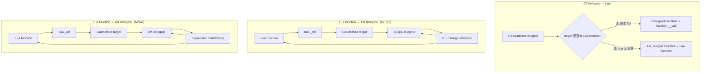
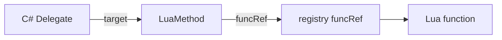

# Delegate / 函数 Marshal

> **规范性：** C# `Delegate` 与 Lua 函数之间的双向 Marshal。  
> **相关：** class ByObj 基础 → [`06-CLASS.md`](./06-CLASS)；`[LuaInvoke]` → [`../01-HOST-API.md`](../01-HOST-API)；C#→Lua byref → [`04-OPAQUE.md`](./04-OPAQUE)；Lua→C# byref → [`03-BYREF.md`](./03-BYREF)；`to_delegate` → [`../05-LIB.md`](../05-LIB)。

**平台原则：** Mono 与 Il2Cpp 的 **Lua 可见语义一致**；实现路径可不同（Il2Cpp：构建期 C++ bridge；Mono：运行时 Expression Emit）。

**明确不写 Event 专用子表：** ZLua **无** Event 特殊 Marshal；订阅/退订使用普通方法 `add_*` / `remove_*`（见 [`../02-TYPE-SYSTEM.md`](../02-TYPE-SYSTEM)）。

---

## 1. 问题与目标

| 方向 | 需求 |
|------|------|
| **C# delegate → Lua** | **默认** 当作普通 class（DelegateUserData）传入；可 `Invoke` / `d(...)`。若 delegate **由 Lua function marshal 而来**（`target` 为 `LuaMethod`），再 Push 时须还原为 **Lua function**（§3） |
| **Lua function → C# delegate** | Lua 调用带 delegate 形参的 C# 方法时，**隐式**将 Lua function marshal 为对应类型 delegate |

| 目标 | 说明 |
|------|------|
| 无感 | 与普通参数一样：Lua 传 function，由 **方法调用的 marshal 层** 完成转换 |
| 性能 | Player 零反射；按 **Invoke 签名** 复用 bridge；Editor 按签名缓存 Emit |
| 统一 | 与 `[LuaInvoke]` 共用 push/pcall/pop 规则 |
| 安全 | `funcRef` 生命周期与 delegate 绑定；禁止悬空调用 |
| 可控 | Il2Cpp 未 codegen 的签名运行时明确报错；**Mono 无法 Emit 的签名明确 `NotSupportedException`（禁止静默降级为反射/`Method.Invoke` 热路径）** |

---

## 2. 总体架构



**核心组件：**

| 组件 | 职责 |
|------|------|
| `LuaMethod` | Lua→C# delegate 的 **closed target**；持有 `funcRef`（registry ref） |
| `DelegateBridges`（Il2Cpp） | 构建期生成的 C++ bridge，按 `Invoke` 签名注册 |
| `DynamicBridgeFactory`（Mono） | 运行时按 `Invoke` 签名 **Expression 编译** bridge，**按签名缓存** |
| `LuaDelegateBinder` | 创建 delegate：`LuaMethod` + bridge |
| `ReadDelegate` | 栈上 Lua function → delegate；与方法 `ReadValue` 并列 |
| `LuaCallInvoker` | `funcRef` + push + `pcall` + pop；Delegate bridge 与 `[LuaInvoke]` 共用 |

---

## 3. C# delegate → Lua

### 3.1 分流规则（必读）

Push **delegate 实例**到 Lua 栈时，按 **`target` 是否为 `LuaMethod`** 分流：

| 判定 | C# → Lua 形态 | 说明 |
|------|---------------|------|
| **`target` 为 `LuaMethod`** | **Lua function** | `lua_rawgeti(REGISTRY, luaMethod.funcRef)`；脚本得到 **原 Lua 闭包** |
| **其它**（原生 C# 多播、target 为普通对象等） | **DelegateUserData** | 与普通 class 相同：`Invoke` + `IMT.__call` |

```text
PushDelegate(d):
  if d == null → push nil; return
  if IsLuaBoundDelegate(d):          // target is LuaMethod (closed)
      PushRef(d.LuaMethod.funcRef)  // → Lua function
      return
  PushByObjUserData(d)              // → DelegateUserData
```

| 项 | 规则 |
|----|------|
| **识别** | 两平台：`target is LuaMethod`（或等价标志） |
| **多播** | 仅当 **整条 invocation list 可还原为单一 Lua 源** 时走 function 路径；否则 ByObjUserData，保持 C# 多播语义 |
| **往返** | Lua `function` → C# delegate → 再 Push：**同一** `funcRef` 对应 function |
| **`[LuaMarshalAs(UserData)]`** | **不** 覆盖分流：Lua 回调源仍 Push **function** |
| **`null`** | **`nil`** |

**设计理由：** 脚本传入的 Lua function 经 C# 中转后再取回时，应仍是 function，而不是「包着同样回调的 C# userdata」。

### 3.2 承载形态（非 Lua 回调源）

**仅适用于 §3.1 的 DelegateUserData 分支。**

- delegate 实例为 **普通托管对象 userdata**（Il2Cpp：`ObjectRegistry`；Mono：GCHandle）。
- **类型表**与普通 class 相同（含闭合泛型 delegate）。
- **静态成员**走 `SMT`；**实例成员**（含 `Invoke`）走 `IMT`；**无需**为传递原生 delegate 单独生成 bridge。

### 3.3 Lua 调用方式（DelegateUserData）

| 写法 | 说明 |
|------|------|
| `d:Invoke(a, b)` | 显式调用 `Invoke` |
| `d(a, b)` | **`IMT.__call`** → 收集参数并转发到 `Invoke` |

```lua
local handler = someObj.Handler   -- 原生 C# delegate
handler(42)                        -- __call
handler:Invoke(42)

-- 往返：Lua→C#→Lua 时得到 function
obj:RegisterCallback(function(v) end)
local f = obj.Callback
print(type(f))   -- "function"
f(1)
```

### 3.4 实例元表 `__call`

对 **`MulticastDelegate` 子类**的实例元表额外注册 `__call`（**仅 DelegateUserData**；function 分支无 metatable）：

```
栈布局：[delegate_ud, arg1, arg2, ...]
→ 收集 args
→ MulticastDelegate.Invoke
→ PushReturn
```

| 项 | 规则 |
|----|------|
| **Multicast** | 保持 C# 多播语义 |
| **`null`** | C# `null` → `nil`；对 `nil` 调用报错 |
| **开放 delegate** | `target == null` 的 open delegate：MVP **不支持** |
| **方向** | ByObjUserData **不** 再走 §4 bridge；绑定到 Lua 的回调在 Push 时已按 §3.1 变为 function |

---

## 4. Lua function → C# delegate

### 4.1 主路径：方法参数隐式 marshal（默认）

**一般不需要**显式创建 delegate：

```lua
-- C#: void RegisterCallback(Action<int> onValue)
obj:RegisterCallback(function(v) print(v) end)
```

流程：

```text
1. 按 MethodInfo 解析第 N 个形参类型为 delegateType
2. 栈上该位置为 Lua function（或 nil → null delegate）
3. ReadDelegate(L, index, delegateType)
     → luaL_ref 得到 funcRef
     → LuaDelegateBinder.Create(delegateType, funcRef)
4. 将生成的 Delegate 填入 C# 调用参数
5. 方法返回后：若 delegate 未被 C# 长期持有，随 GC 回收 LuaMethod 并 unref（§7）
```

| Lua 实参 | C# delegate 形参 |
|----------|-------------------|
| `function ... end` | `LuaDelegateBinder.Create(形参类型, funcRef)` |
| **`nil`** | **`null`** |
| delegate userdata | 直接传递 |
| 其它类型 | **报错** |

**类型来源：** 以 **C# 方法声明的形参类型** 为准；Lua 侧 **不需要** 再传 delegate 类型。

### 4.2 共同约定：`LuaMethod` + closed delegate

**所有** Lua→C# delegate 的 **`target` 均为 `LuaMethod` 实例**；**不** 伪造任意 C# 对象的成员方法作为 target。

| 字段 | 值 |
|------|-----|
| delegate `target` | `LuaMethod`（closed） |
| delegate 入口 | 平台 bridge（§4.3 / §4.4） |

### 4.3 Il2Cpp：构建期 C++ `DelegateBridges`

对每种需要的 delegate **`Invoke` 签名**，构建期生成 C++ closed delegate 入口（与 `MethodBridges` 同源扫描）：

```cpp
// 示例：System.Func<int, int>
static int32_t Bridge_Func_int32__int32(Il2CppObject* target, int32_t a)
{
    const LuaMethod* m = reinterpret_cast<LuaMethod*>(target);
    lua_State* L = LuaEnv::GetState();
    const int top = lua_gettop(L);

    lua_rawgeti(L, LUA_REGISTRYINDEX, m->funcRef);
 Marshaling::PushDefault<int32_t>(L, a);
 Marshaling::LuaPCall(L, 1, 1);
    const int32_t ret = Marshaling::PopDefault<int32_t>(L, -1);
    lua_settop(L, top);
    return ret;
}
```

- **void 返回**（`Action` 等）：`LuaPCall(..., 0)`，无 pop。
- **`Invoke` 上的 `ref` / `out` / `in`**：**支持**；C#→Lua（bridge 调脚本）默认 **OpaqueValue**，与 `[LuaInvoke]` 相同（[`04-OPAQUE.md`](./04-OPAQUE)）。
- **`[LuaMarshalAs]`** 非默认语义：与普通方法 / `[LuaInvoke]` 同一套解析。

**未注册签名：** 运行时查表失败 → 明确报错，提示重新 Codegen。

### 4.4 Mono：Expression Emit bridge（失败须显式）

Mono **不** 预生成 `LuaDelegateShims`；运行时按 `delegateType.GetMethod("Invoke")` 用 **Expression 树编译** bridge（按 `Invoke` 签名缓存工厂）。

| 项 | 说明 |
|----|------|
| **emit 时机** | 首次遇到某 `Invoke` 签名时生成 |
| **缓存** | 同签名只 emit 一次 |
| **marshal** | push/pop 与 `LuaCallInvoker` **同一套规则** |
| **不支持签名** | 无法 marshal 的参数 / 返回类型 → **`NotSupportedException`**（**禁止** 静默 `Method.Invoke` / `object[]` 热路径） |
| **`ref`/`out`/`in`** | **支持**（不因含 byref 而拒绝） |

**禁止：** 对 `DynamicMethod` 使用 `Delegate.CreateDelegate`（Unity Mono 下可能 SIGSEGV）；使用 `Expression.Lambda(...).Compile()`。

**Mono rewrite 原则：** 若某 `Invoke` 签名无法 Expression Emit，须 **绑定期或首次使用时明确失败**，不得 invent 临时慢路径并可能流入 Player。

### 4.5 可选：显式 `zlua.to_delegate`

仅在需要 **先构造 delegate 再传递** 时使用（**非常规路径**）：

```lua
local d = zlua.to_delegate(function(a) return a end, closedFuncIntIntType)
obj:RegisterCallback(d)
```

| 参数 | 说明 |
|------|------|
| `func` | Lua function |
| `delegateTypeTable` | **已闭合**的 delegate 类型表 |

实现调用同一 `LuaDelegateBinder.Create`；返回 **delegate userdata**。

**Native：** `__zlua_to_delegate`

---

## 5. 与 `[LuaInvoke]` 的边界

| | `[LuaInvoke]` | Delegate bridge |
|--|---------------|-----------------|
| **调用方向** | **C# → Lua**（固定模块函数） | **C# → Lua**（经 closed delegate 回调脚本） |
| 绑定时机 | 构建期 module + name → `LuaInvokeSite` | 运行时 `luaL_ref` → `funcRef` |
| 入口 | InternalCall / 生成 IC（Il2Cpp）；C# 包装（Mono） | closed delegate bridge |
| **Marshal** | push / `pcall` / pop | **同一套**（`LuaCallInvoker`） |
| **`ref`/`out`/`in`（C#→Lua）** | 默认 **OpaqueValue** | 默认 **OpaqueValue**（[`04-OPAQUE.md`](./04-OPAQUE)） |
| **`params`** | **不支持** | **不支持** |
| 目标 | 固定 lua 模块函数 | 任意 Lua closure |

**共用实现：** `LuaCallInvoker`（Mono）/ `InvokeFromRegistry`（Il2Cpp）被 `LuaInvokeRuntime::Call`、`DelegateBridges`、`DynamicBridgeFactory` 共同调用。

**不属于 `[LuaInvoke]`：** Lua 调用 C# 方法时的 delegate **形参隐式 marshal**（§4.1）走 **MethodBridge → ReadDelegate**，不是 `[LuaInvoke]`。

---

## 6. 生命周期与 GC



| 事件 | 行为 |
|------|------|
| 隐式 marshal / `to_delegate` | `funcRef = luaL_ref(REGISTRY)`；delegate 持有 `LuaMethod` |
| delegate 被 C# GC | `LuaMethod` 终结 / `Dispose` → 排队 `luaL_unref` |
| Lua 函数无其他引用 | registry ref 仍持有，直至 delegate 释放 |
| delegate 存活期间调用 | 正常 `pcall` |
| `funcRef` 已失效仍调用 | 报错 |

**Mono 注意：** `luaL_unref` 须在持有 `lua_State` 的 **主线程** 执行；`~LuaMethod` / `Dispose` 仅 `AddPendingRef`；`LuaEnv.ProcessPendingRefReleases()` 在主线程批量释放。

**C# delegate → Lua：**

- **Lua 回调源**（§3.1）：Push **function**；**不** 新建 registry ref
- **原生 C# delegate**：ByObjUserData 由 `__gc` 释放 GCHandle；**不** pin Lua 函数

---

## 7. Mono（Editor）与 Il2Cpp（Player）

| 项 | Il2Cpp（Player） | Mono（Editor） |
|----|------------------|----------------|
| **C# delegate → Lua** | §3.1 分流 | **相同** |
| **Lua→C# bridge** | 构建期 C++ `DelegateBridges.cpp` | 运行时 **Expression Emit**（按签名缓存） |
| **delegate 绑定** | `SetClosedDelegateInvoke` | `Expression.Lambda(...).Compile()` |
| **Codegen** | 需要（§8） | **不需要** delegate shim 预生成 |
| **未支持签名** | 运行时查表失败 + Codegen 提示 | **`NotSupportedException`（明确失败）** |
| **Lua 可见语义** | 权威 | **必须与 Il2Cpp 一致** |

---

## 8. Codegen 与签名表（Il2Cpp）

> **Mono 不使用本节**；Editor 由 `DynamicBridgeFactory` 运行时处理。

### 8.1 生成范围

与 `MethodBridges.cpp` **共用或同源**扫描：

- 所有带 **delegate 形参** 的 public 方法（从 `MethodInfo` 推导 `Invoke` 签名）
- 构建配置中的 delegate 白名单（可选）

输出：`generated/DelegateBridges.h/cpp`。

### 8.2 签名键

以 delegate 类型的 **`Invoke` 方法** 为准：

```text
void(System.Int32)                 → Action<int>
System.Int32(System.Int32)         → Func<int,int>
```

Mono Emit 缓存键与上述规则 **对齐**。

### 8.3 未注册签名（Il2Cpp）

```text
unsupported delegate signature for Lua callback: System.Func<...>
```

提示重新执行 ZLua Codegen。

---

## 9. 边界情况

| 场景 | MVP 策略 |
|------|----------|
| `Action` / `Func<>` / 自定义 delegate | 统一按 **`Invoke` 签名** 解析 bridge |
| **C# delegate → Lua** | §3.1：Lua 回调源 → **function**；原生 C# → DelegateUserData + `__call` |
| **`ref`/`out`/`in`（Lua→C# 调 delegate）** | 见 [`03-BYREF.md`](./03-BYREF) |
| **`ref`/`out`/`in`（delegate bridge C#→Lua）** | **OpaqueValue**；见 [`04-OPAQUE.md`](./04-OPAQUE) |
| **`params`（bridge / `[LuaInvoke]`）** | **不支持** |
| 开放 delegate | 可不支持 |
| Multicast 的 Lua 回调 | 隐式 / 显式创建均为 **单播** |
| 协变 / 逆变 | 仅 **精确** delegate 类型匹配 |
| **`LuaMarshalAs`** | Il2Cpp：完整生成 bridge；Mono：不支持则 **明确报错** |
| **Event** | **无** 专用支持；用 `add_*` / `remove_*` 普通方法 |

---

## 10. 相关文档

| 文档 | 内容 |
|------|------|
| [`06-CLASS.md`](./06-CLASS) | DelegateUserData、门面 |
| [`03-BYREF.md`](./03-BYREF) | Lua→C# byref |
| [`04-OPAQUE.md`](./04-OPAQUE) | C#→Lua byref / bridge 回调 |
| [`02-MARSHAL-AS.md`](./02-MARSHAL-AS) | `[LuaMarshalAs]` 合法集合 |
| [`../01-HOST-API.md`](../01-HOST-API) | `[LuaInvoke]` 约束 |
| [`../02-TYPE-SYSTEM.md`](../02-TYPE-SYSTEM) | 委托类型表、`__call` |
| [`../05-LIB.md`](../05-LIB) | `to_delegate` |
| [`../../impl/codegen/EMIT-MONO.md`](../../impl/codegen/EMIT-MONO) | Mono Expression Emit |
