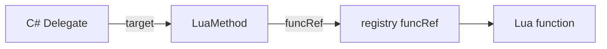

---
mdx:
  format: md
sidebar_position: 4
title: Function 编组
description: Delegate 与 Lua 函数回调的编组规则。
---

# ZLua 函数 / Delegate Marshal 规范

本文档描述 **C# `Delegate` 与 Lua 函数** 之间的双向编组，适用于 **Il2Cpp（Player）** 与 **Mono（Editor）**。

**相关文档：**

| 文档 | 内容 |
|------|------|
| `MARSHAL_SPEC.md` | 参数编组总览 |
| `CLASS_MARSHAL_SPEC.md` | 引用类型 userdata、`ObjectRegistry` |
| `TYPE_SYSTEM_SPEC.md` | 委托类型表、`__call` |
| `LIB_SPEC.md` | `zlua` 标准库（可选 `to_delegate`） |
| `IL2CPP_DESIGN_SPEC.md` | `LuaInvokeRuntime`、`MethodBridge`、Codegen |
| `STRUCT_MARSHAL_SPEC.md` | `[LuaMarshalAs]` 与非默认 marshal |

**平台原则：** Mono 与 Il2Cpp 的 **Lua 可见语义一致**；实现路径可不同：

| 方向 | Il2Cpp（Player） | Mono（Editor） |
|------|------------------|----------------|
| **C# delegate → Lua** | 普通 class userdata + `Invoke` + `IMT.__call` | **相同** |
| **Lua function → C# delegate** | `LuaMethod` + 构建期 C++ `DelegateBridges` | `LuaMethod` + **`DynamicMethod` bridge** |

---

## 1. 问题与目标

| 方向 | 需求 |
|------|------|
| **C# delegate → Lua** | 当作**普通 class** 传入 Lua；可调用 `Invoke`；并支持 `d(...)` 语法 |
| **Lua function → C# delegate** | Lua 调用带 delegate 形参的 C# 方法时，**隐式**将 Lua function marshal 为对应类型 delegate |

| 目标 | 说明 |
|------|------|
| 无感 | 与普通参数一样：Lua 传 function，由 **方法调用的 marshal 层** 完成转换，脚本无需 `to_delegate` |
| 性能 | Player 侧零反射；按 **Invoke 签名** 复用 C++ bridge；Editor 侧 `DynamicMethod` 按签名缓存 |
| 统一 | 与 `[LuaInvoke]` 共用 push/pcall/pop 规则；delegate 形参走 `ReadValue` / `ReadDelegate` 同一套入口 |
| 安全 | `funcRef` 生命周期与 delegate 绑定；禁止悬空调用 |
| 可控 | Il2Cpp 未 codegen 的签名在运行时明确报错；Mono 不支持签名明确报错 |

---

## 2. 总体架构

```mermaid
flowchart TB
    subgraph CSharpToLua["C# delegate → Lua（两平台相同）"]
        D1[C# MulticastDelegate]
        UD1[普通 class userdata]
        IMT[IMT: Invoke + __call]
        D1 --> UD1 --> IMT
    end

    subgraph LuaToCSharpIl2Cpp["Lua function → C# delegate（Il2Cpp）"]
        LF1[Lua function]
        REF1[luaL_ref]
        LM1[LuaMethod target]
        BR1[C++ DelegateBridges]
        DEL1[Il2CppDelegate]
        LF1 --> REF1 --> LM1 --> DEL1
        BR1 --> DEL1
        DEL1 --> BR1 --> LF1
    end

    subgraph LuaToCSharpMono["Lua function → C# delegate（Mono）"]
        LF2[Lua function]
        REF2[luaL_ref]
        LM2[LuaMethod target]
        DM[DynamicMethod bridge]
        DEL2[C# Delegate]
        LF2 --> REF2 --> LM2 --> DEL2
        DM --> DEL2
        DEL2 --> DM --> LF2
    end
```



**核心组件：**

| 组件 | 职责 |
|------|------|
| `LuaMethod` | Lua→C# delegate 的 **closed target**；持有 `funcRef`（registry ref） |
| `DelegateBridges`（Il2Cpp） | 构建期生成的 C++ bridge，按 `Invoke` 签名注册 |
| `DynamicBridgeFactory`（Mono） | 运行时按 `Invoke` 签名 `DynamicMethod` emit，**按签名缓存** |
| `LuaDelegateBinder` | 创建 delegate：`LuaMethod` + bridge；由隐式 marshal / `to_delegate` 调用 |
| `ReadDelegate` | 栈上 Lua function → delegate；与 `ReadValue` 并列，供方法调用路径使用 |
| `LuaCallInvoker` | `funcRef` + push + `pcall` + pop；Delegate bridge 与 `[LuaInvoke]` / `LuaFunc` 共用 |

---

## 3. C# delegate → Lua

**本方向不做单独的 delegate marshal。** delegate 实例与普通引用类型 class 相同：经现有 class userdata 路径进出 Lua。

### 3.1 承载形态

- delegate 实例为 **普通托管对象 userdata**（Il2Cpp：`ObjectRegistry` + `Il2CppMulticastDelegate*`；Mono：GCHandle + `ValueTypeMarshaling.PushBoxedInstance` 同类路径）。
- **类型表**与普通 class 相同（含闭合泛型 delegate，如 `System.Action\`1[System.Int32]`）。
- **静态成员**走类型表 `SMT`；**实例成员**（含 `Invoke`）走 `IMT`，由 `RegisterInstanceMethods` 注册，**无需**为传递 delegate 单独生成 bridge。

### 3.2 Lua 调用方式

| 写法 | 说明 |
|------|------|
| `d:Invoke(a, b)` | 显式调用已暴露的实例方法 `Invoke`（与普通 class 方法相同） |
| `d(a, b)` | **`IMT.__call`** → 收集参数并转发到 `Invoke` |

```lua
local handler = someObj.Handler   -- C# event / 字段 / 属性返回的 delegate
handler(42)                        -- __call
handler:Invoke(42)                 -- 显式 Invoke
```

### 3.3 实例元表 `__call`

对 **`MulticastDelegate` 子类**的实例元表额外注册 `__call`：

```
栈布局：[delegate_ud, arg1, arg2, ...]
→ 收集 args
→ MulticastDelegate.Invoke / DynamicInvoke(args)
→ PushReturn
```

| 项 | 规则 |
|----|------|
| **Multicast** | 保持 C# 多播语义（调用整条链） |
| **null** | C# `null` → Lua `nil`；对 `nil` 调用报错 |
| **开放 delegate** | `target == null` 的 open delegate：MVP 不支持 |
| **方向** | 本路径 **不** 进入 Lua VM；除非 delegate 本身绑定到 Lua 回调（见 §4） |

### 3.4 实现要点

| 平台 | 要点 |
|------|------|
| **Mono** | `PushInstanceMetatable` 判定 `typeof(MulticastDelegate).IsAssignableFrom(type)` 时注册 `__call`；`Invoke` 已由 `TypeMethodRegistration` 暴露 |
| **Il2Cpp** | 同上语义；`__call` 与 `Invoke` 可共用 `MethodBridge` 调用 `invoke_impl` |

**禁止：** 为「仅 C#→Lua 传递 delegate」单独生成 Lua 回调或额外 marshal 层。

---

## 4. Lua function → C# delegate

### 4.0 主路径：方法参数隐式 marshal（默认）

**一般不需要**在 Lua 里显式创建 delegate。当 Lua 调用 C# 方法，且某形参类型为 delegate 时，由 **方法调用的 marshal 层** 在入参阶段完成转换。

```lua
-- C#: void RegisterCallback(Action<int> onValue)
obj:RegisterCallback(function(v) print(v) end)
```

流程：

```
1. 按 MethodInfo 解析第 N 个形参类型为 delegateType
2. 栈上该位置为 Lua function（或 nil → null delegate）
3. ReadDelegate(L, index, delegateType)
     → luaL_ref 得到 funcRef
     → LuaDelegateBinder.Create(delegateType, funcRef)
4. 将生成的 Delegate 填入 C# 调用参数
5. 方法返回后：若 delegate 未被 C# 长期持有，随 GC 回收 LuaMethod 并 unref（§6）
```

| Lua 实参 | C# delegate 形参 |
|----------|------------------|
| `function ... end` | `LuaDelegateBinder.Create(形参类型, funcRef)` |
| `nil` | `null` |
| delegate userdata | 直接传递（已是 C# delegate） |
| 其它类型 | 报错（与 int/string 等形参类型不匹配同理） |

**类型来源：** 以 **C# 方法声明的形参类型** 为准（已闭合的 `Func<int,int>` 等），**不需要** Lua 侧再传 delegate 类型。

与 `int`、`string`、`class` 形参共用 **方法桥接 → ReadValue / ReadDelegate** 规则；详见 `MARSHAL_SPEC.md`。

### 4.1 设计结论（不采用的路径）

| 方案 | 结论 |
|------|------|
| 为每种 delegate 签名预生成 **C# 静态 shim 类**（`LuaDelegateShims`） | **Mono 不采用**；维护成本高、程序集膨胀 |
| 运行时拼装 **伪 `MethodInfo`** 作为主路径 | **不推荐** |
| 每次 `Invoke` 全反射调用 Lua | **不推荐**；仅作调试 |

### 4.2 共同约定：`LuaMethod` + closed delegate

#### `LuaMethod`

```csharp
namespace ZLua
{
    /// <summary>
    /// Lua→C# delegate 的 target；持有 Lua registry 中的函数引用。
    /// </summary>
    public sealed class LuaMethod : IDisposable
    {
        public int RefIndex { get; }   // luaL_ref(L, LUA_REGISTRYINDEX)
        // ...
    }
}
```

- **所有** Lua→C# delegate 的 **`target` 均为 `LuaMethod` 实例**。
- **不**伪造「任意 C# 对象的成员方法」作为 target。

#### 绑定形态（概念）

| 字段 | 值 |
|------|-----|
| delegate `target` | `LuaMethod`（closed） |
| delegate 入口 | 平台相关的 **bridge**（见 §4.2.1 / §4.2.2） |

`LuaDelegateBinder.Create` 由 **§4.0 隐式 marshal** 与 **§4.3 显式 API** 共用。

### 4.2.1 Il2Cpp：构建期 C++ `DelegateBridges`

对每种需要的 delegate **`Invoke` 签名**，在构建期生成 C++ closed delegate 入口（与 `MethodBridges.cpp` 同源扫描策略）：

```cpp
// 示例：System.Func<int, int>
static int32_t Bridge_Func_int32__int32(Il2CppObject* target, int32_t a)
{
    const LuaMethod* m = reinterpret_cast<LuaMethod*>(target);
    lua_State* L = LuaEnv::GetState();
    const int top = lua_gettop(L);

    lua_rawgeti(L, LUA_REGISTRYINDEX, m->funcRef);
    Marshaling::PushDefault<int32_t>(L, a);
    Marshaling::LuaPCall(L, 1, 1);
    const int32_t ret = Marshaling::PopDefault<int32_t>(L, -1);
    lua_settop(L, top);
    return ret;
}
```

绑定：

```cpp
Il2CppDelegate* LuaDelegateBinder::Create(Il2CppClass* delegateClass, int funcRef)
{
    Il2CppObject* luaMethod = ObjectRegistry::Alloc<LuaMethod>();
    luaMethod->funcRef = funcRef;

    Il2CppDelegate* del = AllocMulticastDelegate(delegateClass);
    Il2CppMethodPointer bridge = DelegateBridges::Resolve(delegateClass);
    il2cpp_codegen_set_closed_delegate_invoke(del, luaMethod, bridge);
    return del;
}
```

- **void 返回**（`Action` 等）：`LuaPCall(..., 0)`，无 pop。
- **delegate `Invoke` 上的 ref / out**、**`[LuaMarshalAs]`** 非默认语义：生成专用 bridge 或报错（§9）。**普通 C# 方法** 的 ref/out 见 `MARSHAL_SPEC.md` §3。

### 4.2.2 Mono：`DynamicMethod` bridge

Mono **不**预生成 `LuaDelegateShims`；运行时按 `delegateType.GetMethod("Invoke")` 用 **`Expression` 树编译** bridge（按 `Invoke` 签名缓存 `Func<LuaMethod, Delegate>` 工厂）。**不要**对 `DynamicMethod` 使用 `Delegate.CreateDelegate`（Unity Mono 下可能 SIGSEGV）。

```csharp
// 生成的 bridge 形态（概念）：
// Func<LuaMethod, Action<int>> factory = target => a => LuaCallInvoker.InvokeVoidWithArgs(target, paramTypes, new object[] { a });
// 每个 Lua function 调用 factory(luaMethod) 得到 C# delegate
```

| 项 | 说明 |
|----|------|
| **emit 时机** | 首次遇到某 `Invoke` 签名时生成 |
| **缓存** | `ConcurrentDictionary<MethodInfo, MethodInfo>`，同签名只 emit 一次 |
| **marshal** | push/pop 与 `TypeMethodRegistration` / `LuaCallInvoker` **同一套规则** |
| **适用范围** | **仅 Mono / Editor**；不进入 Il2Cpp Player 程序集 |
| **不支持签名** | `ref/out`、无法 marshal 的参数类型 → 明确 `NotSupportedException` |

### 4.3 可选：显式 `zlua.to_delegate`

仅在需要 **先构造 delegate 再传递** 时使用。**非常规路径。**

```lua
local d = zlua.to_delegate(function(a) return a end, closedFuncIntIntType)
obj:RegisterCallback(d)
```

```lua
zlua.to_delegate(func, delegateTypeTable) → delegateUserdata
```

| 参数 | 说明 |
|------|------|
| `func` | Lua function |
| `delegateTypeTable` | **已闭合**的 delegate 类型表（无方法形参上下文时须显式给出类型） |

实现调用同一 `LuaDelegateBinder.Create`；返回 **delegate userdata**（普通 class 实例）。

**Native：** `__zlua_to_delegate`（可选 API）

### 4.4 示例：`Func<int, int>`（隐式）

```lua
-- C#: void Run(Func<int,int> f) { f(1); }
obj:Run(function(a) return a + 1 end)
```

回调链（两平台语义相同，bridge 实现不同）：

```
Run(delegate, ...)
  → ReadDelegate 创建 delegate（target = LuaMethod）
  → delegate.Invoke(1)
  → [Il2Cpp] Bridge_Func_int32__int32
     [Mono]   DynamicMethod bridge
  → lua_rawgeti(funcRef) + push(1) + pcall + pop
```

---

## 5. 与 `[LuaInvoke]` 的关系

| | `[LuaInvoke]` | Delegate bridge |
|--|---------------|-----------------|
| 绑定时机 | 构建期 module + name → `LuaInvokeSite` | 运行时 `luaL_ref` → `funcRef` |
| 入口 | InternalCall / 生成 IC（Il2Cpp）；C# 包装（Mono） | closed delegate bridge |
| Marshal | push / `pcall` / pop | **同一套**（`LuaCallInvoker`） |
| 目标 | 固定 lua 模块函数 | 任意 Lua closure |

可抽取公共实现：

```csharp
// Mono 概念 API
internal static class LuaCallInvoker
{
    public static void InvokeVoid(LuaMethod target, Action<IntPtr> pushArgs);
    public static T Invoke<T>(LuaMethod target, Action<IntPtr> pushArgs);
}
```

```cpp
// Il2Cpp 概念 API
struct LuaCallContext { int funcRef; };
template<typename Ret, typename... Args>
Ret InvokeFromRegistry(const LuaCallContext& ctx, Args... args);
```

`LuaInvokeRuntime::Call`、`DelegateBridges`（Il2Cpp）、`DynamicBridgeFactory`（Mono）均调用上述公共路径。

---

## 6. 生命周期与 GC



| 事件 | 行为 |
|------|------|
| 隐式 marshal / `to_delegate` | `funcRef = luaL_ref(REGISTRY)`；delegate 持有 `LuaMethod` |
| delegate 被 C# GC | `LuaMethod` 终结 / `Dispose` → 排队 `luaL_unref` |
| Lua 函数无其他引用 | registry ref 仍持有，直至 delegate 释放 |
| delegate 存活期间调用 | 正常 `pcall` |
| `funcRef` 已失效仍调用 | 报错（不应发生若 unref 仅随 delegate 释放） |

**Mono 注意：** `luaL_unref` 须在持有 `lua_State` 的**主线程**执行。`~LuaMethod` / `Dispose` 仅 `AddPendingRef`；`LuaEnv.ProcessPendingRefReleases()`（或等价钩子）在主线程批量 `ClearPendingRefs`。

**C# delegate → Lua** 方向：delegate userdata 由 `__gc` 释放 GCHandle；**不** pin Lua 函数。

---

## 7. Mono（Editor）与 Il2Cpp（Player）

| 项 | Il2Cpp（Player） | Mono（Editor） |
|----|------------------|----------------|
| **C# delegate → Lua** | 普通 class userdata + `Invoke` + `IMT.__call` | **相同** |
| **Lua→C# bridge** | 构建期 C++ `DelegateBridges.cpp` | 运行时 **`Expression` 编译**（按 `Invoke` 签名缓存工厂） |
| **delegate 绑定** | `SetClosedDelegateInvoke` | `Expression.Lambda(...).Compile()`，**不**使用 `Delegate.CreateDelegate` + `DynamicMethod` |
| **Codegen** | 需要（§8） | **不需要** delegate shim 预生成 |
| **未支持签名** | 运行时查表失败，提示 Codegen | `Expression` 编译失败 / 明确 `NotSupportedException` |
| **Lua 可见语义** | 权威 | **必须与 Il2Cpp 一致** |

---

## 8. Codegen 与签名表（Il2Cpp）

> **Mono 不使用本节 Codegen**；Editor 侧由 `DynamicBridgeFactory` 在运行时处理。Il2Cpp Player 仍依赖构建期生成。

### 8.1 生成范围

与 `MethodBridges.cpp` **共用或同源**扫描：

- 所有带 **delegate 形参** 的 public 方法（从 `MethodInfo` 推导 `Invoke` 签名）
- 构建配置中的 delegate 白名单（可选）

输出：`generated/DelegateBridges.h/cpp`（可与 `MethodBridges` 合并为 `BridgeRegistry`）。

### 8.2 签名键

以 delegate 类型的 **`Invoke` 方法** 为准（非 C# 委托类型名）：

```
void(System.Int32)                       → Action<int>
System.Int32(System.Int32)               → Func<int,int>
void(System.Int32, System.String)        → Action<string> 等
```

Mono `DynamicBridgeFactory` 缓存键与上述规则**对齐**，便于两平台行为一致。

### 8.3 未注册签名（Il2Cpp）

运行时：

```
unsupported delegate signature for Lua callback: System.Func<...>
```

提示重新执行 ZLua Codegen。

---

## 9. 边界情况

| 场景 | MVP 策略 |
|------|----------|
| `Action` / `Func<>` / 自定义 delegate | 统一按 **`Invoke` 签名** 解析 bridge |
| **C# delegate → Lua** | 当普通 class；`Invoke` + `__call`；无单独 marshal |
| `ref` / `out` / `in` 参数（**Lua→C# 方法**） | 见 `MARSHAL_SPEC.md` §3：StructUserData 真 ref，否则拷贝语义 |
| `ref` / `out` 参数（**delegate bridge**） | **不支持**；`DynamicBridgeFactory` / Codegen 报错 |
| `params` | 可不支持 |
| 开放 delegate（无 target） | 可不支持 |
| Multicast 的 Lua 回调 | 隐式 / 显式创建均为 **单播**；C# `+=` 仍由 BCL 组合 |
| 协变 / 逆变 | 仅 **精确** delegate 类型匹配 |
| `LuaMarshalAs` | Il2Cpp：完整生成 bridge；Mono：不支持则报错 |

---

## 10. TYPE_SYSTEM 与 MARSHAL 衔接

- 委托 **类型表** 见 `TYPE_SYSTEM_SPEC.md` §10。
- §3 规范 **C# delegate → Lua**：**无**单独 marshal；普通 class + `IMT.__call`。
- §4.0 规范 **Lua function → C# delegate** 的 **默认路径**：并入方法参数 `ReadDelegate`。
- §4.3 `to_delegate` 仅用于无方法调用上下文的显式构造。

---

## 11. 实现清单

### 11.1 共用

- [x] `LuaMethod` 类型（`RefIndex`、`Dispose` / 终结器）
- [ ] `LuaCallInvoker`（`funcRef` + push + `pcall` + pop）
- [ ] `LuaDelegateBinder.Create(delegateType, funcRef)`
- [ ] `ReadDelegate`（方法调用隐式路径，**必做**）
- [ ] delegate 实例 `IMT.__call`（`MulticastDelegate` 子类）
- [ ] `LuaMethod` 释放时排队 `luaL_unref` + 主线程 `ProcessPendingRefReleases`
- [ ] （可选）`zlua.to_delegate` + `__zlua_to_delegate`

### 11.2 Il2Cpp（Player）

- [ ] `generated/DelegateBridges.*` 与签名注册表
- [ ] `LuaDelegateBinder::Create` + `SetClosedDelegateInvoke`
- [ ] `LuaCallContext` / 与 `LuaInvokeRuntime` 共用 marshal
- [ ] Codegen 扫描 delegate 签名

### 11.3 Mono（Editor）

- [ ] `DynamicBridgeFactory`（`Expression` 编译 + 按 `Invoke` 签名缓存工厂）
- [ ] `LuaDelegateBinder.Create`（`factory(luaMethod)`，无 `Delegate.CreateDelegate`）
- [ ] `TypeMethodRegistration` delegate 形参分支（`function` / `nil` / userdata）
- [ ] **不**实现 `LuaDelegateShims` 预生成

### 11.4 文档

- [ ] `MARSHAL_SPEC.md` / `LIB_SPEC.md` 交叉引用
