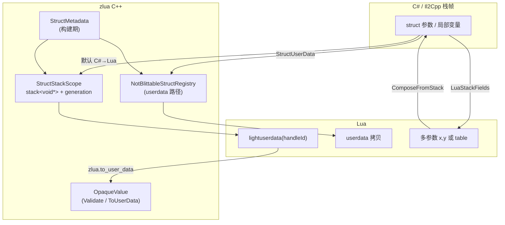

---
mdx:
  format: md
sidebar_position: 3
title: Struct 编组
description: struct 与值类型的编组规则。
---

# ZLua Struct Marshal 设计规范

本文档描述 **Il2Cpp 与 Mono（Editor）** 下 **C# struct 与 Lua 互操作** 的传递方案，与 `DESIGN_SPEC.md`、`TYPE_SYSTEM_SPEC.md`、`IL2CPP_DESIGN_SPEC.md` 中的 `Marshaling`、`LuaMarshalAs`、`ObjectRegistry` 体系衔接。

**版本说明：** Handle 路径采用 **栈地址记录 + `StructStackScope`**，不再使用预分配 slot 池。

**平台原则：** Il2Cpp 侧重 **零 GC / 极致性能**；Mono 实现可更简单，但 **Lua 可见语义必须与 Il2Cpp 一致**（同一套 `LuaMarshalAs`、同一类 lightuserdata / userdata 形态、同一错误与生命周期规则）。

---

## 1. 设计目标与约束

| 目标 | 说明 |
|------|------|
| 零 GC（默认 Handle） | struct 已在 IC / 桥接栈帧上，Push 仅记录地址 + `lua_pushlightuserdata`；不 `new`、不 box、不 `lua_newuserdata` |
| 安全 | Lua **不持有** struct 裸地址；lightuserdata 仅为 **opaque handleId**；过期访问 **报错** |
| 统一 | struct 与 class 同样走 `CSharp.*`、`obj:Method()`；差异在承载形态 |
| 可显式选择 | `[LuaMarshalAs]` / 类型级双向配置：`StructHandle`、`StructUserData`、`LuaStackFields`、`ComposeFromStack` 等 |

**术语：**

- **Blittable struct**：可 `memcpy`，无托管引用。
- **Non-blittable struct**：含 `string`、class 等引用字段，GC 须能扫到实例内存中的指针。

---

## 2. 总体架构



**核心模块：**

| 模块 | 职责 |
|------|------|
| `StructStackScope` | 记录栈上形参/局部地址、管理 generation、嵌套 scope |
| `OpaqueValue` | 校验 handle、`Resolve` 参数槽、`ToUserData`；**无** Lua 字段/方法访问（见 `MARSHAL_SPEC.md` §4） |
| `NotBlittableStructRegistry` | non-blittable 的 userdata 拷贝与 GC 扫描 |
| `generated/StructMetadata.*` | size、align、blittable、ref 偏移、klass |

---

## 3. StructStackScope（lightuserdata 生命周期核心）

### 3.1 职责

`StructStackScope` 管理 **当前调用链** 内所有 Handle 路径 struct 的「逻辑句柄」，**不分配** struct 存储。

内部状态（概念模型）：

```cpp
// 线程 / lua_State 内（ZLua 单线程单 L）
struct StructStackScope {
    uint32_t generation;              // 当前全局 generation
    std::vector<void*> stack;         // stack[i] = 指向活跃 struct 实例的指针
    std::vector<Il2CppClass*> klass;  // 与 stack 平行，类型标签（可选，也可编码在 Push 时另一张表）
    std::vector<uint32_t> scopeMarks; // 嵌套 scope 水位栈
};
```

### 3.2 handleId 编码与类型

**Lua 载荷：** `handleId` 以 **`uintptr_t`（`void*`）** 存入 lightuserdata，满足 `lua_pushlightuserdata` 要求，**须兼容 32 位平台**（不得假定 `uint64_t` 或固定 64 位宽度）。

**逻辑映射：** `handleId` 标识 `StructStackScope` 中一条登记项，解析后得到 **参数在 C# 栈上的地址**：

| 值类型 struct | `void*` → struct 实例首地址 |
| 引用类型形参槽 | `void*` → `Il2CppObject**`（指向对象引用槽） |

实现上可采用「`uintptr_t` 编码 `[generation | stackIndex]`」或「登记表查 `handleId` → `void*`」；无论哪种，**对外 Lua 形态均为 opaque lightuserdata**，校验走 §3.4。

```text
PushOpaque(klass, paramSlotPtr):
  1. 确保当前处于活跃 StructStackScope（见 3.5）
  2. stackIndex = stack.size()
  3. stack.push_back(paramSlotPtr)    // struct 实例地址或 Il2CppObject** 等
  4. klassStack.push_back(klass)
  5. handleId = Encode(generation, stackIndex)   // uintptr_t，宽度随平台
  6. lua_pushlightuserdata(L, (void*)(uintptr_t)handleId)
```

### 3.3 Push（C# → Lua，Opaque / StructHandle 路径）

前置条件：**形参/局部已在当前 native 栈帧**（IC 参数、局部变量、`ref` 指向的稳定区域）。struct 为实例地址；class 等为引用槽地址（`Il2CppObject**`）。详见 `MARSHAL_SPEC.md` §4.2。

**零拷贝**：不把 struct 拷到池；blittable / non-blittable 均适用（non-blittable 的 GC 见 3.7）。Push 步骤见 §3.2 `PushOpaque`。

### 3.4 Validate 与 Resolve

任意使用 handle 前 **必须**：

```text
ValidateHandle(handleId):   // handleId: uintptr_t
  - 解码 generation, stackIndex（或查登记表）
  - generation == scope.generation  （否则 luaL_error: opaque handle expired）
  - stackIndex < stack.size()
  - stack[stackIndex] != nullptr    （可选：已迁移到 UserData 后置空）

ResolveHandle(handleId) -> void*:
  ValidateHandle(...)
  return stack[stackIndex]   // struct 实例地址或 Il2CppObject** 等
```

### 3.5 Scope 嵌套与边界

每次可能跨越「C# 栈帧失效」或「一批 handle 应集体失效」的边界，包一层 scope：

```text
StructStackScopeGuard  RAII / 手动对:

  BeginScope():
    scopeMarks.push_back(stack.size())

  EndScope():
    watermark = scopeMarks.back(); scopeMarks.pop_back()
    stack.resize(watermark)           // 丢弃本层记录的地址（不 free struct）
    ++generation                      // 使本层及子层已发出的 handle 全部过期
```

**必须包 scope 的入口**（至少）：

| 入口 | BeginScope | EndScope |
|------|------------|----------|
| `[LuaInvoke]` IC → `lua_pcall` | IC 入口 | `pcall` 返回后 |
| `MethodBridge` Lua → C# 调用 | 桥接入口 | 调用返回后 |
| `OpaqueValue::ToUserData` / `zlua.to_user_data` | 不使原 handle 失效（拷贝语义） | — |

**嵌套 `Lua→C#→Lua→C#`：** `scopeMarks` 栈保证内层 EndScope 只截断到本层水位，**不**误伤外层仍活跃的 stackIndex。

```text
外层 BeginScope                    stack=[]
  Push A → h0 (gen=0, idx=0)
  内层 BeginScope                  mark=1
    Push B → h1 (gen=0, idx=1)
    lua_pcall 使用 h1
  内层 EndScope                    stack 截断到 1, gen=1  → h1 失效
  仍可使用 h0？                    → h0 也失效（generation 已变）
外层 EndScope
```

**设计决策（已采纳）：** `EndScope` 时 **递增全局 generation**，使该 scope 内发出的 **所有** handle 失效，包括外层在同一 scope 内、但在内层 scope 之前 Push 的 handle。这样语义简单：**handle 仅在「未 EndScope 的同步调用链」内有效**。

若需「外层 handle 跨内层 pcall 仍有效」，须改为 **per-scope generation**（复杂度更高）；当前 spec **不采用**。

### 3.6 与「仅同步 pcall 内有效」规则

- lightuserdata handle **只能**由 C#→Lua 路径产生；**无** Lua API 伪造 handle。
- Lua 在 **异步** / **pcall 返回后** 保存 handle → 下次 `ValidateHandle` → **error**。
- 长生命周期须用 **`StructUserData` / ClassUserData** 或 **`zlua.to_user_data(opaque)`**（`MARSHAL_SPEC.md` §4.4）。

### 3.7 Non-blittable 与 GC（Handle 路径）

**澄清：** BDWGC **不扫描** Lua lightuserdata 里的 handleId；须扫描的是 **`stack[i]` 指向的 struct 内存** 中的引用字段。

在 **StructStackScope 活跃且 struct 位于可被 GC 看见的内存** 期间：

- struct 在 **IC 栈帧** 上：依赖 Il2Cpp 线程栈扫描覆盖该帧；或
- 对当前 scope 内每个 `stack[i]`，在 `BeginScope`–`EndScope` 之间对 `[ptr, ptr+size)` **`RegisterRoot` / PushRootCallback**（见第 5 节）。

**Push 时** 对引用字段执行 `SetWriteBarrier`（与 `FieldBridge` 一致）。

**EndScope** 时：撤销本 scope 登记的 root（若使用 RegisterRoot 方案）。

---

## 4. OpaqueValue（已迁至总册）

**临时不透明 lightuserdata**（校验、`Resolve`、`zlua.to_user_data`、struct/class 槽语义、生命周期）的完整规范见 **`MARSHAL_SPEC.md` §4**。

本节 struct 文档仅保留：

- **§3** `StructStackScope`：登记与 generation（OpaqueValue 与 struct Handle 路径共用）
- **§5** `StructUserData`：`to_user_data` 产出形态之一
- **§6** Lua→C# Pop：同步链内可将 opaque **原样传回**，**不可**在 Lua 侧对 opaque 做字段/方法访问

原 **`StructValueOps`**（opaque 上 `__index` / 字段访问）**已移除**；脚本须 `zlua.to_user_data` 后再使用 `:` / `.`。

---

## 5. 路径 B：StructUserData（C# → Lua）

### 5.1 Blittable

- `lua_newuserdata` + `memcpy` + struct metatable。
- 无需 `NotBlittableStructRegistry`，无需 Boehm 扩展。

#### 5.1.1 与枚举（enum）的关系

枚举在 CLR 中为 **单字段 blittable 值类型**（underlying 整型）。**默认** C#↔Lua 编组为 integer/number，**不**走 userdata（见 `MARSHAL_SPEC.md` §2）。

仅当 Lua 侧通过类型表 **`_ctor` / `__call`** 显式构造时，走与本节相同的 **blittable userdata** 路径（详见 §5.4）。

### 5.2 Non-blittable：NotBlittableStructRegistry

**注册表：**

```cpp
StructUserData** _registeredStructs;
int32_t struct_count;
```

**单条记录：**

```cpp
struct StructUserData {
    int32_t index;      // 在 _registeredStructs 中的下标
    int32_t _pad;       // 8 字节对齐
    uint8_t data[];     // 柔性数组：完整 struct 拷贝，按指针对齐分配
};
```

**创建：**

1. 分配 `sizeof(StructUserData) + alignedStructSize`。
2. `memcpy` struct 内容；引用字段 `SetWriteBarrier`。
3. `index = struct_count`；`_registeredStructs[struct_count++] = ud`。
4. 记录 `data` 起始地址与 `size`，供 GC 扫描。

**GC 扫描（已采纳 PushRootCallback）：**

在 **`LuaAppDomain::Initialize` / `ZLua` 启动时** 调用一次：

```cpp
il2cpp::gc::GarbageCollector::RegisterPushRootCallback(NotBlittableStructRegistry::PushRoots);
```

之后每次 Boehm GC 标记阶段会自动回调，**应用层 / 业务开发者无需再关心**。

**释放（swap-with-tail）：**

```text
Release(index):
  tail = struct_count - 1
  若 index != tail: 将 tail 条移到 index，更新被移动 StructUserData.index = index
  --struct_count
  释放尾部内存
```

**Lua `__gc`（必须）：** userdata 被 Lua GC 回收时，metatable 的 `__gc` 调用 `NotBlittableStructRegistry::Release(index)`，与 Registry 对称。

### 5.3 GarbageCollector::RegisterPushRootCallback 实现分层

目标：**zlua 只调用公开 API**；Il2Cpp 内部把「回调注册表」与「Boehm 钩子」分离，使 **zlua 代码不直接改 `BoehmGC.cpp` 的业务逻辑**。

Il2Cpp 现有事实：`RegisterRoot` / `UnregisterRoot` 的**实现**在 `gc/BoehmGC.cpp` 的 `push_other_roots` 中，不在 `GarbageCollector.cpp`。因此「完全不碰 Boehm 后端」不可行；可行的是 **只改一处 Il2Cpp 基础设施，ZLua 零侵入 Boehm**。

**推荐分层：**

```text
GarbageCollector.h          ← 公开 API（zlua 只 include 这个）
  RegisterPushRootCallback(cb)
  InvokePushRootCallbacks(pushAll)   // internal / friend GC backend

GarbageCollector.cpp        ← 便携：回调链表/数组，注册与遍历
  static std::vector<PushRootCallback> s_PushRootCallbacks;

gc/BoehmGC.cpp              ← 后端唯一挂钩（与 RegisterRoot 同级，仅 +1 行）
  push_other_roots() {
      for (s_Roots) GC_push_all(...)
      GarbageCollector::InvokePushRootCallbacks((GcPushAllFunc)GC_push_all);
      if (default_push_other_roots) default_push_other_roots();
  }
```

**类型定义（公开头文件）：**

```cpp
typedef void (*GcPushAllFunc)(void* start, void* end);
typedef void (*PushRootCallback)(GcPushAllFunc pushAll);

static void RegisterPushRootCallback(PushRootCallback callback);
```

**`NotBlittableStructRegistry::PushRoots` 实现：**

```cpp
static void PushRoots(GcPushAllFunc pushAll) {
    for (int i = 0; i < struct_count; ++i) {
        StructUserData* ud = _registeredStructs[i];
        void* start = ud->data;
        pushAll(start, (uint8_t*)start + ud->size);
    }
}
```

**对比 `RegisterRoot` 逐条注册：**

| | RegisterRoot 每条 StructUserData | PushRootCallback |
|--|-----------------------------------|------------------|
| zlua 改动 | 仅 zlua | zlua + Il2Cpp 基础设施一次 |
| BoehmGC.cpp | 已依赖（s_Roots） | 多一行 Invoke |
| 创建/释放开销 | Register/Unregister 每次 | 仅维护 Registry 数组 |
| 适合 | 少量长生命周期对象 | **大量 struct userdata、集中扫描** |

**其他 GC 后端**（若将来有）：在对应 `*GC.cpp` 的 `push_other_roots` 等价处同样调用 `InvokePushRootCallbacks`，`GarbageCollector.cpp` 中的回调表可复用。

### 5.4 枚举（enum）实例 userdata

枚举的 **显式构造**（`EnumType(value)` / `EnumType._ctor(value)`）产出 **blittable enum userdata**，与 §5.1 blittable struct userdata **同一套机制**，差异仅为 payload 大小与类型元数据。

#### 5.4.1 构造入口（类型表）

与 class/struct 相同，在枚举类型表静态元表 `SMT` 上注册（见 `TYPE_SYSTEM_SPEC.md` §3.5.2）：

| 元表键 | 说明 |
|--------|------|
| `_ctor` | `function(typeTable, underlyingValue) → enumUserdata` |
| `__call` | 指向 `_ctor`；`EnumType(v)` 等价 `EnumType._ctor(v)` |

参数 **1 个**：**integer**（Lua 5.4+ 优先）或 **number**（整型）。  
实现将值按枚举 **underlying type** 写入 userdata payload，并挂接 `IMT`（`__type` → 枚举类型表）。

#### 5.4.2 Payload 与 metatable

```text
enum userdata
  size     = sizeof(underlying type)   // 1 / 2 / 4 / 8 字节等
  payload  = underlying 整型值（native 字节序）
  metatable = IMT（字段/方法表通常为空；__type 指回 E）
```

- **Blittable**：`memcpy` 即可；**不**进入 `NotBlittableStructRegistry`。
- Il2Cpp：Codegen 为每个枚举生成 `EnumMetadata { underlyingSize, underlyingType, klass }`。
- Mono：`lua_newuserdata` + 写入整型 + 挂接 `__instance_mt`。

#### 5.4.3 Pop / Push 与默认 integer 规则

| 场景 | 行为 |
|------|------|
| C# 返回 enum（默认） | Push **integer/number**，**非** userdata（`MARSHAL_SPEC.md` §2.1） |
| Lua 传入 enum 形参（默认） | 接受 **integer/number** 或 **enum userdata**（从 payload 读 underlying 值） |
| Lua 持有 `EnumType(v)` 结果 | userdata；跨调用传递时 Pop 可读 payload |

enum userdata **不**参与 `StructStackScope` Handle 路径（无 C# 栈上 enum 的 Handle Push 默认形态）。

#### 5.4.4 示例

```lua
local Color = CSharp.AC['MyGame.Color']

-- 常量：integer/number，非 userdata
local v = Color.Red

-- 显式 boxed 实例（与 blittable struct _ctor 同类）
local boxed = Color(Color.Green)
local boxed2 = Color._ctor(2)

-- 默认形参：三者等价
SetColor(Color.Red)
SetColor(1)
SetColor(boxed)
```

#### 5.4.5 Mono / Il2Cpp

- userdata 构造、`__call`/`_ctor` 签名、Pop 接受 integer 与 userdata **语义一致**。
- Il2Cpp 须走 generated bridge + `memcpy`；Mono 可用反射，但 Lua 侧行为不变。

---

## 6. Lua → C# 方向

### 6.1 接受的 Lua 形态

| 形态 | 说明 |
|------|------|
| **lightuserdata** | 仅当由 C#→Lua Opaque 传入；Pop 时 `Validate` + `memcpy` / 绑定 ref；**不可**在 Lua 侧读写字段 |
| **StructUserData** | by-val：Pop 时 **拷贝** payload；`ref`/`out`/`in`：绑定 payload 地址，**真 ref**（见 §6.2） |
| **多栈上标量** | `ComposeFromStack`：`Vector2` ← 连续 `x, y` 两个参数（见 6.3） |
| **单个 lua table** | 默认 table 规则：按字段名从 table 取值组装 struct（见 6.4） |

**lightuserdata 无 Lua 侧创建 API。**

### 6.2 写回语义与 `ref` / `out` / `in`

总览见 `MARSHAL_SPEC.md` §3。本节补充 **值类型** 在 StructUserData 路径上的规则。

#### 6.2.1 by-value vs ref

| C# 形参 | Lua 实参 | Pop 行为 | C# 修改后 |
|---------|----------|----------|-----------|
| by-value `T` | 任意可 Pop 形态 | **拷贝**进参数槽 / 临时 struct | 不影响 Lua 原 userdata |
| `ref`/`out`/`in` `T` | **StructUserData**（§6.2.2） | 绑定 **payload 地址**（Il2Cpp）或同一 box（Mono） | payload / userdata **原地**更新 |
| `ref`/`out`/`in` `T` | 非 StructUserData（number、table、nil…） | 拷贝进 **临时 ref 槽** | **不写回** Lua；**不报错** |

#### 6.2.2 真 ref 的 StructUserData 来源

| 来源 | 传给 `ref T` / `ref struct` |
|------|------------------------------|
| `zlua.new_ref(ref_type [, value, ...])` | 真 ref |
| `T._ctor` / `T(...)` 构造的 struct / enum userdata | **真 ref**（与 `new_ref` 共用 payload 模型） |
| C#→Lua 推送的 StructUserData | 真 ref |

Pop 时校验 userdata 绑定类型与形参元素类型 **一致**；否则 `luaL_error`。

#### 6.2.3 Opaque 路径（Il2Cpp）

C#→Lua 默认 **StructHandle**（opaque lightuserdata）在同步调用链内可由绑定层 `OpaqueValue::Resolve` 写回栈上 struct（**无 Lua 侧字段 API**）。

Lua→C# 的 `ref struct` 形参：

- 若传入 **StructUserData**：绑定 payload 指针（与 §5 路径 B 一致）。
- 若传入 **opaque**（由 C# 刚 Push、仍在 `StructStackScope` 内）：`Validate` + 取 `stack[index]` 地址作为 ref 目标（仅同步链）。
- 若传入 number / table 等：拷贝语义（§6.2.1），不使用 Opaque。

Opaque 与 StructUserData 互转：`zlua.to_user_data(opaque)` 为 **拷贝** 到 StructUserData，与 ref 槽独立。

#### 6.2.4 `zlua.new_ref`

创建 **带类型的 StructUserData**，专用于 ref/out 槽，亦可供 by-val 读取。

```lua
local n = zlua.new_ref(zlua.types.int32, 5)
local p = zlua.new_ref(Point2D)              -- default(Point2D)
local p2 = zlua.new_ref(Point2D, 1, 2)       -- 构造参数规则同 _ctor
local out = zlua.new_ref(zlua.types.int32) -- default，供 out
```

| `value` | 行为 |
|---------|------|
| 省略 / `nil` | `default(T)` 写入 payload |
| 基元 / enum | 按 by-val Pop 写入 |
| 已有 StructUserData | **拷贝** payload 到新 ref userdata（避免无意 alias） |
| struct 构造参数 | 同类型表 `_ctor` dispatch |

**限制：** `ref_type` 须为 **值类型**（基元、enum、struct）；引用类型 → `luaL_error`。API 详见 `LIB_SPEC.md` §6。

#### 6.2.5 示例

```lua
-- 拷贝语义：裸 number，不报错，x 概念上不变（local 本就不会变）
CS.Demo.Increment(5)

-- 真 ref：基元
local n = zlua.new_ref(zlua.types.int32, 5)
CS.Demo.Increment(n)

-- 真 ref：_ctor struct userdata
local p = Point2D(1, 2)
CS.Demo.Offset(p, 10, 20)   -- void Offset(ref Point2D p, int dx, int dy)
assert.equal(p.x, 11)

-- 真 ref：new_ref struct
local q = zlua.new_ref(Point2D, 0, 0)
CS.Demo.Offset(q, 1, 1)
```

### 6.3 字段展开：`LuaStackFields` / `ComposeFromStack`

此前「UnPackFields」易误解为 table；实际语义是 **Lua 栈上的多个独立参数** 与 struct 字段一一对应。

| 名称 | 方向 | 含义 | 示例 |
|------|------|------|------|
| **`LuaStackFields`** | C# → Lua | struct **展开**为多个 Lua 值压栈 | `Vector2(1,2)` → `1, 2` |
| **`ComposeFromStack`** | Lua → C# | 从栈上 **连续 Pop** 多个值组装 struct | `foo(1, 2)` → `Vector2 {1,2}` |

```lua
-- Lua → C#，C# 签名 void Foo(Vector2 v)，v 配置为 ComposeFromStack
foo(1.0, 2.0)   -- 两个参数，不是 { x=1, y=2 }
```

Codegen 按 **字段声明顺序** 生成 push/pop；嵌套 struct 递归展开（子 struct 占连续多槽）。

### 6.4 默认 table 组装（无需单独 Marshal 枚举）

当 Lua 侧传入 **单个 table** 且该参数未强制 `ComposeFromStack` 时，走 **默认 table 规则**：

```lua
foo({ x = 1, y = 2 })   -- 默认允许
```

- 按字段名（或与 Lua 名映射）从 table 读取，写入 struct 对应偏移。
- struct 在 C# 侧先 **零初始化**；未赋值的字段保持 0。

**字段可选（table 缺键）：**

- 字段上 `[LuaMarshalAs(LuaMarshalFlags.OptionalField)]` 或 XML 等价配置。
- 语义：table 中 **找不到该键时不赋值**（等价于使用零初始化值，不报错）。
- 未标记 Optional 的字段：缺键 → `luaL_error`（严格模式）。

### 6.5 C# → Lua 的字段展开

与上对称：`LuaStackFields` 将 struct 各字段 **依次 push**（返回值或多 out 场景同理由 Codegen 展开）。

---

## 7. LuaMarshalAs 与双向配置

### 7.1 问题：同一类型可能需要不同的 Push / Pop 语义

- **C# → Lua**：`Vector2` 默认 `StructHandle`；也可能 `LuaStackFields` 展开为 `x,y`。
- **Lua → C#**：同一 `Vector2` 可能接受 `ComposeFromStack`（两个参数）或默认 table。

函数 **参数** 在单次调用里只有一个方向（要么 Push 要么 Pop），但 **类型** 需要同时配置两个方向。

### 7.2 推荐方案：类型双向 + 参数单向覆盖（不拆成两个 Attribute）

**保留一个 `LuaMarshalAsAttribute`**，增加 **目标（Target）** 与 **方向（Direction）** 维度，避免 `LuaPushAs` / `LuaPopAs` 两套属性重复维护。

```csharp
[Flags]
public enum LuaMarshalDirection
{
    CSharpToLua = 1,
    LuaToCSharp = 2,
    Both = CSharpToLua | LuaToCSharp,
}

public enum LuaMarshalType
{
    Default,
    // ... 现有标量类型 ...
    StructHandle,
    StructUserData,
    LuaStackFields,      // C#→Lua：struct 展开为多值
    ComposeFromStack,    // Lua→C#：多值组装为 struct
    // Default + table 输入走 6.4 节，不单独占枚举
}

[AttributeUsage(...)]
public sealed class LuaMarshalAsAttribute : Attribute
{
    public LuaMarshalType MarshalType { get; }
    public LuaMarshalDirection Direction { get; }  // 默认 Both（仅类型上有意义）
    public LuaMarshalFlags Flags { get; }          // OptionalField 等
}
```

**类型级（struct / class）——配置双向：**

```csharp
[LuaMarshalAs(LuaMarshalType.StructHandle, Direction = LuaMarshalDirection.CSharpToLua)]
[LuaMarshalAs(LuaMarshalType.ComposeFromStack, Direction = LuaMarshalDirection.LuaToCSharp)]
public struct Vector2 { ... }
```

或 C# 11+ 多 attribute 合并为单一语法糖（Editor 代码生成器提供）：

```csharp
[LuaMarshal(TypeToLua = LuaMarshalType.StructHandle, TypeFromLua = LuaMarshalType.ComposeFromStack)]
public struct Vector2 { ... }
```

**参数 / 返回值级——方向由 Codegen 隐式推断，无需写 Direction：**

```csharp
// Lua→C# 桥接 Pop 参数时，此 attribute 只覆盖「从 Lua 进来」一侧
void Foo([LuaMarshalAs(LuaMarshalType.ComposeFromStack)] Vector2 v);

// C#→Lua IC Push 返回值时，只覆盖「推到 Lua」一侧
[return: LuaMarshalAs(LuaMarshalType.LuaStackFields)]
Vector2 GetPos();
```

Codegen 规则：

```text
解析参数 marshal：
  1. 参数上的 [LuaMarshalAs]（若 Direction 含 LuaToCSharp 或未指定 Direction）
  2. 参数类型上的 LuaToCSharp 配置
  3. XML method/param
  4. 内置默认（struct → ComposeFromStack 或 table 默认规则）

解析返回值 / C#→Lua Push：
  1. return / 参数上的 CSharpToLua 配置
  2. 类型上的 CSharpToLua 配置
  3. XML
  4. 默认 StructHandle
```

**为何不拆成两个 Attribute？**

| 方案 | 优点 | 缺点 |
|------|------|------|
| 单 Attribute + Direction | 与现有 `LuaMarshalAs` 一致；XML 一条记录可写 `toLua`/`fromLua` | 类型上可能要写两个 attribute |
| `LuaPushAs` + `LuaPopAs` | 名字直观 | 与 Parameter 上「方向已隐含」重复；Weaver 要处理两套 |
| 仅 XML 双向 | 不改 C# 源码 | 不利于可读性 |

**结论：采用「单 Attribute + Direction + 类型双条配置」**；可选增加仅用于类型的便捷属性 `LuaMarshalAttribute.TypeToLua / TypeFromLua` 语法糖。

### 7.3 字段级 Flags

```csharp
public enum LuaMarshalFlags
{
    None = 0,
    OptionalField = 1,   // table 组装时缺键不报错、不赋值
}
```

```csharp
public struct MyStruct {
    [LuaMarshalAs(LuaMarshalType.Default, Flags = LuaMarshalFlags.OptionalField)]
    public int optionalX;
}
```

### 7.4 XML 配置（无法改源码时）

```xml
<type fullname="UnityEngine.Vector2"
      csharpToLua="StructHandle"
      luaToCsharp="ComposeFromStack" />
<field type="..." name="optionalX" optional="true" />
<method type="..." name="Foo">
  <param index="0" luaToCsharp="ComposeFromStack" />
</method>
```

### 7.5 优先级（高 → 低）

```text
参数 / 返回值 [LuaMarshalAs]（Codegen 按当前方向过滤）
  > 方法级
  > 类型上对应方向的 [LuaMarshalAs]
  > XML（method > type > assembly）
  > 内置默认
```

---

## 8. 与 MetaBinding 的衔接

- value type 类型表：`__valuetype = true`。
- **Opaque（StructHandle）**：**无** 实例 metatable；不可 `:` / `.`；仅 `zlua.to_user_data`（`MARSHAL_SPEC.md` §4）。
- **UserData**：payload + 与 class 相同的 `instanceMap`（offset 注册期预计算）。
- **禁止** 通过实例访问 static 成员。
- 方法 `this`：仅 **UserData** → `payload` 地址；opaque 须先 `to_user_data`。

---

## 9. 构建期元数据

```cpp
struct StructTypeInfo {
    Il2CppClass* klass;
    uint32_t size, align;
    bool isBlittable;
    bool hasRefs;
    uint32_t refFieldCount;
    const uint32_t* refOffsets;
};
```

---

## 10. 生命周期总览

```text
[LuaInvoke IC]
  StructStackScopeGuard guard;          // BeginScope
  PushOpaque(&localStruct) → h
  lua_pcall(...)                        // Lua 仅可 to_user_data(h)，不可 h.x
  guard.~()                             // EndScope: 截断 stack, ++generation

Lua 保存 h 至下次调用 → Validate 失败 → error

需长期持有 → zlua.to_user_data(h) 或 [LuaMarshalAs(StructUserData)]
```

---

## 11. 零 GC 清单（Handle 路径）

| 操作 | 允许 |
|------|------|
| 记录 `&struct` 到 `stack<void*>` | ✓ |
| `lua_pushlightuserdata(handleId)` | ✓ |
| struct 已在栈上，无额外 memcpy | ✓ |
| `lua_newuserdata` | ✗（UserData 路径） |
| C# 堆分配 / box | ✗ |

---

## 12. 风险与对策

| 风险 | 对策 |
|------|------|
| 栈地址悬空 | StructStackScope + generation；禁止 Lua 伪造 handle |
| 嵌套调用 stackIndex 错乱 | `scopeMarks` 水位栈 |
| EndScope 后误用 handle | `ValidateHandle` 报错 |
| non-blittable GC 漏扫 | RegisterRoot 或 PushRootCallback 扫 **struct 内存** |
| Registry 与 Lua 泄漏 | `__gc` ↔ `Release` 对称 |
| ToUserData 与 opaque 双写 | **拷贝**语义，两者独立（`zlua.to_user_data`） |

---

## 13. Mono（Editor）行为对齐

Mono 侧 **不要求** Il2Cpp 级别的零分配与 `RegisterPushRootCallback`，但 **必须对齐下列 Lua / C# 可观察行为**，保证同一份 `app.lua` 在 Editor 与 Player 表现一致。

### 13.1 必须对齐的能力

| 能力 | Il2Cpp | Mono | Lua 侧表现 |
|------|--------|------|------------|
| **StructHandle / Opaque** | `StructStackScope` + lightuserdata | 等价语义实现 | opaque lightuserdata，无成员访问 |
| **StructUserData** | `NotBlittableStructRegistry` + userdata | 等价语义实现 | `userdata` + struct metatable |
| **`zlua.to_user_data`** | 拷贝到 StructUserData / ClassUserData | 同 | opaque → userdata |
| **OpaqueValue** | `Validate` / `Resolve` / `ToUserData` | 同 API | **无** opaque `__index` |
| **LuaStackFields** | 展开 push | 展开 push | C#→Lua 多值 |
| **ComposeFromStack** | 连续 pop 组装 | 连续 pop 组装 | `foo(x, y)` |
| **默认 table** | `ComposeFromTable` | 同规则 | `foo({ x=1, y=2 })` |
| **OptionalField** | 缺键不赋值 | 同 | table 缺字段 |
| **LuaMarshalAs 双向** | Codegen + XML | 反射 / 同一 Attribute | 同一配置生效 |
| **过期 handle** | `ValidateHandle` 报错 | 同 | 异步持有 handle → error |
| **static 不可经实例访问** | MetaBinding 隔离 | 同 | 与 class 规则一致 |

### 13.2 Mono 实现策略（允许简化）

```text
ZLua.Mono / LuaManagerObject（或拆出的 StructMarshaling 模块）
├── StructStackScope          // 可用 List<(GCHandle|object box, Type)> 或 pinned 缓冲；语义同 Il2Cpp
├── OpaqueHandleCodec         // uintptr_t generation | stackIndex（宽度随平台）
├── StructUserDataRegistry    // 托管侧字典 + userdata __gc；non-blittable 用 GCHandle 保活即可
├── OpaqueValue               // Validate / Resolve / ToUserData；无 Lua 字段入口
└── Marshal 解析              // 复用 LuaMarshalAs + XML，走反射 Push/Pop
```

**可接受的 Mono 与 Il2Cpp 差异（仅实现层，非语义层）：**

| 项目 | Il2Cpp | Mono |
|------|--------|------|
| Handle 存储 | 栈上 struct 地址 | 可 `GCHandle.Alloc(boxed, Pinned)` 或栈上临时 + pin |
| GC 集成 | `RegisterPushRootCallback` | CLR GC 自动跟踪 boxed / GCHandle |
| 字段 / 方法 | offset + `methodPointer` | `FieldInfo` / `MethodInfo.Invoke` |
| 性能 | 零 GC 热路径 | 允许分配与反射 |

**不可接受的差异：**

- Mono 用 **table 代替** struct handle，而 Player 用 lightuserdata（除非该参数显式配置为 table marshal）。
- Mono **不实现** `StructUserData` 路径，仅支持 table。
- handleId（`uintptr_t`）、过期报错文案、`zlua.to_user_data` 拷贝语义与 Il2Cpp **不一致**。

### 13.3 类型注册（与 class 并列）

- `CSharp.*` 懒注册 value type：`__valuetype = true`。
- 实例 metatable：**UserData** 一套；**Opaque 无 metatable**。
- Lua 脚本 **不区分** Editor / Player：`typeof`、字段访问、`:` 调用写法相同。

### 13.4 测试要求

同一 `LuaScripts/*.lua` 用例须覆盖：

1. struct 默认 **Handle** 传参 / 返回值  
2. `[LuaMarshalAs(StructUserData)]` 长生命周期 userdata  
3. `ComposeFromStack`：`foo(x, y)`  
4. 默认 table：`foo({ x=, y= })`  
5. `zlua.to_user_data(opaque)` 后修改 userdata 不影响原 opaque（拷贝）  
6. scope 外使用 handle → 两边均 error  
7. 枚举：`Color.Red` 为 integer/number；`Color(v)` / `Color._ctor(v)` 为 userdata；形参接受 integer 与 userdata（`MARSHAL_SPEC.md` §2）  
8. **ref 值类型：** `zlua.new_ref` 与 `_ctor` userdata 传给 `ref T` 为真 ref；裸 number 为拷贝语义且不报错（`MARSHAL_SPEC.md` §3）

---

## 14. 实施阶段

| 阶段 | Il2Cpp | Mono |
|------|--------|------|
| Phase 1 | `StructStackScope` + Opaque + `OpaqueValue` | 同等 Lua 语义的最小实现 |
| Phase 2 | non-blittable Handle GC | GCHandle / boxed 对齐 |
| Phase 3 | `NotBlittableStructRegistry` + `__gc` | `StructUserDataRegistry` + `__gc` |
| Phase 4 | `LuaStackFields` / `ComposeFromStack` / XML | **同步实现**，共用 Lua 测试 |

---

## 15. 已确认项

1. **Handle 生命周期**：`StructStackScope`；EndScope 递增 generation；仅同步调用链有效。
2. **handleId**：`uintptr_t` opaque lightuserdata，不提供 Lua 侧构造；详见 `MARSHAL_SPEC.md` §4。
3. **`zlua.to_user_data`**：**拷贝**到 userdata；与 opaque 独立共存。
4. **StructUserData**：必须有 **`__gc`** → Registry `Release`（Il2Cpp：`NotBlittableStructRegistry`；Mono：等价 Registry）。
5. **GC（Il2Cpp）**：启动时 `RegisterPushRootCallback`；扫描 struct 实例内存；开发者无感。
6. **字段展开**：`LuaStackFields`（C#→Lua）/ `ComposeFromStack`（Lua→C#）；table 为默认并行路径。
7. **Marshal 双向**：单 `LuaMarshalAs` + `Direction`；类型配双向，参数方向由 Codegen / 反射推断。
8. **Mono 对齐**：struct 同样支持 **StructHandle（lightuserdata）** 与 **StructUserData（userdata）** 两种方式；Lua 语义与 Il2Cpp 一致，实现可简化。  
9. **ref/out/in（Lua→C#）**：StructUserData（含 `new_ref` 与 `_ctor`）→ 真 ref；其他实参 → 拷贝语义、不回写、不报错（`MARSHAL_SPEC.md` §3）。

---

## 16. 相关文档

- `MARSHAL_SPEC.md` — OpaqueValue（§4）、ref/out/in、枚举默认规则
- `DESIGN_SPEC.md` — 总体目标与 `LuaMarshalAs`
- `IL2CPP_DESIGN_SPEC.md` — C++ 模块、ThinBinding / FullBinding、Codegen
