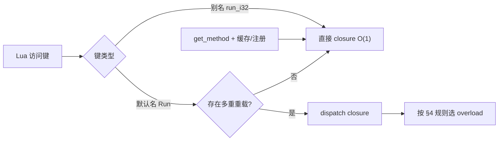

---
mdx:
  format: md
sidebar_position: 3
title: 方法重载规范
description: C# 方法重载在 Lua 侧的解析与调用策略。
---

# ZLua 方法重载规范

本文档描述 **C# 方法重载** 在 Lua 侧的解析与调用策略，适用于 **Il2Cpp（Player）** 与 **Mono（Editor）**。与 `DESIGN_SPEC.md`、`TYPE_SYSTEM_SPEC.md`、`MARSHAL_SPEC.md` 衔接。

**继承说明：** 子类访问父类成员、别名、`new` 隐藏、dispatch 沿继承链解析等见 **`TYPE_SYSTEM_SPEC.md` §5**。

---

## 1. 问题与目标

C# 允许同名方法因参数类型/个数不同而重载；Lua 无静态类型，无法仅凭 `obj:Run(x)` 在编译期选定重载。

| 目标 | 说明 |
|------|------|
| 易用 | `obj:Run(10)` 在常见场景下应能工作 |
| 精确 | 脚本可显式绑定某一重载，并缓存或注册别名 |
| 性能 | 热路径避免每次按字符串键查表；不推荐 `obj[sig](...)` 类写法 |
| 一致 | Mono 与 Il2Cpp 选中同一重载，错误信息一致 |

---

## 2. 三层机制（优先级）



1. **默认名 + dispatch**（§3）：仅当存在多个同名重载时，默认名绑定分派闭包；单重重载仍直接绑定桥接闭包。
2. **别名**（§5）：`[LuaAlias]` 或 XML，类内唯一，O(1) 查表。
3. **运行时签名**（§6）：`zlua.signature` + `zlua.get_method`，查找后**缓存**或 `zlua.register_method` 注册别名。

**不推荐：** 将签名字符串作为元表键做 `obj[sig](...)` 查找——每次经字符串键解析，低效，**不保留、不文档化**。

---

## 3. 默认名与 dispatch

### 3.1 注册规则

对同一类型、同一 `is_static` 域内的同名方法：

| 重载数量 | 元表键 `methodName` 绑定 |
|----------|--------------------------|
| 1 | 该重载的桥接 closure |
| ≥ 2 | **dispatch closure**（运行时再选具体重载） |

静态方法与实例方法分表存放（类型表 vs `__instance_mt`）。C# 允许 `static void Foo()` 与 `void Foo()` 同名，二者互不影响。

### 3.2 重载候选顺序

分派时按以下顺序遍历候选列表，**第一个全参数匹配**的重载被调用：

1. **Codegen 声明顺序**（Il2Cpp / Mono 生成元数据中的顺序）——规范顺序。
2. 反射兜底时：对候选做**确定性排序**（建议按完整签名字典序），并在文档注明「勿依赖反射返回顺序」。

> 注：不宜使用 `Type.GetMethods()` 的未定义顺序作为唯一依据。

### 3.3 参数匹配规则

在参数个数可接受的前提下，逐参数判断 Lua 实参是否可绑定到 C# 形参类型。规则与 `MARSHAL_SPEC` / 参数 `ReadValue` 一致，包括但不限于：

| Lua 实参 | C# 形参 | 规则 |
|----------|---------|------|
| `integer` | `int` / `long` 等整数类型 | 在目标类型范围内 |
| `number`（非整数） | `int` | **不匹配**（如 `10.5` 不能选 `Run(int)`） |
| `number` | `float` / `double` | 允许 |
| `string` | `string` | 允许 |
| `nil` | 引用类型 / `Nullable<T>` | 允许 |
| `nil` | 值类型（非 Nullable） | 不匹配 |
| userdata | 引用类型 | 运行时类型可赋值（含子类） |
| 多参 + `params T[]` | `params` 形参 | 固定前缀匹配后，其余 Lua 参数打包为数组 |

**可选参数 / 默认参数：** Lua 实参个数少于形参时，若剩余形参在 C# 侧有默认值，仍可匹配该重载（通过反射 `Invoke` 或生成代码填充默认值）。

**构造函数：** `Type(...)` / `__call` 使用与实例方法相同的分派逻辑，不单独搞一套规则。

### 3.4 性能说明

dispatch 每次调用需遍历候选并重算匹配，标记为**低效路径**。文档与工具应引导开发者对热点重载使用 §5 别名或 §6 缓存/注册。

可选实现：对小 arity 缓存 `(methodName, 实参 Lua 类型 tag 指纹) → MethodIndex` 的 memo（实现细节，不改变语义）。

### 3.5 失败错误

无匹配重载时 `luaL_error`，并列出候选签名，例如：

```
no overload for Demo.Run matching (number); candidates: Run(System.Int32), Run(System.String)
```

---

## 4. 签名字符串规范（仅参数，不含方法名）

### 4.1 `zlua.signature`

```lua
local sig = zlua.signature(zlua.types.int32)
-- sig == "(System.Int32)"

local sig0 = zlua.signature()
-- sig0 == "()"

local sig2 = zlua.signature(zlua.types.int32, zlua.types.string)
-- sig2 == "(System.Int32,System.String)"
```

**约定：**

- 参数为 **C# 参数类型** 的 type 对象（`zlua.types.*` 或 `zlua.typeof(...)`）。
- **不包含** 方法名。
- 格式：括号包裹、逗号分隔的 **`Type.FullName`** 列表；无参为 `()`。
- 数组写为 `System.Int32[]`；泛型写为 `System.Collections.Generic.List\`1[[System.Int32]]` 等 Codegen 统一格式（与生成元数据一致）。

底层 C 回调名可为 `__zlua_create_signature`；Lua 侧封装为 `zlua.signature`。

### 4.2 内部查找键（实现用，非 Lua 元表键）

原生层可将 **方法名 + 参数签名** 拼为内部键，供 `get_method` O(1) 查找，例如：

```
Run + (System.Int32)  →  内部键 "Run(System.Int32)"
```

该键 **不** 暴露为 Lua 元表的 `__index` 字符串键，禁止 `obj["Run(System.Int32)"]` 或 `obj[sig]` 风格访问。

---

## 5. 别名机制

别名提供 **独立于默认方法名** 的 Lua 键，用于 O(1) 绑定某一具体重载。别名与默认方法名分属两个不相交的键空间。

### 5.1 键空间规则（注册期强制）

对同一类型、同一 `is_static` 域，元表上最终键集合为：

| 键类型 | 来源 | 说明 |
|--------|------|------|
| **默认名** | C# `MethodInfo.Name` | 单重重载 → 桥接 closure；多重重载 → dispatch closure |
| **别名** | `[LuaAlias]` / XML | 额外键，指向**单个**重载的桥接 closure |

**硬性约束（Codegen / 注册期校验，违反即报错）：**

1. **别名不得与任何非别名默认方法名重复**（含本类型及继承链上已注册到该元表的方法名）。若重复，别名与默认键冲突，**无意义**，禁止注册。
2. **别名之间不得重复**（声明类型内唯一；继承链合并到同一元表时亦不得冲突）。
3. **非别名方法名不得占用已有别名**——与规则 1 等价：默认名集合与别名集合必须 **互不相交**。

```text
{ 默认方法名 } ∩ { 别名 } = ∅
```

**禁止示例：**

```csharp
// 错误：别名与默认名 Run 重复（Run 已作为 dispatch 键存在）
[LuaAlias("Run")]
public void Run(int value) { ... }

// 错误：别名与另一非别名方法 GetValue 重复
[LuaAlias("GetValue")]
public void Run(int value) { ... }
public int GetValue() => 0;

// 错误：C# 方法名 run_i32 与别名 run_i32 重复
public void run_i32() { ... }
[LuaAlias("run_i32")]
public void Run(int value) { ... }
```

**合法示例：**

```csharp
[LuaAlias("run_i32")]
public void Run(int value) { ... }

[LuaAlias("run_str")]
public void Run(string value) { ... }

// 默认键 Run：多重重载时为 dispatch；run_i32 / run_str 为额外键，互不冲突
```

### 5.2 C# Attribute

```csharp
[LuaAlias("run_i32")]
public void Run(int value) { ... }
```

- 新属性 **`LuaAliasAttribute`**（不要复用 `MonoLuaCallbackAttribute`）。
- 须满足 §5.1 键空间规则。
- 别名在元表中注册为**额外键**，不替换默认名 `Run` 的 dispatch 行为。

### 5.3 XML 配置（不可改源码时）

```xml
<Type fullName="Demo">
  <Method name="Run" signature="(System.Int32)" alias="run_i32"/>
</Type>
```

- `signature` 仅含参数部分，格式同 §4.1。
- 优先级建议：**Attribute > XML**。
- 合并后做与 §5.1 相同的键空间校验。

### 5.4 静态 / 实例

- 实例别名 → 写入类型的 `__instance_mt`。
- 静态别名 → 写入类型表（静态成员表）。

---

## 6. 运行时 API

### 6.1 `zlua.get_method`

```lua
local demo = CSharp.AC.Demo()
local sig_i32 = zlua.signature(zlua.types.int32)

local run_i32 = zlua.get_method(demo, "Run", sig_i32, false)
run_i32(demo, 10)   -- 实例方法：点号调用，首参为 self

local add = zlua.get_method(CSharp.AC.Demo, "Add", zlua.signature(zlua.types.int32, zlua.types.int32), true)
add(3, 5)           -- 静态方法
```

| 参数 | 说明 |
|------|------|
| `target` | 实例 userdata **或** 类型表；仅用于解析 **声明类型** 及继承链 |
| `methodName` | C# 方法名 |
| `signature` | §4.1 参数签名字符串 |
| `is_static` | `true` 在静态域查找；`false` 在实例域查找 |

**`is_static` 与 `target`：**

- `is_static == true`：从类型表（及基类链）解析静态重载；`target` 传实例 userdata 仍应能解析到正确类型（与字段规则一致：**不得**用 `demo.StaticMethod` 隐式访问静态方法，但 `get_method(demo, ..., true)` 允许）。
- `is_static == false`：从 `__instance_mt`（及基类链）解析实例重载。

返回值为**已绑定重载的 closure**（内部含 `klass`、`is_static`、桥接入口），可直接调用。

查找失败时 `luaL_error`，消息包含 `Type.methodName` 与请求的 `signature`。

### 6.2 缓存（推荐用法）

```lua
-- 模块加载时一次查找，多处复用
local Run_i32 = zlua.get_method(CSharp.AC.Demo, "Run", zlua.signature(zlua.types.int32), false)

local function call_run(demo, v)
    Run_i32(demo, v)
end
```

### 6.3 `zlua.register_method`

```lua
zlua.register_method(static_class_mt_or_obj, aliasName, methodOrClosure) → void
```

将 `get_method` 得到的 closure 注册为 `methodTable` 上的**别名键**，便于 `obj:alias(...)` 或 `TypeTable.alias(...)` 语法糖。完整 API 见 `LIB_SPEC.md` §9.3。

```lua
local Demo = CSharp.AC.Demo
local demo = Demo()

-- 实例方法别名：第一个参数传对象实例
local run_i32 = zlua.get_method(demo, "Run", zlua.signature(zlua.types.int32), false)
zlua.register_method(demo, "run_i32", run_i32)
demo:run_i32(20)

-- 静态方法别名：第一个参数传类型表
local add = zlua.get_method(Demo, "Add",
    zlua.signature(zlua.types.int32, zlua.types.int32), true)
zlua.register_method(Demo, "add_i32", add)
assert.equal(Demo.add_i32(3, 5), 8)
```

| 参数 | 说明 |
|------|------|
| `static_class_mt_or_obj` | **类型表**（静态类元表）或 **C# 对象实例 userdata** |
| `aliasName` | 写入 `methodTable` 的 Lua 键名；须满足 §5 唯一性 |
| `methodOrClosure` | `get_method` 返回值，或语义兼容的可调用 closure |

**写入目标（由第一个参数决定）：**

| 传入值 | 写入目标 |
|--------|----------|
| **类型表** | 该类型**静态绑定**的 `methodTable`（`SMT.__index` upvalue） |
| **对象实例 userdata** | 该实例 **IMT** 所绑定的 `methodTable` |

- 静态方法别名须传**类型表**；实例方法别名须传**对象实例**。
- 目标 `methodTable` 中**已存在同名键**时立即报错，不覆盖。

`methodTable` 语义见 `META_TABLE_SPEC.md` §3.1。

### 6.4 `zlua.types`

内置常用类型，等价于 `zlua.typeof(CSharp....)`，例如：

```lua
zlua.types.int32
zlua.types.string
zlua.types.boolean
-- ...
```

（`corlibtypes` 为旧称，统一为 `zlua.types`。）

---

## 7. 调用约定摘要

| 场景 | 写法 |
|------|------|
| 默认分派 | `demo:Run(10)` |
| 显式重载（缓存 closure） | `run_i32(demo, 10)` |
| 注册实例别名后 | `demo:run_i32(20)` |
| 注册静态别名后 | `Demo.add_i32(3, 5)` |
| 静态 | `CSharp.AC.Demo.Add(3, 5)` 或 `add(3, 5)`（`get_method` 缓存） |
| ~~签名字符串键~~ | ~~`demo[sig](demo, 10)`~~ **禁止** |

实例方法 closure 用 **点号** 调用并显式传入 `self`；注册别名后可用 **冒号**。

---

## 8. Mono / Il2Cpp 一致性

| 项 | 要求 |
|----|------|
| 三层机制语义 | 一致 |
| 签名格式 §4.1 | 一致 |
| dispatch 匹配规则 §3.3 | 一致；Mono 可更慢 |
| 选中重载 | 相同 Lua 实参必须选中相同 C# 重载 |
| 错误文案 | 一致 |

Il2Cpp 以生成元数据 + 桥接函数为主；Mono 可以反射实现 dispatch，但 Lua 可见行为须对齐。

---

## 9. 示例（`Demo` 类）

```csharp
public void Run(int value) { x = value; }

[LuaAlias("run_str")]
public void Run(string value) { x = value == null ? 0 : value.Length; }
```

```lua
local demo = CSharp.AC.Demo()

-- 默认 dispatch：10 → Run(int)，"ab" → Run(string)
demo:Run(10)
demo:Run("ab")

-- 已有别名
demo:run_str("xyz")

-- 显式绑定 int 重载并注册
local sig_i32 = zlua.signature(zlua.types.int32)
local run_i32 = zlua.get_method(demo, "Run", sig_i32, false)
zlua.register_method(demo, "run_i32", run_i32)
demo:run_i32(20)
```

---

## 10. 实现清单（参考）

- [ ] `zlua.signature` 仅编码参数类型
- [ ] `zlua.get_method(target, methodName, signature, is_static)`
- [ ] `zlua.register_method(static_class_mt_or_obj, aliasName, methodOrClosure)`
- [ ] 多重重载时默认名改为 dispatch closure
- [ ] `[LuaAlias]` + XML 合并与唯一性校验
- [ ] 元表**不**暴露签名字符串键给 `__index`
- [ ] 构造函数 dispatch 与 §3 对齐
- [ ] Il2Cpp `MetaBinding` / Mono `LuaManagerObject` 行为对齐
