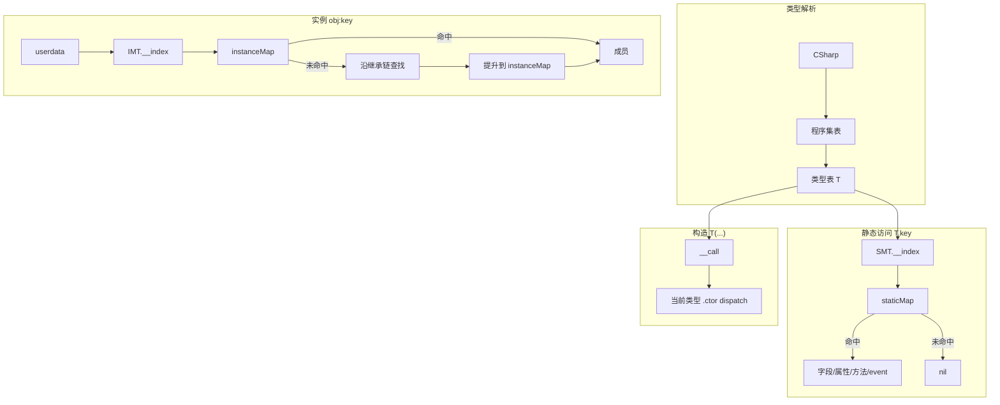

---
mdx:
  format: md
sidebar_position: 2
title: 类型系统规范
description: Lua 侧访问 C# 类型、成员与元表的完整设计。
---

# ZLua 类型系统与元表规范

本文档描述 Lua 侧 **访问 C# 类型、成员与元表（metatable）** 的完整设计，适用于 **Il2Cpp（Player）** 与 **Mono（Editor）**。

**相关文档：**

| 文档 | 内容 |
|------|------|
| `../lib-spec.md` | `zlua` 标准库 Lua API |
| `../method-overload-spec.md` | 方法重载 dispatch、签名、`get_method` |
| `../marshal/index.md` | 参数编组总览、**枚举默认 marshal** |
| `../marshal/struct.md` | struct 传递 |
| `../meta-table-spec.md` | **`__index` / `__newindex`（obj_indexer）三表分派、strict miss** |
| `../marshal/function.md` | Delegate、Lua 函数回调 |
| `../marshal/class.md` | class / 引用类型传递 |
| `../design-spec.md` | 总体目标与双运行时架构 |

**平台原则：** Il2Cpp 侧重零 GC 与直接内存/`methodPointer` 访问；Mono 可基于反射实现，但 **Lua 可见语义必须与 Il2Cpp 一致**。

---

## 1. 设计目标

| 目标 | 说明 |
|------|------|
| 统一入口 | 所有普通类型经 `CSharp` 根表懒加载访问 |
| 语义贴近 C# | `Type.Static()`、`obj:Instance()`、构造 `Type()` 与 C# 一致 |
| 静实例隔离 | 静态成员与实例成员使用**完全独立**的元数据表，禁止混用 |
| 仅 public | Lua 仅可访问 `public` 成员 |
| 可优化 | Il2Cpp 字段/无参属性走 `__index` / `__newindex` 快速路径 |

---

## 2. 类型命名与解析

### 2.1 `CSharp` 根表

```
CSharp                          -- 全局表，__index → 懒加载程序集
  └─ {assemblyName}             -- 程序集表，__index → 懒加载类型
       └─ {typeFullName}         -- 类型表（见 §3）
```

**程序集名**为程序集简单名（不含 `.dll`），例如 `Assembly-CSharp`、`mscorlib`。

**简写别名**（可选，由 Lua 或 `globals.lua` 定义，非框架强制）：

```lua
CSharp.AC = CSharp['Assembly-CSharp']   -- 便于 CSharp.AC.Demo
```

### 2.2 类型访问语法

程序集表上的类型键为 **完整类型名** `typeFullName`（含命名空间，见 §2.3）。访问分两类：

#### 无命名空间的类型（全局命名空间）

当类型**不在任何 namespace 内**，且 `assemblyName` 与 `TypeName` 均为合法 Lua 标识符时，可用点号：

```lua
CSharp.AC.Demo                    -- OK：Demo 在全局命名空间，AC 为程序集别名
CSharp['Assembly-CSharp'].Demo  -- 等价括号写法
```

#### 含命名空间的类型（强制括号）

当类型带有 **namespace** 时，**禁止**将命名空间拆成多级点号访问：

```lua
-- 禁止（解析错误或未定义行为）：
CSharp.AC.MyGame.UI.Panel

-- 必须：整段 typeFullName 作为程序集表的一个键
CSharp.AC['MyGame.UI.Panel']
CSharp['Assembly-CSharp']['MyGame.UI.Panel']
```

规则：**namespace 与类型名中的 `.` 属于 `typeFullName` 字符串本身**，不是 Lua 表路径分隔符。

#### 程序集名含特殊字符

程序集名含 `-` 等非法标识符字符时，程序集级访问须用括号，类型仍按上文规则：

```lua
CSharp['Assembly-CSharp']['MyGame.UI.Panel']   -- 含 namespace
CSharp['Assembly-CSharp'].Demo                 -- 无 namespace 的全局类型
```

**合法 Lua 标识符**：`[A-Za-z_][A-Za-z0-9_]*`。类型名或程序集名含 `-`、`+`、空格、泛型 `` ` `` 等时，对应段**必须**用 `['...']`。

| 场景 | 写法 |
|------|------|
| 无 namespace + 合法程序集/类型名 | `CSharp.{assembly}.{TypeName}` |
| **有 namespace** | `CSharp.{assembly}['{Namespace}.{TypeName}']`（**必须**） |
| **嵌套类型** | `CSharp.{assembly}['{OuterFullName}+{NestedClassName}']`（**必须**括号，`+` 分隔，见 §2.3） |
| 含特殊字符 | 对应用括号键 `['...']` |

### 2.3 命名空间与嵌套类型

- **命名空间**在 `typeFullName` 中以 `.` 连接：`MyGame.UI.Panel` 表示 namespace `MyGame.UI` 下的类 `Panel`。
- 访问时整段作为程序集表键（§2.2），**不得**写成 `CSharp.asm.MyGame.UI.Panel`。
- **嵌套类型**在 `typeFullName` 中使用 **`+`** 连接外层类型全名与内层类名，与 CLR 反射 / `Type.FullName` 一致：

```
{OuterFullName}+{NestedClassName}
```

| 场景 | `typeFullName` 示例 |
|------|---------------------|
| 无 namespace 的一层嵌套 | `TopClass+NestedClass` |
| 含 namespace 的外层 + 嵌套 | `MyGame.UI.Outer+Inner` |
| 多层嵌套 | `Outer+Inner+DeepNested`（每级一层 `+`） |

```lua
-- 必须（括号键；'+' 非合法标识符）
CSharp.AC['TopClass+NestedClass']
CSharp.AC['MyGame.UI.Outer+Inner']

-- 禁止：用 '.' 连接嵌套内外层（与 namespace 的 '.' 混淆，查找困难）
CSharp.AC['Outer.Inner']
CSharp.AC['MyGame.UI.Outer.Inner']
```

规则：**`.` 仅用于 namespace**；**嵌套层级一律用 `+`**。类型表 `__fullname` 字段存上述字符串（与 CLR 嵌套名一致，不做 `.` ↔ `+` 转换）。

### 2.4 类型描述符（type descriptor）

`zlua.make_generic_type`、`zlua.make_szarray_type`、`zlua.make_mdarray_type` 的类型相关参数（下文统称 **typeArg**）须为下列两种形式之一。

#### 2.4.1 类型表

须为 ZLua **类型表**（`typeTable`），且**仅**允许以下来源：

| 来源 | 示例 |
|------|------|
| `CSharp[assemblyName][typeFullName]` | `CSharp.mscorlib['System.Int32']`、`CSharp.AC['MyGame.UI.Panel']` |
| `zlua.make_generic_type(...)` 返回值 | 闭合泛型类型表 |
| `zlua.make_szarray_type(...)` 返回值 | szarray 类型表 |
| `zlua.make_mdarray_type(...)` 返回值 | mdarray 类型表 |

含 namespace 的类型须用 §2.2 规定的括号键；**不得**拆成多级点号。

**禁止**将普通 Lua 表、任意 userdata、`zlua.typeof(...)` 返回值等非上述来源的值当作 typeArg 传入（`typeof` 供 `signature` 等 API 使用，见 §2.7）。

#### 2.4.2 字符串（仅 mscorlib）

typeArg 可为 **字符串**，此时**仅接受 mscorlib 程序集中类型的 CLR 全名**（单段字符串，与反射 `Type.FullName` 一致）：

```lua
"System.Int32"
"System.String"
"System.Object"
```

- **不接受**其他程序集类型的字符串。例如 `System.Collections.Generic.List\`1` 须通过 `CSharp.mscorlib['System.Collections.Generic.List']`（或**定义所在程序集**的 `CSharp[...]` 表）取得类型表，**不能**传字符串。
- `zlua.types.*` 为上述 mscorlib 全名的预定义常量（§2.8），可直接作为 typeArg。

#### 2.4.3 各 API 的参数映射

| API | 使用 typeArg 规则的参数 |
|-----|-------------------------|
| `zlua.make_generic_type(genericBaseType, genericParamType1, …)` | **全部**参数：`genericBaseType` 与各 `genericParamType` |
| `zlua.make_szarray_type(elementType)` | `elementType` |
| `zlua.make_mdarray_type(elementType, rank)` | `elementType` |

`make_szarray_type` 与 `make_mdarray_type` 的 `elementType` 规则与 `make_generic_type` 的类型参数**完全相同**。

### 2.5 泛型类型

```lua
-- genericBaseType：类型表；genericParamType：字符串或类型表
local ListDef = CSharp.mscorlib['System.Collections.Generic.List`1']
local List_int = zlua.make_generic_type(
    ListDef,
    zlua.types.int32                    -- 等价于 "System.Int32"
)

-- 类型实参亦可为类型表或嵌套构造结果
local Dict_str_int = zlua.make_generic_type(
    CSharp.mscorlib['System.Collections.Generic.Dictionary`2'],
    zlua.types.string,
    zlua.types.int32
)

-- 元素类型为数组的闭合泛型
local List_int_arr = zlua.make_generic_type(
    ListDef,
    zlua.make_szarray_type(zlua.types.int32)
)
```

- `genericBaseType`：未闭合的泛型定义（CLR 名含 `` ` `` 与 arity，如 `System.Nullable\`1`）；遵循 §2.4。定义在非 mscorlib 程序集时（如 `System.Collections.Generic.List\`1`）**须**用 `CSharp[assemblyName][typeFullName]` 类型表，**不能**传字符串。
- `genericParamType`…：泛型实参，遵循 §2.4（类型表或 mscorlib 字符串）。
- 返回闭合泛型的**类型表**；相同实参组合多次调用应 **intern** 为同一表。

### 2.6 数组类型

`elementType` 遵循 §2.4（与 `make_generic_type` 的类型参数规则相同）。

#### 单维向量数组（szarray）

```lua
local int_arr_type = zlua.make_szarray_type(zlua.types.int32)
-- 等价于 zlua.make_szarray_type("System.Int32")；语义对应 C# int[]

local panel_arr = zlua.make_szarray_type(CSharp.AC['MyGame.UI.Panel'])
```

#### 多维数组（mdarray）

```lua
local md_type = zlua.make_mdarray_type(zlua.types.int32, 2)  -- int[,]
local nested = zlua.make_mdarray_type(
    zlua.make_szarray_type(zlua.types.int32),
    2
)  -- int[][,]
```

`rank` 为维度数（≥ 1）。mdarray 与 szarray 为不同类型。

### 2.7 `zlua.typeof`

```lua
local t = zlua.typeof(CSharp.AC.Demo)
```

返回该类型对应的 **System.Type 等价物**（Mono 为真实 `System.Type`；Il2Cpp 为携带 `Il2CppClass*` 的类型描述对象）。供 `signature`、`get_method` 等 API 使用；**不**作为 §2.4 所规定的 typeArg 传入 `make_*_type`。

### 2.8 `zlua.types`

记录 **mscorlib** 常见基元与常用类型的 CLR 全名字符串，可直接作为 §2.4.2 的 typeArg。例如 `zlua.types.int32` 的值为 `"System.Int32"`。

### 2.9 类型获取途径总览

Lua 侧获取 C# **类型表**（`typeTable`，见 §3.1）的入口如下。除 §2.4 规定的 typeArg 外，**凡需“类型对象”参与成员访问、构造、签名的场景，均使用类型表**。

| 途径 | 适用类型 | Lua 示例 | 说明 |
|------|----------|----------|------|
| `CSharp[assemblyName][typeFullName]` | class、struct、enum、delegate、interface、嵌套类型、**未闭合泛型定义** | `CSharp.AC.Demo`<br />`CSharp.AC['MyGame.UI.Panel']`<br />`CSharp.AC['Outer+Inner']`<br />`CSharp.mscorlib['System.Collections.Generic.List\`1']` | 程序集表 `__index` 懒解析；键为 §2.2–§2.3 规定的 `typeFullName` |
| `zlua.make_generic_type` | **闭合泛型** | `zlua.make_generic_type(ListDef, zlua.types.int32)` | 实参见 §2.5；返回类型表 |
| `zlua.make_szarray_type` | **单维向量数组** `T[]` | `zlua.make_szarray_type(zlua.types.int32)` | 元素类型见 §2.4 |
| `zlua.make_mdarray_type` | **多维数组** `T[,…]` | `zlua.make_mdarray_type(zlua.types.int32, 2)` | `rank ≥ 1` |
| `LuaMonoAppDomain.RegisterType`（可选） | 任意已加载 `Type` | C# 侧 `RegisterType(typeof(Demo))` | **预注册**到 `CSharp[assembly]`，键为 `typeFullName`；不替代懒加载 |

**不通过 `CSharp[...]` 直接解析的类型：**

- **闭合泛型**（如 `List<int>`）——须 `make_generic_type`。
- **数组类型**（`int[]`、`int[,]`）——须 `make_szarray_type` / `make_mdarray_type`（或作为泛型实参嵌套构造）。

**Intern：** `make_generic_type` / `make_szarray_type` / `make_mdarray_type` 对相同实参多次调用须返回**同一**类型表（native 侧 registry intern）。

#### 2.9.1 懒加载与缓存

```
CSharp.__index(asmName)
  → rawget 命中？返回
  → 否则解析 Assembly，创建程序集表，rawset 缓存

assembly.__index(typeFullName)
  → rawget 命中？返回
  → 否则 CLR 解析 Type，PushTypeTable，rawset 缓存
```

`EnsureCSharpRoot` **仅在宿主启动时调用一次**；之后 C# 侧通过 `lua_getglobal("CSharp")` 取得根表（须为 table）。程序集/类型 `__index` 新建项后 **rawset** 写入父表，避免重复走元方法。

#### 2.9.2 嵌套类型名

`typeFullName` 与 CLR 一致，格式为 `{OuterFullName}+{NestedClassName}`（多级嵌套重复 `+`）。**不接受**以 `.` 连接嵌套层级的别名。

| `typeFullName`（Lua 键 = `__fullname`） | 说明 |
|----------------------------------------|------|
| `Outer+Inner` | 全局命名空间下的嵌套类 |
| `MyGame.UI.Outer+Inner` | 含 namespace 的外层类 + 嵌套类 |

解析时 native 直接使用该字符串调用 `Assembly.GetType(typeFullName)`（及 Il2Cpp 等价路径）；**不做** `.` → `+` 的兼容映射。

#### 2.9.3 类型表元数据（解析用）

除 §3.1 所列字段外，实现侧增加：

| 字段 | 说明 |
|------|------|
| `__typeid` | Mono：内部 `Type` 注册 id；用于闭合泛型、数组等无法仅凭 `__fullname` 字符串反查的类型 |
| `__assembly` | 定义所在程序集简单名（无 `.dll`） |
| `__fullname` | Lua 规范全名（§2.3、§2.9.2） |
| `__name` | 短名（不含命名空间/外层类） |
| `__struct` | 仅 struct：`true`，标记值类型（§3.6） |
| `__enum` | 仅 enum：`true`，标记枚举类型（§3.5） |

`zlua.make_*_type` 与 `CSharp` 懒加载产出的类型表结构**相同**，均可作 typeArg（§2.4.1）。

---

## 3. 类型表与元表结构

### 3.1 类型表（静态门面）

每个 C# 类型对应一张 **类型表** `T`（Lua table），带 **静态元表** `SMT`：

```
T  (类型表，Lua 可见静态成员 + 元数据字段)
├─ __assembly      : string
├─ __fullname      : string      -- Lua 规范全名（§2.3、§2.9.2）
├─ __name          : string
├─ __typeid        : integer     -- 实现用；闭合泛型/数组等反查 Type（§2.9.3）
├─ __instance_mt   : table     → 实例元表 IMT（§3.2）
├─ __klass         : lightuserdata (Il2Cpp) / typeId (Mono)  [实现用]
├─ StaticField     : 快速字段访问或 closure
├─ StaticMethod    : closure / dispatch closure
├─ static_event    : event 表 { get, set, fire }
└─ ...

SMT (__index / __newindex on T)
  → 查 staticMap：字段 / 无参属性 / 方法 / 事件
  → 未命中：返回 nil（§5.1，不向上查父类）

**Mono obj_indexer（三表 Lua indexer、strict miss）见 `../meta-table-spec.md`。**

**`__call`**（在 `SMT` 或 `T` 上）：调用实例构造函数 `T(...)`。无 public 实例构造时调用报错。

**通过类型表仅可访问静态成员**：静态字段、静态属性、静态方法、静态 event。  
**唯一例外**：`__call` 创建实例。

### 3.2 实例元表 `__instance_mt`

实例 userdata 的元表 `IMT` 与 `SMT` **完全独立**：

```
IMT
├─ __index      → 查 instanceMap；未命中则继承解析 + 提升（§5.2）
├─ __newindex   → 实例字段/属性/event 赋值
├─ __gc         → 释放 ObjectRegistry 跟踪
└─ __type       : → 指回类型表 T（互查引用，§3.3）

**Mono：** `__index` / `__newindex` 为三表 Lua closure，miss strict error，继承 Bind 期扁平化 — 见 `../meta-table-spec.md`。

instance userdata
  metatable = IMT
  payload   = Il2CppObject* / GCHandle
```

**禁止**：通过实例 userdata 以 `__index` **隐式**访问静态成员（应使用类型表）。`zlua.get_method(obj, ..., is_static=true)` 等**显式 API** 除外（见 `../method-overload-spec.md`）。

### 3.3 静实例互查引用

| 引用 | 用途 |
|------|------|
| `T.__instance_mt` → `IMT` | 构造实例时挂接元表 |
| `IMT.__type` → `T` | 从实例反查类型、`typeof`、注册方法 |
| `TypeBinding`（native） | 同时持有 `staticMap` 与 `instanceMap`，供 `__index` 共享 |

互查在类型**首次绑定**时建立，之后不变。

### 3.4 延迟初始化

静态绑定（`SMT` + `staticMap`）与实例绑定（`IMT` + `instanceMap`）均在**该类型第一次被访问**时完整构建（`EnsureBinding`），而非启动时全量注册。

构建内容（Codegen 或反射扫描，**仅 public**）：

- 字段、无参/有参属性、方法、event、构造函数元数据
- 继承的 **实例** 成员索引（见 §5）
- 继承的 **静态** 成员**扁平复制**到派生类 `staticMap`（见 §5.1）

### 3.5 枚举类型

枚举（`enum`）经 `CSharp[assemblyName][typeFullName]` 解析为 **类型表** `E`，带静态元表 `SMT` 与实例元表 `IMT`。枚举 **无继承查找**（不扁平化基类枚举成员到其他类型）。

#### 3.5.1 类型表与静态成员

Bind 期扫描该枚举所有 **public static literal** 字段（即各枚举常量），写入类型表 `E`（经 `SMT.__index` / `staticMap` 访问）：

```
E  (枚举类型表)
├─ __assembly / __fullname / __name / __typeid / __instance_mt  （同 §3.1）
├─ Red          : integer | number    -- 底层整型值，如 0
├─ Green        : integer | number    -- 如 1
├─ Blue         : integer | number    -- 如 2
├─ _ctor        : closure             -- 见 §3.5.2
└─ ...

SMT
├─ __index / __newindex   （同 §3.1）
└─ __call  →  _ctor       -- Type(...) 与 Type._ctor(...) 等价
```

规则：

- 每个枚举常量名 → **integer**（Lua 5.4+ 优先）或 **number**，值为 C# 中该常量的 **underlying 整型值**。
- **不是** userdata；**不可**对常量字段赋值（`__newindex` 报错或忽略，与 static readonly 一致）。
- 枚举 **无** public 实例字段 / 方法；`IMT` 仅服务于 §3.5.2 构造出的 userdata（若需 `__type` 互查等）。
- 访问路径与 class 相同：`CSharp.AC['MyGame.Color'].Red`。

#### 3.5.2 构造：`__call` 与 `_ctor`

枚举类型表提供 **单一** 构造函数，签名等价于 C# 中接受 **underlying 整型** 的隐式转换：

```lua
-- 以下等价（单参数为 integer / number）
local c1 = CSharp.AC['MyGame.Color'](1)
local c2 = CSharp.AC['MyGame.Color']._ctor(CSharp.AC['MyGame.Color'].Red)
```

| 项 | 说明 |
|----|------|
| 参数个数 | **1** |
| 参数类型 | **integer**（优先）或 **number**（须为整型值） |
| 返回值 | **enum userdata**（blittable，payload 为 underlying 类型宽度） |
| 语义 | 与 **blittable struct** 的 `_ctor` → userdata 相同，见 `../marshal/struct.md` §5.4 |
| `__call` | `SMT.__call` **指向** `_ctor`（与 class/struct 相同，`TypeMethodRegistration` 规则） |

非法 underlying 值（越界、非整型 number）→ `luaL_error`。

**默认传参仍用 integer/number**（见 `../marshal/index.md` §2）；`E(...)` userdata 用于需 **boxed enum 实例** 的场景。

#### 3.5.3 与 class / struct 的差异

| 项 | enum | class | struct |
|----|------|-------|--------|
| 类型表常量 | integer/number 枚举项 | 静态成员 closure/字段 | 通常无字面常量 |
| 默认 `__call` | 单整型 → userdata | `.ctor` dispatch | `.ctor` dispatch |
| `_default` | **无** | **无** | 无参 → 默认实例 userdata（§3.6.2） |
| 默认跨边界形态 | integer/number | userdata / null | Handle 或 userdata |
| 继承 | 无 | 有 | 无 |

#### 3.5.4 `tostring`

类型表 `__tostring` 返回 `__fullname`（同 §3.1 其他类型）。enum userdata 的 `__tostring` 建议返回 `"EnumFullName(value)"` 或底层整型字符串；具体以实现为准，Mono/Il2Cpp 须一致。

### 3.6 值类型 struct

struct 经 `CSharp[assemblyName][typeFullName]` 解析为 **类型表** `T`，带静态元表 `SMT` 与实例元表 `IMT`。类型表含 **`__struct : true`** 元数据字段，用于与 class / enum 区分。

```
T  (struct 类型表)
├─ __assembly / __fullname / __name / __typeid / __instance_mt  （同 §3.1）
├─ __struct     : true
├─ _ctor        : closure | dispatch closure   -- 见 §3.6.1
├─ _default     : closure                     -- 见 §3.6.2
├─ StaticField  : 字段或 closure
├─ StaticMethod : closure / dispatch closure
└─ ...

SMT
├─ __index / __newindex   （同 §3.1）
└─ __call  →  _ctor       -- Type(...) 与 Type._ctor(...) 语义对齐 §3.6.1
```

规则摘要：

- **实例** 在 Lua 侧为 **boxed userdata**（Mono：`GCHandle` 持有 box 后对象；Il2Cpp：见 `../marshal/struct.md`）。
- **public 实例字段 / 方法** 经 `IMT` 暴露；**静态** 成员经 `SMT` 暴露（与 class 相同路径）。
- struct **无继承**；静态成员 **不** 向上查找基类（与 class 的 Bind 期扁平化策略不同，值类型无派生静态继承场景）。

#### 3.6.1 构造：`__call` 与 `_ctor`

struct 的 public 实例构造函数经 `TypeMethodRegistration` 注册到 `SMT`，与 class 相同支持单重 / 多重 overload dispatch。

```lua
local Point2D = CSharp.AC['MyGame.Point2D']
local p1 = Point2D(3, 4)        -- __call：栈 [typeTable, arg1, ...]
local p2 = Point2D._ctor(3, 4)  -- _ctor：栈 [arg1, ...]（C closure 无 self）
```

| 项 | 说明 |
|----|------|
| 返回值 | **struct userdata**（box 后实例 + `IMT`） |
| `__call` | `SMT.__call` 指向 `_ctor` dispatch（与 class 相同注册规则） |
| `_ctor` | 与 `__call` **独立 closure**，参数起始栈索引与静态方法一致（**1**），见 `../method-overload-spec.md` |
| 无 public 构造 | 仍可通过 §3.6.2 `_default` 取得默认实例；**不能** `Type(...)` 传参构造 |

有参构造语义与 `../marshal/struct.md` §5.4 一致。

#### 3.6.2 默认实例：`_default`

struct 在静态元表 `SMT` 上额外提供 **`_default`**，用于取得 **零初始化** 的默认 struct 实例，等价于 C# 的 `default(T)` / `new T()`（无显式 field 初始化时的默认值）。

```lua
local Point2D = CSharp.AC['MyGame.Point2D']
local zero = Point2D._default()   -- 无参；X/Y 等为 0
```

| 项 | 说明 |
|----|------|
| 适用类型 | **仅 struct**（`__struct == true`）；class / enum **无** `_default` |
| 参数个数 | **0**；传入任意实参 → `luaL_error` |
| 返回值 | **struct userdata**（与 §3.6.1 相同 boxed 形态） |
| 语义 | `Activator.CreateInstance(T)` / 全字段零初始化；**不**调用用户定义的带参构造函数 |
| 访问路径 | `Type._default()`（`SMT.__index` → `_default` closure） |
| 与 `_ctor` / `__call` | `_default` 专用于无参默认实例；带参构造仍用 `Type(...)` 或 `Type._ctor(...)` |

典型用途：需要先持有可写 userdata 再逐字段赋值，或调用仅接受「已分配」struct 实例的 API，而无需手写全零字段的 `_ctor` 重载。

#### 3.6.3 与 class / enum 的差异

| 项 | struct | class | enum |
|----|--------|-------|------|
| `__struct` / `__enum` | `__struct` | 无 | `__enum` |
| `_default` | ✅ 无参默认 userdata | 无 | 无 |
| `__call` / `_ctor` | 有参 → userdata | 有参 → userdata | 单整型 → userdata |
| 类型表字面常量 | 少见 | 静态成员 | integer 枚举项 |
| 默认跨边界传参 | userdata（或 Handle，见 struct 分册） | userdata | integer/number |

#### 3.6.4 `tostring`

类型表 `__tostring` 返回 `__fullname`。struct userdata 的 `__tostring` 以实现为准（Mono 可与 class 相同走默认规则）；Il2Cpp/Mono 须语义一致。

---

## 4. 成员在 Lua 侧的暴露规则

### 4.1 可见性

仅 `public` 成员进入 `staticMap` / `instanceMap`。`internal` / `protected` / `private` 对 Lua 不可见。

### 4.2 字段

| 访问 | 实例 | 静态 |
|------|------|------|
| 读 | `obj.field` | `Type.field` |
| 写 | `obj.field = v` | `Type.field = v` |

只读字段（`readonly`、无 setter 的 init-only）赋值时报错。

### 4.3 属性

| 类型 | Lua 访问 |
|------|----------|
| 无参属性 | `obj.prop` / `Type.prop`（Il2Cpp 可走快速路径，§7） |
| 有参属性 | **仅** `get_PropName(args)` / `set_PropName(args)` 方法形式；不模拟 `obj:Prop(a)` |

索引器同理：`get_Item(i)` / `set_Item(i, v)`。

### 4.4 方法

见 `../method-overload-spec.md`：单重重载直接 closure；多重重载 dispatch；`[LuaAlias]` / `get_method` / `register_method`。

### 4.5 事件

暴露为表：

```lua
Type.SomeEvent = { get = fn_add, set = fn_remove, fire = fn_raise }  -- 视元数据而定
```

- `get` → `add` 处理器
- `set` → `remove` 处理器（命名与 C# event 语义对齐，非 C# property 的 get/set）
- `fire` → 若有 `raise` 方法则暴露

实例 event 同理，调用时需传入 `self`。

### 4.6 构造函数

- class / struct：通过类型表 `Type(...)` / `SMT.__call` 调用 **有参** 实例构造；多构造函数与实例方法相同，使用 **dispatch**（`../method-overload-spec.md` §3）。
- struct 另提供 **`Type._default()`**（§3.6.2）：无参，返回 `default(T)` userdata；**不**替代 `_ctor` / `__call` 的有参 overload。
- **不**在继承链上查找基类构造；仅使用**当前类型**声明的 public 实例构造函数。
- enum：见 §3.5.2（单整型 `_ctor` / `__call`，无 `_default`）。

---

## 5. 继承

### 5.1 静态成员：无运行时父类查找

`SMT.__index` / `__newindex` 在 `staticMap` 未命中时 **不**递归查找父类。

为保持与 C#「可通过派生类型名访问继承的 static 成员」一致，在 **Bind 期**将基类 public 静态成员**扁平注册**到派生类型的 `staticMap`（派生类同名成员覆盖基类）。因此运行时仍 O(1)，且无需向上遍历。

**`new` / `hide`：** 派生类声明的 `new static` 成员覆盖扁平表中的基类项。

### 5.2 实例成员：继承查找 + 提升缓存

`IMT.__index` / `__newindex` 流程：

```
1. 查当前类型 instanceMap
2. 命中 → 返回
3. 未命中 → 沿继承链向上查找 public 成员（最近优先：子类已声明则不会落到父类同名）
4. 找到 → 将条目**复制/提升**到当前类型 instanceMap（键 → MetaInfo）
5. 下次同键访问 O(1)
6. 全链未命中 → __index 返回 nil；__newindex 报错
```

**提升（promotion）** 仅缓存**解析结果**，不改变 C# 虚调用语义；虚方法仍通过生成的 bridge 走 `methodPointer` 虚派发。

**构造函数**不参与继承查找（§4.6）。

### 5.3 方法与 dispatch 的继承

若某方法名在继承树上存在多个 public 重载（含父类），则该名绑定 **dispatch closure**（见 `../method-overload-spec.md`）：

1. 先在**当前类型**声明的重载中按参数匹配；
2. 若无匹配，再递归父类（及更上级）的**同域**（static / instance 分开）重载列表；
3. 顺序：子类声明优先，再按 `../method-overload-spec.md` 的候选顺序。

别名（`[LuaAlias]`）不参与 dispatch，为独立键；**不得与任何非别名默认方法名重复**（见 `../method-overload-spec.md` §5.1）。

---

## 6. 泛型方法

仅针对**方法自身带泛型参数**的情形，例如 `int Foo<T>(T a)`。  
**泛型类上的普通方法**（如 `List<int>.Add(int)`）已闭合，**不**走本节。

### 6.1 调用约定

```lua
local inst = zlua.make_generic_inst(zlua.types.int32)
Type.Foo(inst, value)   -- 第一实参必须是 generic_inst
```

`make_generic_inst` 校验类型参数个数与约束（Il2Cpp 开销大，须校验）。

### 6.2 `inflatedMap` 缓存

每个泛型方法维护：

```
genericMethodId × generic_inst fingerprint → inflated MethodInfo / bridge closure
```

首次 `generic_inst` 组合完成校验与 inflation 后写入；后续 O(1) 复用。  
**禁止**每次调用重复做完整约束检查。

---

## 7. 数组：创建与 `__len`

### 7.1 创建 szarray

```lua
local arr1 = zlua.new_szarray_by_element_type(zlua.types.int32, 10)
local arr2 = zlua.new_szarray_by_szarray_type(int_arr_type, 10)
```

第二参数为长度（≥ 0）。元素初始化为 `default(T)`。

### 7.2 创建 mdarray

```lua
-- 方式 A：已知 mdarray 类型
local arr = zlua.new_mdarray_by_mdarray_type(md_type, lowbounds, sizes)

-- 方式 B：由元素类型 + 维度规格构造
local arr = zlua.new_mdarray_by_spec(zlua.types.int32, lowbounds, sizes)
```

| 参数 | 说明 |
|------|------|
| `lowbounds` | 长度为 `rank` 的表，每维下界 |
| `sizes` | 长度为 `rank` 的表，每维元素个数 |

### 7.3 szarray 的 `#`

szarray 实例 userdata 实现 `__len`：

```lua
local n = #arr   -- 等价于 C# arr.Length
```

mdarray 无单一 `Length` 语义，**不**实现 `__len`；通过 `GetLength(d)` 或专用 API 访问。

### 7.4 szarray 与 Lua 互转

由 `zlua` 标准库提供（详见 `../lib-spec.md` §6.3）：

| API | 说明 |
|-----|------|
| `zlua.to_bytes(arr)` | 基元 szarray → 二进制 Lua `string`（仅 blittable 基元） |
| `zlua.to_table(arr)` | 任意元素类型 szarray → 等长 Lua 表（`t[i]` ↔ `arr[i-1]`） |

### 7.5 数组类型表

数组类型表与普通类型表结构相同（静态门面 + 实例元表）。实例为数组对象 userdata，元素访问/赋值规则见 `../marshal/class.md`。

---

## 8. Il2Cpp 元表快速路径

以下优化**不改变 Lua 语义**；Mono 可走反射慢路径。

### 8.1 字段

在 `__index` / `__newindex` 中根据 Codegen 预计算的 **偏移** 直接读写：

- 静态字段：`staticAddress`（类型数据段指针 + offset）
- 实例字段：`(uint8_t*)object + instanceOffset`

为常见基元（`int`、`bool`、`float`、`double`、`IntPtr` 等）和引用类型字段生成专用 `getter` / `setter` 函数指针，存入 `MetaInfo.field`。

### 8.2 无参属性

无参 property 若 getter/setter 可内联为字段等价或单跳 `methodPointer`，在 `__index` / `__newindex` 快速路径处理；否则退化为 `getterRef` / `setterRef` closure 调用。

### 8.3 有参属性

仅 `get_XXX` / `set_XXX` closure，不走属性名直接访问。

### 8.4 方法

通过 `MethodInfo::methodPointer` + 签名桥接调用，不经 C# 包装。

---

## 9. 总体访问流程



---

## 10. 特殊类型（概要）

| 类型 | 说明 |
|------|------|
| 接口 | 可解析类型表；不可 `__call` 构造（除非默认接口方法场景，不支持） |
| 抽象类 | 若有 protected 构造对 Lua 不可见；仅 public 构造可 `__call` |
| 静态类 | 仅静态成员，无 `__call` |
| 枚举 | 类型表 + 常量为 integer/number；`__call`/`_ctor(整型)` → userdata；marshal 见 `../marshal/index.md` §2、本文 §3.5 |
| 委托 | 类型表 + 实例 `IMT.__call`；Lua↔C# 见 `../marshal/function.md` |
| 值类型 struct | 类型表（`__struct`）+ `_default` / `_ctor` / `__call` → 实例 userdata；传递见 `../marshal/struct.md`、本文 §3.6 |

---

## 11. Mono / Il2Cpp 一致性

| 项 | 要求 |
|----|------|
| 类型命名与 `CSharp` 路径 | 一致 |
| 静实例隔离 | 一致 |
| public 可见性 | 一致 |
| 继承查找与提升语义 | 一致 |
| 构造、dispatch、泛型方法 | 一致 |
| 数组创建与 `#` | 一致 |
| 错误消息 | 一致或等价 |
| 性能 | Il2Cpp 必须满足 §8；Mono 允许反射 |

---

## 12. 示例

```lua
CSharp.AC = CSharp['Assembly-CSharp']

-- 无 namespace 的全局类型：点号
local sum = CSharp.AC.Demo.Add(3, 5)
local demo = CSharp.AC.Demo()

-- 含 namespace 的类型：必须括号
local panelType = CSharp.AC['MyGame.UI.Panel']
local panel = panelType()

-- 嵌套类型（'+' 分隔，必须括号）
local innerType = CSharp.AC['Outer+Inner']

-- struct（与 class 相同访问路径；另含 _default，见 §3.6）
local vecType = CSharp['UnityEngine.CoreModule']['UnityEngine.Vector3']
local pointType = CSharp.AC['MyGame.Point2D']
local origin = pointType._default()       -- 无参默认实例 userdata
local p = pointType(3, 4)                 -- __call → _ctor
local q = pointType._ctor(3, 4)

-- 未闭合泛型定义（键含 ` 与 arity）
local ListDef = CSharp.mscorlib['System.Collections.Generic.List`1']

-- 闭合泛型
local ListInt = zlua.make_generic_type(ListDef, zlua.types.int32)
local list = ListInt()

-- szarray / mdarray 类型
local IntArray = zlua.make_szarray_type(zlua.types.int32)
local IntMatrix = zlua.make_mdarray_type(zlua.types.int32, 2)

-- 元素为数组的闭合泛型
local ListIntArr = zlua.make_generic_type(ListDef, zlua.make_szarray_type(zlua.types.int32))

-- 枚举：常量字段 + 构造 userdata
local Color = CSharp.AC['MyGame.Color']
assert(Color.Red == 0)                    -- integer/number
local redBox = Color(Color.Red)           -- __call → _ctor → userdata
local blueBox = Color._ctor(Color.Blue)

demo:SetX(10)
print(demo:GetX())

-- 数组实例（见 §7）
local arr = zlua.new_szarray_by_szarray_type(IntArray, 4)
print(#arr)

-- 显式重载（见 METHOD_OVERLOAD_SPEC.md）
local sig = zlua.signature(zlua.types.int32)
local run_i32 = zlua.get_method(demo, "Run", sig, false)
run_i32(demo, 20)
```

---

## 13. 实现清单（参考）

### 13.1 类型获取（§2.9）

| 项 | Mono | Il2Cpp |
|----|------|--------|
| `CSharp` 根表 + 程序集懒加载 | ✅ | ✅ |
| 程序集 `__index` + rawset 缓存 | ✅ | ✅ |
| `CSharp[assembly][typeFullName]`：class / struct / enum / 嵌套 | ✅ | 部分 |
| `CSharp[...]`：未闭合泛型定义（`` ` `` 键） | ✅ | 部分 |
| `zlua.make_generic_type` + intern | ✅ | 待实现 |
| `zlua.make_szarray_type` + intern | ✅ | 待实现 |
| `zlua.make_mdarray_type` + intern | ✅ | 待实现 |
| typeArg：类型表 + mscorlib 字符串（§2.4） | ✅ | 部分 |
| 嵌套类型 `+` 命名（§2.3、§2.9.2） | ✅ | 待实现 |
| `RegisterType` 预注册（`typeFullName` 键） | ✅ | — |
| 类型表 `__typeid` 反查闭合泛型/数组 | ✅ | 待实现 |
| 枚举：常量 integer/number + `_ctor`/`__call` | ✅ | 待实现 |
| struct：`__struct` + `_default` / `_ctor` / `__call`（§3.6） | ✅ | 待实现 |

### 13.2 成员绑定与元表

- [x] `CSharp` 根表 + 程序集/类型懒加载（Mono）
- [x] 程序集 `__index`：无 namespace 类型支持点号；**有 namespace 类型仅接受整段 `typeFullName` 括号键**
- [ ] 类型表元数据字段 `__assembly` / `__fullname` / `__name` / `__typeid` / `__instance_mt`
- [ ] `staticMap` 与 `instanceMap` 双表 + `SMT` / `IMT` 分离
- [ ] Bind 期扁平注册继承的 static 成员
- [ ] 实例 `__index` 继承查找 + promotion
- [ ] 构造 `__call`（无继承查找）+ overload dispatch
- [ ] `new_szarray_*` / `new_mdarray_*`
- [ ] szarray `__len`
- [ ] 泛型方法 `make_generic_inst` + `inflatedMap`
- [ ] 枚举类型表：public 常量 → integer/number；`_ctor`/`__call`（§3.5）
- [x] struct 类型表：`__struct`；`_default`（§3.6.2）；`_ctor`/`__call`（§3.6.1，Mono）
- [ ] Il2Cpp 字段/无参属性快速路径（§8）
- [ ] Mono 语义对齐
